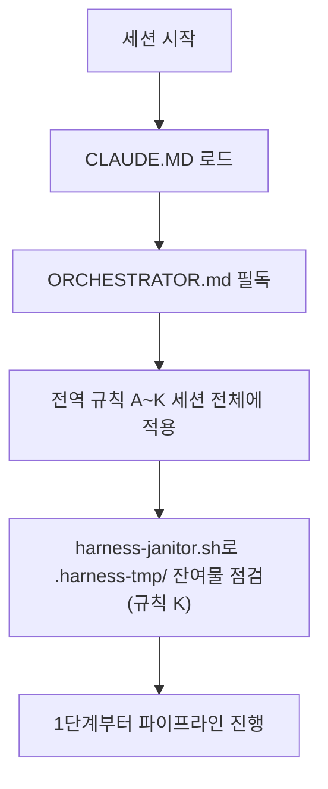

# HANESS_AUTO — 13단계 개발 하네스 시스템

이 저장소는 범용 재사용 가능한 13단계 개발 파이프라인 하네스다. 이 프로젝트에서 작업을 시작하기 전에 **[ORCHESTRATOR.md](ORCHESTRATOR.md)를 반드시 먼저 읽는다** — 전체 페르소나(20년차 개발/기획/설계/보안/디자인 기준), 전역 규칙(A~K: 모르면 질문, 최소 2회 내부 검증, 완전한 테스트 결과서, 단계 게이트, 배포 승인, 실패 피드백 루프, 의사결정 로그, 요구사항 추적성, 규제 민감 도메인 대응, AI/LLM 기능 내장 대응, 중단-안전 정리), 13단계 파이프라인 정의(11단계 문서화/인수인계 포함), 자동화 트리거 설계가 모두 여기에 있다.

- 각 단계 서브에이전트 정의: `.claude/agents/01-trend-analyst.md` ~ `13-post-deploy-verifier.md`
- 공통 양식: `templates/verification-log-template.md`, `templates/test-report-template.md`, `templates/decision-log-template.md`, `templates/traceability-matrix-template.md`
- 자동화(CI/git hook) 예시: `automation/` (임시 아티팩트 잔여 점검용 `automation/harness-janitor.sh` 포함)
- 검증/테스트용 임시 아티팩트(venv·DB 등) 전용 디렉터리: `.harness-tmp/` (`.gitignore` 처리됨, 규칙 K)

ORCHESTRATOR.md의 규칙은 이 저장소 안에서는 예외 없이 적용된다. 특히 규칙 A(모르면 반드시 질문, 임의 진행 금지), 규칙 E(배포는 사용자 승인 없이 절대 실행 금지), 규칙 K(정상 종료든 강제 중단이든 임시 아티팩트 정리는 동일하게 보장)는 어떤 상황에서도 우회하지 않는다.

## 보류 사항 (사용자 결정, 2026-10-02)

- **일일 배치 스케줄링은 지금 다루지 않는다.** 사용자가 "지금은 제외, 추후 배치 스케줄링 예정"이라고 결정했다. 그래서 `scripts/run_daily_batch.ps1`(Windows 작업 스케줄러 `StockScreenerKR-DailyBatch`, 매일 07:00)의 동작 확인·수정·재설계를 먼저 제안하거나 진행하지 않는다.
  - 참고 사실: 이 스크립트는 `python`(3.11, 의존성 없음)을 호출해 2026-09-29부터 실패하던 것을 `py -3.12` 호출로 한 줄 고쳐 두었다(DEC-036). 실제 정상 동작은 아직 확인하지 않았다. 스케줄링을 다시 다룰 때 이 점부터 점검한다.
  - 개발 DB는 마이그레이션 0011이 적용된 상태라, 배치가 실행되면 패턴 지표 컬럼도 함께 기록된다.
