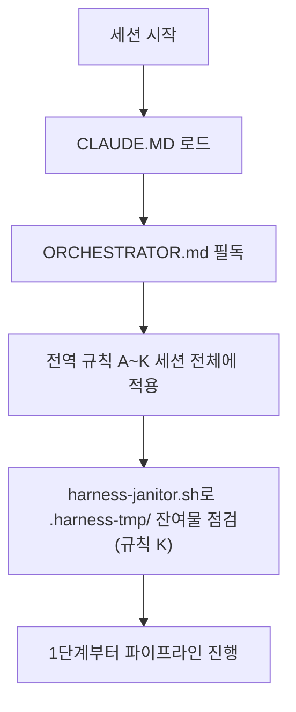

# HANESS_AUTO — 13단계 개발 하네스 시스템

이 저장소는 범용 재사용 가능한 13단계 개발 파이프라인 하네스다. 이 프로젝트에서 작업을 시작하기 전에 **[ORCHESTRATOR.md](ORCHESTRATOR.md)를 반드시 먼저 읽는다** — 전체 페르소나(20년차 개발/기획/설계/보안/디자인 기준), 전역 규칙(A~K: 모르면 질문, 최소 2회 내부 검증, 완전한 테스트 결과서, 단계 게이트, 배포 승인, 실패 피드백 루프, 의사결정 로그, 요구사항 추적성, 규제 민감 도메인 대응, AI/LLM 기능 내장 대응, 중단-안전 정리), 13단계 파이프라인 정의(11단계 문서화/인수인계 포함), 자동화 트리거 설계가 모두 여기에 있다.

- 각 단계 서브에이전트 정의: `.claude/agents/01-trend-analyst.md` ~ `13-post-deploy-verifier.md`
- 공통 양식: `templates/verification-log-template.md`, `templates/test-report-template.md`, `templates/decision-log-template.md`, `templates/traceability-matrix-template.md`
- 자동화(CI/git hook) 예시: `automation/` (임시 아티팩트 잔여 점검용 `automation/harness-janitor.sh` 포함)
- 검증/테스트용 임시 아티팩트(venv·DB 등) 전용 디렉터리: `.harness-tmp/` (`.gitignore` 처리됨, 규칙 K)

ORCHESTRATOR.md의 규칙은 이 저장소 안에서는 예외 없이 적용된다. 특히 규칙 A(모르면 반드시 질문, 임의 진행 금지), 규칙 E(배포는 사용자 승인 없이 절대 실행 금지), 규칙 K(정상 종료든 강제 중단이든 임시 아티팩트 정리는 동일하게 보장)는 어떤 상황에서도 우회하지 않는다.



## 상시 규칙 (사용자 지시, 2026-10-06 — 모든 작업에서 예외 없이 적용)

1. **내부 테스트는 에이전트(Claude)가 직접 한다.** 에이전트가 실행·검증할 수 있는 것(단위·통합·종단·브라우저·성능·정적 검사, 임시 DB, 모의 서버, PowerShell 구문·실행 점검 등)은 **사용자에게 시키지 않고 에이전트가 끝까지 직접 돌려 확인한다.** "사용자 PC에서 실행해 보세요"를 해결책으로 내놓지 않는다. 도구가 없으면 설치해서라도(예: 실행기 내려받기) 직접 시험한다.
2. **사용자에게 요청하는 것은 에이전트가 물리적으로 할 수 없는 것으로 한정한다**(사용자 PC의 실제 화면·로그, 증권사 실제 앱키 응답, 사용자 계정·결정이 필요한 것). 이런 경우에도 "무엇이 막혔는지·왜 못 하는지"를 먼저 밝히고, 사용자에게 시키는 단계는 **한 번에 한 가지**만, 설명 없이 요구하지 않는다. 같은 작업을 두 번 시키지 않는다.
3. **모든 작업에는 내부 테스트 결과서를 완전하게 작성한다**(`docs/qa/`): 범위·환경·변경 요약·시험 케이스(기대/실제/결과)·발견·수정한 결함·확인하지 못한 것과 위험·재현 방법. 확인하지 못한 것은 숨기지 않고 정직하게 적는다.
4. 20년차 개발/기획/설계/보안/디자인 기준으로 일하고, 모르면 묻고, 임의로 결정하지 않는다. 빠르게 처리한다. 작업이 끝날 때마다 작업 브랜치와 `PROD_SCH`에 푸시한다(Render 배포는 하지 않고 테스트는 사용자 로컬 노트북에서만 한다).

5. **"남은 작업"은 에이전트가 끝낼 수 있는 것은 전부 끝까지 한다**: 시험·회귀·성능·보안 점검(`npm audit`, `pip-audit`)·의존성 취약점 업데이트·문구/문서 정리·결과서까지. 사용자에게 남기는 것은 (a) 사용자만 줄 수 있는 결정, (b) 에이전트가 물리적으로 접근할 수 없는 것(사용자 PC 실제 화면·증권사 앱키 응답·KRX 공식 공고)뿐이며, 이것도 목록으로 정직하게 적는다(해결된 척하지 않는다).
6. **완료 전 체크(작업마다)**: `ruff check` · `pytest tests`(회귀 전체) · 프런트면 `tsc --noEmit`·`eslint`·`lint:copy`·`scripts/check-*.mjs`·`npm run build` · 화면이면 Playwright 브라우저 시험 · `.ps1`이면 `tests/e2e/ps1_scripts_check.py` · 내부 테스트 결과서(`docs/qa/`) · `docs/harness/decisions.md`·`docs/HANDOFF.md` 갱신 · 작업 브랜치와 `PROD_SCH` 푸시.

7. **로컬 노트북 실시간 가이드는 계속 갱신한다(사용자 요구 "절대 잊지 말 것")**: 속도·설정·점검 방법이 바뀌면 `docs/ops/local-fast-realtime-guide.md`를 같이 고치고, 사용자에게는 그 문서 기준으로 "최대한 빠르게 실시간 주식정보를 보는 방법"을 안내한다. 수치는 계산값/확인값을 구분해 적고 사용자 PC에서만 확인되는 것은 정직하게 표시한다.

## 시험 환경 만들기 (새 컨테이너에서 처음 한 번, 에이전트가 직접 한다)

```
python3.12 -m venv /var/tmp/venv312 && /var/tmp/venv312/bin/pip install -r requirements-dev.txt     # 파이썬 3.12(시스템 기본은 3.13/3.11일 수 있음)
# 임시 PostgreSQL(포트 5544, 소켓 /tmp/pgsock) — 시험이 임시 DB를 만들고 지운다(개발 DB 미사용)
mkdir -p /tmp/pgsock /var/tmp/pgd2 && chown postgres /tmp/pgsock /var/tmp/pgd2
su postgres -c "/usr/lib/postgresql/16/bin/initdb -D /var/tmp/pgd2 -A trust -U postgres"
su postgres -c "/usr/lib/postgresql/16/bin/pg_ctl -D /var/tmp/pgd2 -o '-p 5544 -k /tmp/pgsock' -l /var/tmp/pgd2.log start"   # 도구 호출 사이에 꺼질 수 있어 시험 전에 psql로 확인하고 꺼졌으면 다시 켠다(postmaster.pid 삭제 후)
psql -h /tmp/pgsock -p 5544 -U postgres -c "CREATE ROLE migrator LOGIN SUPERUSER PASSWORD 'x'" -c "CREATE ROLE batch_worker LOGIN PASSWORD 'x'" -c "CREATE ROLE api_service LOGIN PASSWORD 'x'" -c "CREATE ROLE auth_service LOGIN PASSWORD 'x'" -c "CREATE DATABASE stock_screener OWNER migrator"
# /tmp/claude-0/pgenv.sh 에 아래 환경변수를 export
#   TEST_PG_ADMIN_PSQL="psql -h /tmp/pgsock -p 5544 -U postgres"
#   ALEMBIC_DATABASE_URL / BATCH_DATABASE_URL / PUBLIC_API_DATABASE_URL / PUBLIC_API_AUTH_DATABASE_URL = postgresql+psycopg://<migrator|batch_worker|api_service|auth_service>:x@localhost:5544/stock_screener
export PATH=/var/tmp/venv312/bin:/usr/lib/postgresql/16/bin:$PATH
python -m pytest tests -q            # 전체 회귀(약 6분). 새 시험은 tests/unit, tests/integration
# 프런트: cd frontend && npm ci && npx tsc --noEmit && npm run lint && npm run lint:copy && for f in scripts/check-*.mjs; do node --experimental-strip-types $f; done
# 브라우저(Playwright): mkdir -p /tmp/claude-0/pw && cd /tmp/claude-0/pw && npm i playwright-core axe-core ; CHROME=/opt/pw-browsers/chromium-1194/chrome-linux/chrome
#   node frontend/scripts/qa/live-screen.mjs dev|prod|auth      # 장중 기준 화면(가짜 서버)
#   python tests/e2e/live_screen_stack.py [--prod]               # 장중 기준 종단(실제 API·모의 증권사·DB)
#   python tests/e2e/local_mode_stack.py --mode on|off [--dev]   # 로그인 켠/끈 로컬 종단
# PowerShell(.ps1): https://github.com/PowerShell/PowerShell/releases/download/v7.4.5/powershell-7.4.5-linux-x64.tar.gz 를 풀어 PWSH=<경로>/pwsh python tests/e2e/ps1_scripts_check.py
```

## 보류 사항 (사용자 결정, 2026-10-02)

- **일일 배치 스케줄링은 지금 다루지 않는다.** 사용자가 "지금은 제외, 추후 배치 스케줄링 예정"이라고 결정했다. 그래서 `scripts/run_daily_batch.ps1`(Windows 작업 스케줄러 `StockScreenerKR-DailyBatch`, 매일 07:00)의 동작 확인·수정·재설계를 먼저 제안하거나 진행하지 않는다.
  - 참고 사실: 이 스크립트는 `python`(3.11, 의존성 없음)을 호출해 2026-09-29부터 실패하던 것을 `py -3.12` 호출로 한 줄 고쳐 두었다(DEC-036). 실제 정상 동작은 아직 확인하지 않았다. 스케줄링을 다시 다룰 때 이 점부터 점검한다.
  - 개발 DB는 마이그레이션 0011이 적용된 상태라, 배치가 실행되면 패턴 지표 컬럼도 함께 기록된다.
