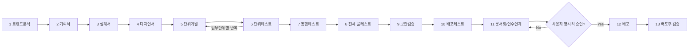

# 13단계 개발 하네스 시스템 (범용 템플릿)

20년차 개발/기획/설계/보안/디자인 담당자 기준으로 구성한 재사용 가능한 개발 파이프라인 하네스입니다.

## 구성
- [USAGE-GUIDE.md](USAGE-GUIDE.md) — **처음 쓸 때 이 문서부터 읽는다.** 새 프로그램 시작 절차, 단계별 실전 진행법, 여러 프로그램 재사용 전략, 막혔을 때 체크리스트, 복붙용 예시 대화 모음.
- [ORCHESTRATOR.md](ORCHESTRATOR.md) — 전체 플로우를 규정하는 마스터 프롬프트. 세션 시작 시 통째로 컨텍스트에 제공.
- `.claude/agents/01-trend-analyst.md` ~ `13-post-deploy-verifier.md` — 각 단계별 Claude Code 서브에이전트 정의 (`Agent` 도구의 `subagent_type`으로 호출)
- `templates/verification-log-template.md` — 모든 산출물에 적용하는 **최소 2회 내부 검증** 로그 양식
- `templates/test-report-template.md` — 모든 테스트/보안/배포 단계에 적용하는 **완전한 테스트 결과서** 양식
- `templates/decision-log-template.md` — 질문·답변·비가역적 결정을 append-only로 남기는 의사결정 로그 양식 (`docs/harness/decisions.md`)
- `templates/traceability-matrix-template.md` — 기획서 요구사항(REQ-ID)이 설계→구현→테스트까지 빠짐없이 이어지는지 추적하는 매트릭스 (`docs/harness/traceability.md`, 2단계에서 생성)
- `automation/` — 수동 호출 대신 CI/git hook으로 자동 트리거하고 싶을 때 쓰는 예시 (12단계 배포는 항상 사람 승인 게이트로 보호)
- [ORCHESTRATOR.md 5장 "MCP 활용 가이드"](ORCHESTRATOR.md#5-mcpmodel-context-protocol-활용-가이드-선택) — 프로젝트에 GitHub/Playwright/Sentry/Slack 등 MCP가 연결되어 있을 때 각 단계에서 선택적으로 활용하는 방법 (강제 아님, 미연결 시 기존 방식으로 항상 대체됨)

## 파이프라인 요약
```
1 트렌드/근황 분석 → 2 기획서(자율 작성, 재질문 금지) → 3 설계서 → 4 디자인서
→ [5 단위개발 → 6 단위테스트]×N (업무단위별 반복) → 7 업무단위 통합테스트
→ 8 전체 풀테스트 → 9 보안검증 → 10 배포테스트
→ 11 문서화/인수인계(운영 Runbook·사용자/관리자 매뉴얼·API 문서)
→ 12 배포(사용자 승인 필수) → 13 배포후 검증
```



## 핵심 규칙 (ORCHESTRATOR.md에 상세)
1. **모르면 반드시 질문한다.** 임의 추측으로 진행하지 않는다. (규칙 A)
2. **모든 문서/테스트 산출물은 최소 2회 독립 검증**을 거쳐야 완료 처리된다 (하한선이며 상한선이 아님). (규칙 B)
3. **테스트 결과서는 템플릿의 모든 섹션을 빠짐없이 작성**한다. 근거 없는 "이상 없음"은 금지. (규칙 C)
4. 2단계(기획서)는 사용자에게 재요청하지 않고, 1단계 산출물 + 프로젝트 기존 코드/문서 컨텍스트만으로 완성한다. (규칙 D 게이트와 연동)
5. 실제 배포(12단계)는 사전 테스트가 전부 PASS여도 **사용자의 명시적 승인** 없이는 절대 실행하지 않는다. (규칙 E)
6. **FAIL이 나오면 근본 원인 단계까지 거슬러 올라가 고치고, 그에 의존하는 모든 하위 단계를 다시 돈다** (회귀 의무, 임의로 "이미 지나간 단계"라고 건너뛰지 않음). (규칙 F)
7. **질문·답변, 비가역적 결정은 모두 `docs/harness/decisions.md`에 append-only로 기록**해 나중 단계가 맥락을 잃지 않게 한다. (규칙 G)
8. **`docs/harness/traceability.md`로 모든 요구사항이 설계→구현→테스트까지 추적**되는지 관리하며, 8단계는 커버리지 100%가 아니면 PASS할 수 없다. (규칙 H)
9. **금융/의료/법률/보험처럼 "조언·추천"이 인허가 규제 대상이 될 수 있는 도메인은 1단계에서 인허가 요건을 조사하고, 대응 방안을 정식 REQ-ID로 등록해 9단계까지 추적·검증**한다 (규칙 I).
10. **만들려는 서비스 자체가 챗봇/에이전트/RAG 등 LLM 기능을 포함하면, 프롬프트 인젝션 방어·출력 새니타이즈·도구 권한 최소화·비용 레이트리밋을 정식 REQ-ID로 등록해 9단계까지 추적·검증**한다 (규칙 J). 5단계가 LLM으로 코드를 작성하는 구조 특성상, 9단계는 새로 추가된 의존성이 실제 공식 레지스트리에 존재하는지(패키지 환각/"slopsquatting" 방지)도 함께 점검한다.

## 설계 확정 사항 (검토 시 확인받음)
- **UAT(사용자 인수테스트)**: 별도 단계로 분리하지 않고 8단계 산출물 안에 섹션으로 포함.
- **코드 리뷰**: 사람에 의한 필수 리뷰 게이트 없음 — 5단계 에이전트의 자체 코드리뷰 체크리스트 + 6단계 검증으로 대체.
- **문서화/인수인계(운영 Runbook·사용자 매뉴얼·관리자 매뉴얼·API 문서)**: 새 독립 단계(11단계)로 신설. 8·9·10단계에서 검증된 실제 동작을 기준으로 작성하며, 배포(12단계) 전에 완료되어야 한다(게이트). 프로젝트 성격상 해당 없는 문서(예: 관리자 화면이 없는 프로젝트의 관리자 매뉴얼)는 임의로 지어내지 않고 사유와 함께 "해당 없음"으로 명시한다.
- **자동화 범위**: `automation/`에 CI/git hook 예시 포함, 단 12단계(실제 배포)는 항상 사람 승인 없이는 실행되지 않도록 설계.
- **MCP(Model Context Protocol) 연동**: 특정 MCP 서버를 강제하지 않고, 2·8·10·11·12·13단계 및 규칙 A/E에 "연결되어 있으면 이렇게 활용하라"는 선택적 가이드만 추가(ORCHESTRATOR.md 5장). 서브에이전트 `tools:`가 화이트리스트라서 연결 안 된 MCP 이름을 미리 넣으면 호출 자체가 실패하므로, 기본 `tools:` 목록에는 어떤 MCP도 넣지 않음 — 실제 사용은 프로젝트에서 MCP를 연결한 뒤 사용자가 해당 단계 파일의 `tools:`에 직접 추가해야 함.
- **MCP 연동 여부 "질문"은 필수, "설정"은 선택**: ORCHESTRATOR.md 4장 3번에 따라 신규 프로젝트에서 1단계를 시작하기 전 MCP 연동 여부를 사용자에게 반드시 한 번 질문한다(생략 금지). 사용자가 원치 않으면 그대로 진행하며, 그것으로 절차는 충족된다 — 강제되는 것은 질문 행위이지 실제 MCP 설정이 아니다.

## 사용 방법
1. 이 폴더 전체(`ORCHESTRATOR.md`, `.claude/agents/`, `templates/`)를 실제 프로젝트 루트로 복사합니다.
2. Claude Code 세션에서 `ORCHESTRATOR.md` 내용을 컨텍스트로 제공한 뒤, 1단계부터 순서대로 `Agent` 도구로 각 `subagent_type`을 호출합니다.
3. 각 단계는 이전 단계 산출물이 검증 로그 2회 이상 PASS 상태여야 시작됩니다 (게이트).

## 참고
- 이 저장소(`HANESS_AUTO`) 자체가 여러 프로젝트에서 재사용하기 위한 고정 템플릿 저장소입니다. 실제 프로젝트에 적용할 때는 이 폴더 전체를 대상 프로젝트 루트로 복사해 사용하세요.
