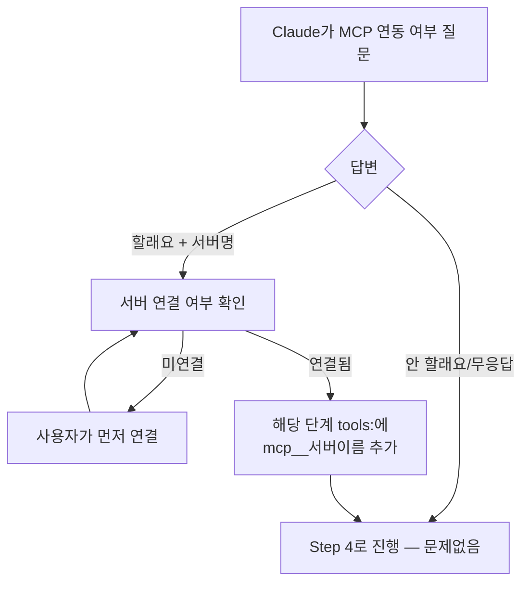
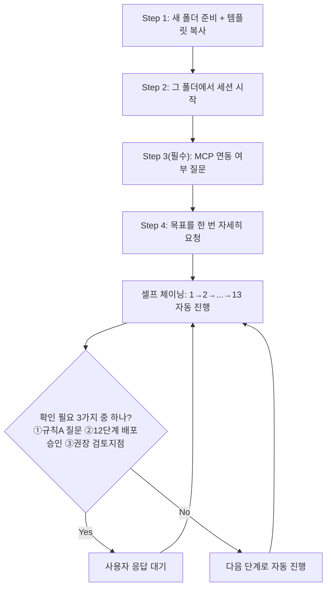
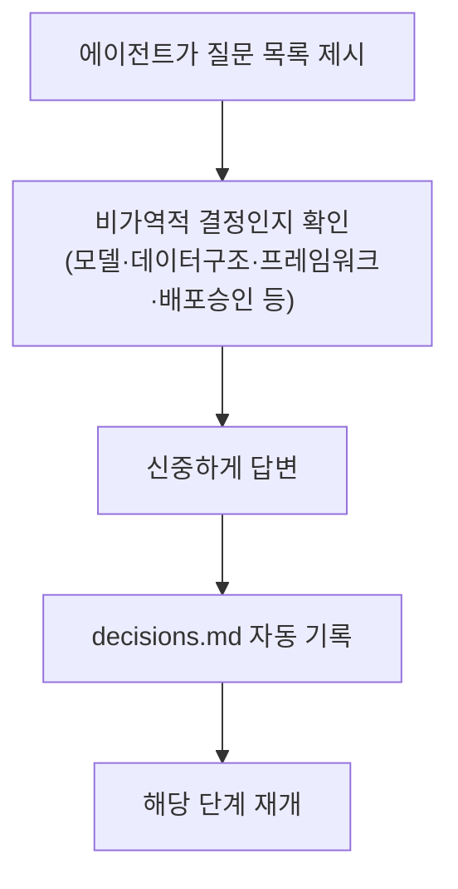
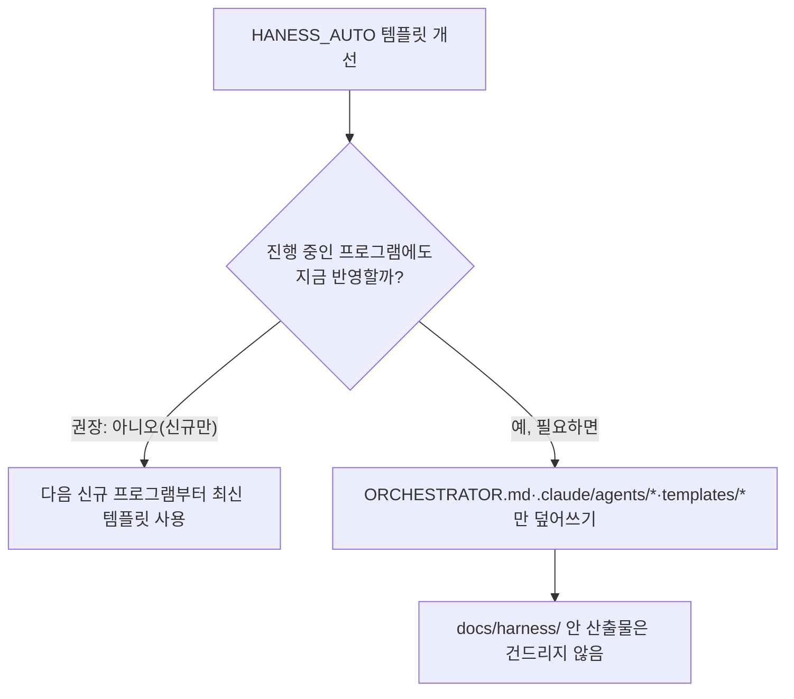
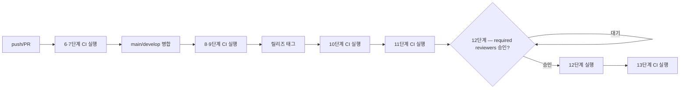
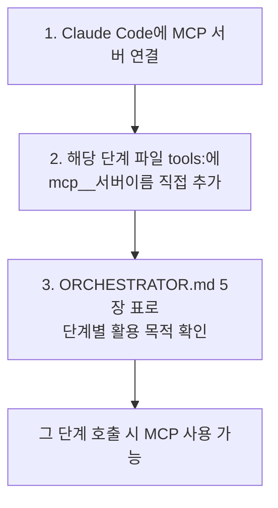
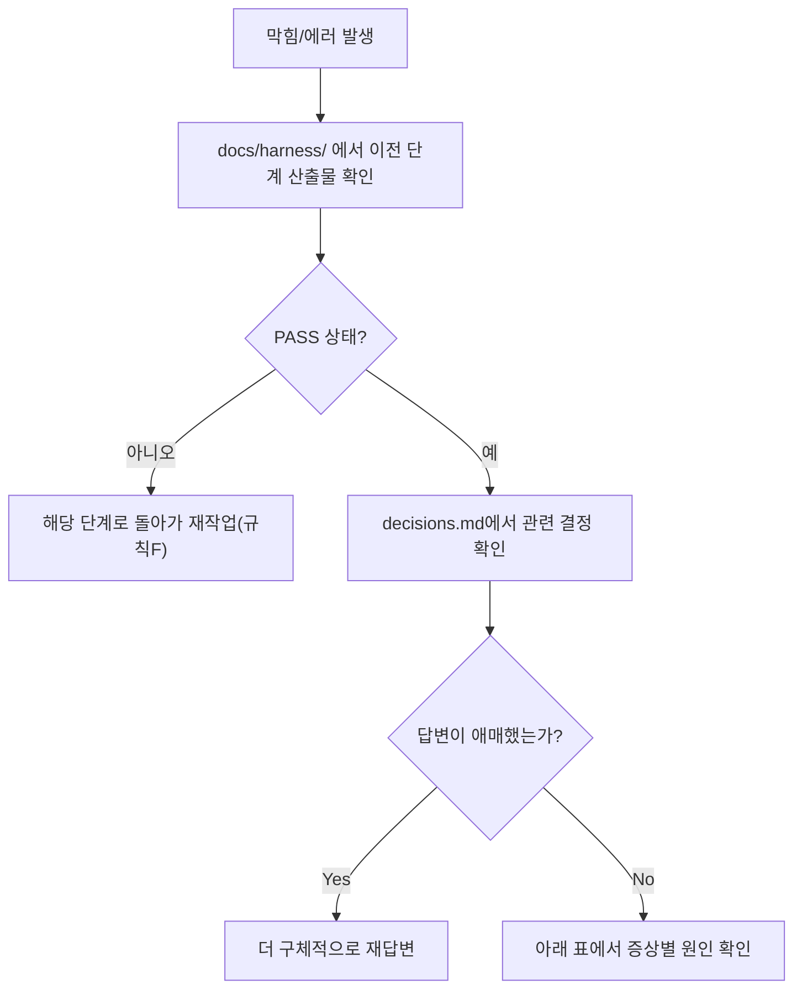

# 사용 가이드 — 이 하네스로 여러 프로그램 만들기

20년차 기준으로, 쉽고 상세하게 정리했다. 이 문서 하나만 읽으면 실제로 손을 움직일 수 있어야 한다는 원칙으로 썼다.

---

## 0. 30초 핵심 개념

- **`HANESS_AUTO`(지금 이 저장소) = 템플릿 원본.** 여기서 직접 프로그램을 만들지 않는다.
- **프로그램 1개 = 새 폴더/새 git 저장소 1개.** 템플릿을 복사해서 시작한다.
- **`docs/harness/` 폴더 = 그 프로그램의 진행 상태 그 자체.** 기획서, 설계서, 테스트 결과, 의사결정 로그가 전부 여기 쌓인다.
- **기본 동작은 "셀프 체이닝"이다.** 처음에 목표를 한 번 자세히 알려주면, 그 다음부터는 매 단계마다 "다음 단계 진행해줘"라고 말할 필요 없이 Claude가 알아서 1→2→3→…으로 이어간다. 사용자가 할 일은 사실상 하나뿐이다: **정말 판단이 필요한 순간(질문, 배포 승인, 권장 검토 지점)에만 응답한다.** 나머지(문서 작성, 검증, 파일 생성, 다음 단계 호출)는 전부 Claude가 알아서 한다.
- **1단계 시작 전, MCP 연동 여부를 딱 한 번 물어본다 (필수 절차).** 쓸지 말지는 사용자 자유이고 안 써도 하네스는 완전히 동작하지만, "물어보는 것" 자체는 매 신규 프로젝트마다 생략되지 않는다.

---

## 1. 프로그램 1개를 새로 시작하는 절차

### Step 1 — 새 프로젝트 폴더 준비
```bash
mkdir -p "C:\big21\vibe-coding\내프로그램이름"
```
그 다음 이 템플릿(`ORCHESTRATOR.md`, `.claude/agents/`, `templates/`, `automation/`, `CLAUDE.MD`)을 새 폴더로 복사한다. (Claude Code 세션에서 "이 하네스 템플릿을 `C:\big21\vibe-coding\내프로그램이름`에 복사해줘"라고 말만 하면 된다.)

> **왜 매번 새 폴더인가?** `docs/harness/traceability.md`, `decisions.md` 같은 상태 파일이 프로그램마다 독립적이어야 하기 때문이다. 두 프로그램을 한 폴더에서 진행하면 요구사항 추적과 의사결정 로그가 뒤섞여 하네스 전체가 무의미해진다. **이건 타협하면 안 되는 원칙이다.**

### Step 2 — 그 폴더에서 세션 시작
Claude Code에서 새 폴더로 이동(`change_directory`)하면, `CLAUDE.MD`가 자동으로 `ORCHESTRATOR.md`를 읽으라고 안내한다. 사람이 매번 규칙을 복붙할 필요가 없다.

### Step 3 — (필수) MCP 연동 여부 질문 — 1단계 시작 전 반드시 한 번
`ORCHESTRATOR.md` 4장 3번에 따라, Claude는 1단계(`01-trend-analyst`)를 부르기 전에 **반드시** 아래와 같이 먼저 물어본다. 이건 매 신규 프로젝트마다 생략되면 안 되는 절차다.

> Claude: "이 프로젝트에서 MCP(GitHub/GitLab, Playwright, Sentry/Datadog, Slack/Teams 등)를 연동해서 쓰시겠습니까? 연동하면 기획·E2E테스트·배포모니터링·배포승인 알림 단계에서 실측 근거를 쓸 수 있습니다(연동 안 해도 하네스는 100% 정상 동작합니다). 연동을 원하시면 어떤 서버를 쓰실지 알려주세요."

**여기서 실제로 강제되는 것은 "물어보는 행위"뿐이다.** 사용자의 답은 완전히 자유다:
- **"안 할래요" / 답 없음** → 그대로 Step 4로 진행. MCP 없이도 아무 문제 없다.
- **"할래요, GitHub랑 Slack 연동할게요"** 같은 답 → Claude가 (1) 그 MCP 서버가 실제로 연결돼 있는지 확인하고, 없으면 먼저 연결해달라고 안내한 뒤, (2) 연결이 확인되면 해당 단계 에이전트 파일(예: `.claude/agents/02-planning-writer.md`)의 `tools:` 줄에 `mcp__github` 같은 이름을 직접 추가해준다. 어떤 단계에 어떤 MCP가 맞는지는 `ORCHESTRATOR.md` 5장 표를 참고한다.

이 질문과 답은 `docs/harness/decisions.md`에 자동으로 기록된다.



### Step 4 — 처음 한 번만 목표를 자세히 요청 (이게 끝이다)
특별한 명령어 문법은 없다. 그냥 대화하듯, 최대한 구체적으로 한 번 말하면 된다. (Step 3의 MCP 질문 답변과 함께 이 메시지에서 같이 말해도 된다.)

> 예시: "1단계부터 쭉 진행해줘. 도메인은 소규모 학원 출결관리 서비스야. 타깃은 학원 원장님들. MCP는 연동 안 할게. 정말 판단이 필요한 질문이나 배포 승인 시점 아니면 멈추지 말고 계속 이어서 진행해줘."

이러면 Claude가 `01-trend-analyst`부터 시작해서, PASS 확인 → 다음 단계 호출을 스스로 반복한다. 각 단계가 끝날 때마다 "○단계 완료, 요약: …" 정도로 짧게 보고하고 바로 다음으로 넘어간다. 사용자는 타이핑할 필요 없이 진행 상황만 지켜보면 된다.

**다시 확인이 필요한 순간은 정확히 세 가지뿐이다** (Step 3의 MCP 질문은 프로젝트 시작 시 1회성 절차라 이 목록과 별개다):
1. 에이전트가 진짜 판단 불가능한 질문을 던졌을 때 (규칙 A — 이건 절대 자동화 못 함, 대충 넘기면 나중에 더 큰 재작업으로 돌아옴)
2. 12단계 실제 배포 직전 승인 (규칙 E — 시스템상 강제, 우회 불가)
3. (선택) "이 산출물은 꼭 검토하고 싶다"고 사용자가 미리 지정한 지점 — 예: "2단계 기획서 나오면 나한테 보여주고 잠깐 멈춰줘" 라고 처음 요청에 넣으면 그 지점에서만 멈춘다

이 세 가지가 아니면, 5~7단계(개발→단위테스트→통합테스트)가 작업 단위 수만큼 반복되는 것도, 8~11단계(전체테스트→보안→배포테스트→문서화/인수인계)로 이어지는 것도 전부 자동으로 진행된다. **12단계 배포만은 예외 없이 명확한 승인을 물어본다** ("지금 프로덕션에 배포해도 됩니다" 같은 구체적 문구가 있어야 함). 승인하면 배포 후 자동으로 13단계(배포후 검증)까지 이어진다.

**참고용 다이어그램(최종 근거는 위 Step 1~4 설명):**


### (참고) 세밀하게 통제하고 싶다면 — 수동 모드
셀프 체이닝 대신 한 단계씩 직접 지시하고 싶다면 그것도 가능하다:
```
"2단계(기획서)만 진행해줘, 끝나면 멈춰줘"
"3단계 설계서 작성해줘"
```
이렇게 매번 명시하면 그 단계만 하고 멈춘다. 기본값(셀프 체이닝)이 편하지만, 강제는 아니다.

---

## 2. 질문이 왔을 때 (규칙 A)

에이전트가 "질문 목록"을 내놓으면, 이건 **귀찮은 게 아니라 하네스가 제대로 작동하고 있다는 신호**다. 대충 답하면 그 위에 3~4단계가 더 쌓인 뒤에 문제가 터진다 — 그때 되돌아가는 비용이 훨씬 크다(규칙 F). 특히 아래 유형의 질문은 신중하게 답할 것:
- 유료/무료 모델, 데이터 구조 방향 같은 **비가역적 결정**
- 프레임워크/DB 선택
- 배포 승인

답변은 자동으로 `docs/harness/decisions.md`에 기록되므로, 나중에 "왜 이렇게 정했었지?"를 다시 찾아볼 수 있다.



---

## 3. 진행 상태를 확인하는 법

특정 단계가 끝났는지 헷갈리면:
```
"지금 어느 단계까지 끝났는지 정리해줘"
```
또는 직접 `docs/harness/` 폴더를 열어본다. 각 파일 맨 아래 "내부 검증" 섹션에 PASS/FAIL이 적혀 있고, `docs/harness/traceability.md`를 보면 요구사항별로 어디까지 진행됐는지 한눈에 보인다.

---

## 4. 여러 프로그램을 동시에/순차로 만들 때

### 권장 폴더 구조
```
C:\big21\vibe-coding\
├── HANESS_AUTO/              ← 템플릿 원본 (계속 개선되는 곳)
├── 프로그램A/                 ← 템플릿 복사본 + 실제 진행 상태
├── 프로그램B/                 ← 템플릿 복사본 + 실제 진행 상태
└── 프로그램C/
```
각 프로그램은 **완전히 독립된 git 저장소**여야 한다. 절대 한 저장소 안에서 여러 프로그램의 `docs/harness/`를 같이 두지 않는다.

### 템플릿(HANESS_AUTO)이 나중에 개선되면?
이미 진행 중인 프로그램A/B/C에는 자동으로 반영되지 않는다(각자 복사본이므로). 개선된 `.claude/agents/*.md`, `ORCHESTRATOR.md` 등을 필요한 프로그램에 다시 복사해줘야 한다. 진행 중인 프로그램의 `docs/harness/` 안 내용(이미 만든 산출물)은 건드리지 않고, 규칙/에이전트 정의 파일만 덮어쓰면 된다.

> 20년차 조언: 템플릿을 자주 바꾸고 싶어지는 초반 몇 개 프로그램 동안은, 완전히 새 프로그램을 시작할 때만 최신 템플릿을 복사하고, **이미 진행 중인 프로그램은 중간에 규칙을 바꾸지 않는 것**을 권장한다. 파이프라인 중간에 규칙이 바뀌면 이전 산출물과의 정합성이 깨진다.



---

## 5. 자동화(선택) — 손으로 안 하고 싶을 때

**주의: 이건 위에서 설명한 "셀프 체이닝"과 다른 것이다.** 셀프 체이닝은 "대화 세션 안에서 Claude가 단계를 이어가는 것"이고, 여기서 말하는 자동화는 "사람이 대화하지 않아도 CI/git hook이 대신 트리거하는 무인 실행"이다. 셀프 체이닝은 지금 당장 아무 설정 없이 쓸 수 있고, 아래 CI 자동화는 별도 설정(GitHub Actions, 시크릿 등)이 필요하다.

`automation/README.md`에 정리되어 있다. 요약:
- 5~11, 13단계는 CI(GitHub Actions)나 git hook으로 자동 실행 가능 (`automation/run-harness-agent.sh`가 실제로 동작함)
- 1~4단계는 일부러 자동화 안 함 — 비즈니스 판단이 들어가는 단계라 사람이 트리거해야 안전
- 12단계(실제 배포)는 자동화해도 **사람 승인 없이는 절대 실행 안 되도록** GitHub Environments 보호 규칙이 걸려 있음



---

## 5-1. MCP(선택) 실제로 연결해서 쓰고 싶을 때

MCP(예: GitHub, Playwright, Sentry, Slack)는 **아무것도 안 해도 하네스가 돌아가는 데는 지장이 없다.** 다만 연결해서 특정 단계의 판단 근거를 실측으로 강화하고 싶다면:

1. Claude Code에 그 MCP 서버를 먼저 연결한다 (프로젝트/사용자 설정에서 MCP 서버 추가 — 서버마다 인증 방식이 다르니 해당 MCP 문서를 따른다).
2. 연결한 MCP를 쓰게 하려는 **그 단계의 에이전트 파일**(예: `.claude/agents/08-full-system-tester.md`)을 열어, frontmatter의 `tools:` 줄 끝에 `mcp__<연결한 서버 이름>`을 직접 추가한다.
   ```
   tools: Read, Write, Bash, Grep, Glob, mcp__playwright
   ```
3. 어떤 단계에 어떤 MCP가 도움이 되는지는 `ORCHESTRATOR.md` 5장 표를 참고한다.

**주의:** 2번을 건너뛰고 연결만 해두면 그 에이전트는 여전히 MCP를 못 쓴다(`tools:`가 화이트리스트라서). 반대로 연결하지도 않은 MCP 이름을 `tools:`에 미리 적어두면 그 단계 호출 자체가 실패한다 — 반드시 "먼저 연결 → 그 다음 tools:에 추가" 순서를 지킨다.



처음 만드는 프로그램이라면 자동화는 나중에 붙이고, **처음 한두 개는 반드시 수동으로 전체 파이프라인을 한 번 완주해보길 권장한다.** 그래야 각 단계에서 무슨 일이 일어나는지 감이 잡히고, 자동화했을 때 뭔가 잘못됐을 때 원인을 알아챌 수 있다.

---

## 6. 막혔을 때 체크리스트

**일반적인 문제 해결 흐름(참고용):**


| 증상 | 원인 / 조치 |
|------|-------------|
| 다음 단계 에이전트가 "입력을 채울 수 없다"고 함 | 이전 단계가 PASS가 아니거나 산출물이 없음 → `docs/harness/`에서 확인 |
| 같은 질문을 반복해서 물어봄 | 답변이 `decisions.md`에 제대로 기록됐는지 확인, 애매하게 답했으면 더 구체적으로 재답변 |
| 8단계에서 커버리지 100% 안 됨 | `docs/harness/traceability.md`에서 어느 REQ-ID가 비어있는지 확인, 해당 work unit을 5~7단계로 되돌려 처리 |
| 9단계에서 Critical 결함 | 절대 그냥 넘어가지 말 것. 근본 원인이 3단계 설계 문제면 규칙 F에 따라 설계서부터 다시 |
| 12단계가 실행이 안 됨 | 정상. 승인 문구를 명확하게 줘야 함 ("배포 승인합니다" 같은 애매한 것 말고 구체적으로) |
| 12단계 입력 계약에서 막힘 (11단계 문서 미완성) | 정상. 운영 Runbook·사용자/관리자 매뉴얼·API 문서 4종이 "작성 완료" 또는 근거 있는 "해당 없음"으로 확정되어야 배포로 넘어감 |
| CI에서 `HARNESS_BLOCKED` 로그 | 무인 환경이라 질문에 답할 사람이 없어서 멈춘 것. 로그의 질문을 읽고 답한 뒤 재실행(re-run) |

---

## 7. 바로 복붙해서 쓸 수 있는 예시 대화

### 기본형 — 셀프 체이닝 (권장)
```
1단계부터 쭉 진행해줘.
도메인은 [여기에 서비스 주제], 타깃은 [여기에 대상 사용자].
정말 판단이 필요한 질문이나 12단계 배포 승인 시점이 아니면 멈추지 말고 계속 이어서 진행해줘.
```
이 한 메시지 이후로는 사용자가 따로 칠 말이 거의 없다. 진행 상황은 계속 보고받고, 진짜 확인이 필요할 때만 질문을 받는다.

### 특정 지점에서 검토하고 싶을 때 (선택 옵션을 위 메시지에 추가)
```
단, 2단계 기획서가 나오면 거기서 한 번 멈추고 나한테 보여줘. 내가 확인하면 이어서 진행해줘.
```

### 진행 상황이 궁금할 때 (아무 때나)
```
지금까지 어느 단계까지 끝났는지 traceability.md 기준으로 정리해줘.
```

### 수동 모드로 한 단계만 콕 집어 실행하고 싶을 때
```
3단계 설계서만 다시 진행해줘. (2단계 답변을 방금 수정했어)
```
```
지금 프로덕션 배포 승인합니다. 12단계 진행해줘.
```
