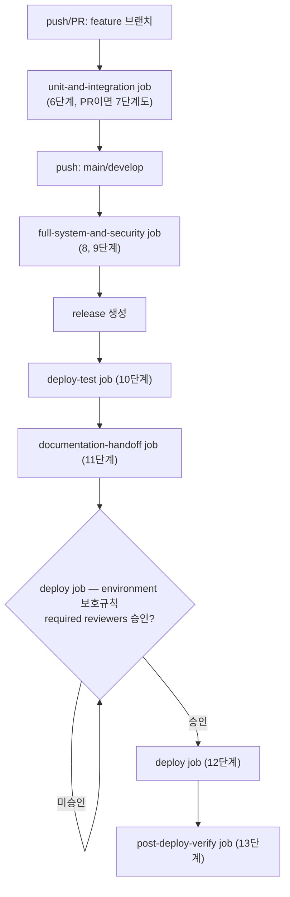
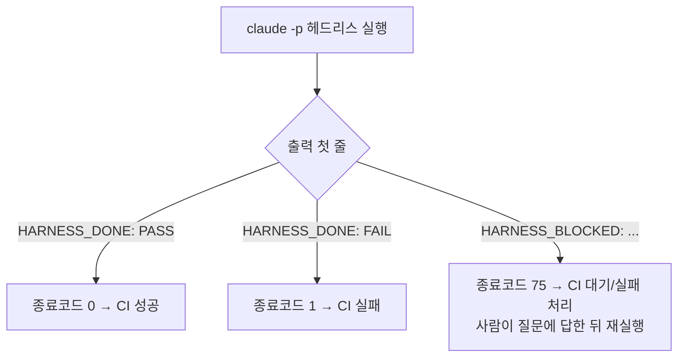
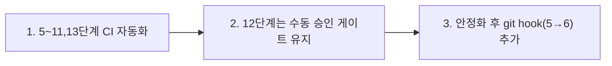

# 자동화 트리거 (ORCHESTRATOR.md 3장 참고)

이 폴더는 13단계 하네스를 사람이 수동으로 `Agent` 도구를 호출하는 대신, 이벤트에 반응해 자동으로 실행하기 위한 것이다. `run-harness-agent.sh`는 Claude Code CLI를 실제로 헤드리스 호출하는 동작하는 스크립트다 (더미 아님). 다만 아래 사전 준비물이 채워져 있어야 실제로 동작한다.

## 사전 준비물 (필수)
- **Claude Code CLI**가 실행 환경(로컬/CI 러너)에 설치되어 있고 `--agent` 플래그를 지원하는 버전일 것. `claude --version` / `claude update`로 확인. `--agent` 플래그는 비교적 최근 기능이라, 오래된 버전에는 없을 수 있다 — 없다면 업데이트하거나 `.claude/agents/<stage>.md` 내용을 프롬프트에 직접 붙여넣는 방식으로 스크립트를 수정해야 한다.
- **인증**: CI에서는 보통 `ANTHROPIC_API_KEY` 환경변수/시크릿으로 인증한다. 조직 정책에 따라 다를 수 있으니, 실제로 붙이기 전에 그 러너 환경에서 `claude -p "hi"`가 동작하는지 먼저 확인할 것.
- **`jq` 또는 `node`** 중 하나 — `claude -p --output-format json` 결과에서 최종 텍스트를 뽑아내는 데 사용.

## 파일
- `run-harness-agent.sh` — 실제 실행 스크립트. `claude -p "..." --agent <stage> --output-format json --allowedTools "<해당 에이전트의 tools:>" --permission-mode dontAsk --permission-prompts none` 로 호출하고, 결과 첫 줄이 `HARNESS_DONE: PASS`/`HARNESS_DONE: FAIL`/`HARNESS_BLOCKED:` 중 무엇인지로 종료 코드를 결정한다 (0/1/75). 사용법과 종료 코드 의미는 파일 상단 주석 참고.
- `harness-janitor.sh` — 규칙 K(중단-안전 정리) 점검 스크립트. `.harness-tmp/`와 레거시 위치(저장소 루트의 `.venv_*`, `venv/` 등)에 검증용 임시 아티팩트가 남아있는지 스캔한다. 기본(`--check`)은 읽기 전용 점검(잔여물 있으면 종료코드 1), `--clean`은 `.harness-tmp/` 안만 실제로 삭제한다 — 그 밖의 위치는 사용자 작업물일 가능성이 있어 자동 삭제하지 않고 목록만 안내한다(규칙 A/K5). 세션/파이프라인 재개 전, 그리고 커밋 전에 실행하는 것을 권장한다.
- `github-actions-harness.yml` — 위 스크립트를 호출하는 GitHub Actions 예시. 브랜치/태그 이벤트에 따라 5~11, 13단계를 매핑하고, 12단계(배포)는 GitHub Environments의 `required reviewers` 보호 규칙으로 사람 승인 없이는 절대 실행되지 않도록 게이트를 건다 (**이 environment 보호 규칙은 GitHub 저장소 Settings에서 직접 등록해야 하며, 파일만으로는 걸리지 않는다**).
- `git-hooks/post-merge.sample` — work unit 브랜치가 로컬에 병합됐을 때 6단계(단위테스트)를 실제로 실행하는 훅. `.git/hooks/post-merge`로 복사 후 실행권한을 줘야 활성화된다 (파일명이 `.sample`인 동안은 git이 무시함).
- `git-hooks/pre-commit.sample` — 커밋 직전 `harness-janitor.sh --check`를 실행해, 검증용 임시 아티팩트가 스테이징되려는 걸 사전에 경고하는 훅 (규칙 K). `.git/hooks/pre-commit`으로 복사 후 실행권한을 줘야 활성화된다.

**참고용 다이어그램 — 실제 `github-actions-harness.yml` job 흐름(최종 근거는 위 설명과 그 파일 자체):**

**참고용 다이어그램 — `run-harness-agent.sh` 종료 코드 판정:**

## 아직 구현되지 않은 것 (알고 있어야 할 한계)
- **1~4단계(트렌드분석/기획/설계/디자인서)는 자동 트리거가 없다.** 의도적 설계다 — 이 상류 단계는 비즈니스 판단이 들어가므로 사람이 트리거·검토하는 것을 권장한다.
- 여러 work unit이 동시에 진행 중일 때 "지금 몇 번째까지 끝났는지" 판단은 `docs/harness/` 파일 존재 여부로 에이전트가 스스로 스캔하게 위임했다 (스크립트가 별도 상태 DB를 관리하지 않음). 프로젝트 규모가 커지면 이 방식의 한계(스캔 시간, 동시 실행 충돌 등)를 재검토할 것.

## 절대 자동화하면 안 되는 것 (다시 강조)
- **12단계 실제 배포 실행**은 CI가 아무리 정상이어도 사람의 명시적 클릭/승인 없이 실행되게 만들지 않는다 (규칙 E).
- **규칙 A의 질문 목록**이 발생하는 상황은 자동 파이프라인을 강제로 계속 돌리지 않고, 사람에게 알림을 보내고 그 단계에서 대기 상태로 멈춘다 (예: CI 잡을 실패시키지 말고 "대기(pending)" 상태로 두고 Slack/이메일 등으로 알림).

## 실제 적용 순서 (권장)
1. 먼저 5~11, 13단계를 CI에서 자동 실행하도록 연결한다 (질문 발생 시 정지하는 로직 포함).
2. 12단계는 마지막까지 수동 승인 게이트로 남겨둔다.
3. 파이프라인이 안정화된 후에만 git hook 기반의 로컬 자동화(5→6)를 추가로 도입한다.

