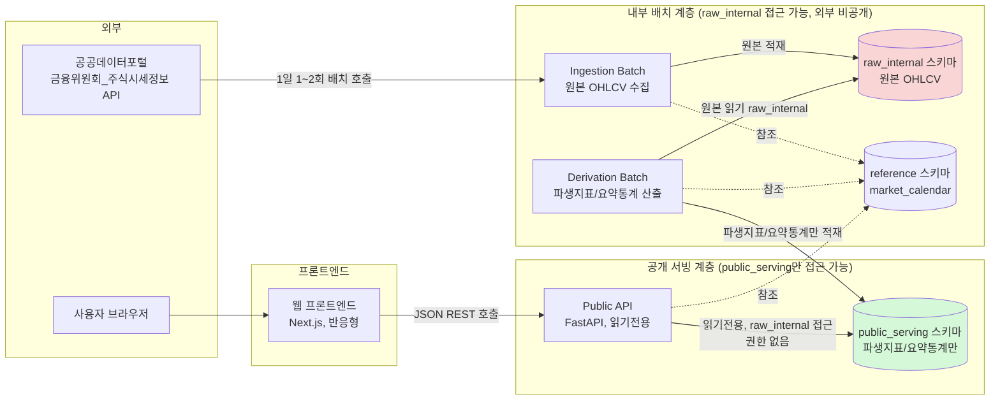

# 03. 시스템 설계서 — 국내 주식(코스피/코스닥) 조건 기반 스크리닝 정보 웹서비스

- 작성 에이전트: 03-system-designer
- 작성일: 2026-09-14
- 버전: v4 (규칙 F 피드백 루프 반영 — 6단계(단위테스트)가 UNIT-01 검증 중 발견한 근본 결함 DEF-001(High, `get_last_trading_day()` 의사코드의 주석-조건식 내적 모순) 해소, 내부 검증 2회 반영, PASS)
- 입력: `docs/harness/02-planning.md` (v3, PASS), `docs/harness/04-ux-design.md` (v2, PASS), `docs/harness/units/unit-01-test.md`(DEF-001), `docs/harness/traceability.md`, `docs/harness/decisions.md` (DEC-001~017, 본 개정으로 DEC-018 추가)

---

## 0. 설계 착수 전 확인 사항 (요약)

이 설계서는 `02-planning.md` v3가 이미 규칙 F 피드백 루프를 거쳐 확정한 전제를 그대로 승계한다. 즉:

- 데이터소스(공공데이터포털 "금융위원회_주식시세정보" API) 채택 자체는 유지하되, **실제 약관이 "상업적 목적 여부와 상관없이 제3자 재배포 엄격 금지"임이 이미 확인되어 있다.** 이 설계서는 그 약관 문구를 다시 조사하지 않는다.
- §4-3 "데이터 가공 원칙" 5개 항목(원본 OHLCV 재게시 금지, 파생 지표만 노출, 근거 지표 위주 표시, 요약 통계 중심, 법적 문제 미확정)은 **본 설계서의 모든 절에 강제 반영 대상**이다. 이 원칙을 "코드 리뷰 때 조심하기"로 넘기지 않고, 아래 §1에서 아키텍처 계층 분리로 강제한다.
- REQ-022(KRX 공식 확인/법률 자문 완료 게이트)는 코드 구현 대상이 아니다. 이 설계서에서는 "구현할 기능"으로 다루지 않으며, §7과 §8에서 12단계 배포 승인 체크리스트 항목으로만 명시한다.
- REQ-016(로그인/인증)은 Out-of-Scope이므로, 이 설계서는 인증/인가 모델을 "설계하지 않기로 결정"한 근거만 §6에 명시하고 별도 인증 시스템을 설계하지 않는다.

### 0-1. v3 개정 사유 (규칙 F 피드백 루프)

4단계(UX설계) 에이전트가 화면 설계 중 이 설계서(v2)의 데이터 모델/API 명세를 화면 요구사항 관점에서 대조하다가 7가지 기술 스펙 공백을 발견해 `04-ux-design.md` §7-1(Q1~Q7)에 "확인 필요 항목"으로 문서화했다. 이는 사업적 판단이 아니라 **설계 완성도 문제**이므로, 사용자에게 되묻지 않고 아키텍트(본 에이전트)가 직접 확정한다. 각 항목의 확정 내용은 아래 각 절(§3-1-1, §3-2, §4-2)에 반영했고, 근거는 `decisions.md` DEC-011~016에 기록했다. 요약:

| # | 공백 | 확정 결과 | 상세 위치 |
|---|---|---|---|
| Q1 | `market` 필드 의미 중복(상장시장 vs 거래소 세션) | `stock_master`/`derived_metrics_daily`/`market_summary_daily`의 `market`은 **KOSPI/KOSDAQ(상장시장)**, `raw_ohlcv`/`market_calendar`의 `market`은 **KRX/NXT(거래소 세션)**로 완전히 분리·명명 | §3-1-1, DEC-011 |
| Q2 | `matched_metrics`에 `sort_by` 전용 지표 포함 여부 불명 | 필터 조건 지표 ∪ `sort_by` 지표를 항상 포함 | §4-2 `GET /screen`, DEC-013 |
| Q3 | `GET /screen`에 시장 구분 필터 없음 | `market`(KOSPI\|KOSDAQ\|ALL, 기본 ALL) 파라미터 추가 | §4-2 `GET /screen`, DEC-012 |
| Q4 | `return_rank_pct` 방향성 미정의 | "값이 작을수록 상위"로 확정, 계산식·예시 명시 | §3-2, DEC-014 |
| Q5 | PER/PBR/시가총액 가공 방식 미확정 | 원시값(`*_raw`, 비노출)과 백분위(`*_percentile`, 노출)를 분리 저장하는 구조로 확정 | §3-2, DEC-014 |
| Q6 | 거래대금 통화 단위 미명시 | KRW(원)로 확정, 필드명에 `_krw` 반영 | §3-2, §4-2, DEC-015 |
| Q7 | `market-summary` market 생략 시 동작 미정의 | 기본값 `ALL`, Derivation Batch가 `ALL` 행을 직접 집계해 저장(클라이언트 합산 불필요) | §3-2, §4-2, DEC-016 |

### 0-2. v4 개정 사유 (규칙 F 피드백 루프 — 6단계 발견 DEF-001)

6단계(단위테스트) 에이전트가 UNIT-01(`get_last_trading_day()` 구현체)을 검증하는 과정에서, 이 설계서(v3) §3-3의 의사코드 자체에 내적 모순이 있음을 발견했다(`docs/harness/units/unit-01-test.md` DEF-001, High). 요지: §3-3 주석은 "오늘 마감 전 데이터는 존재할 수 없으므로 오늘을 후보에서 제외한다"고 설명하면서도, 실제 조건식은 `market_open_time(market)`(개장 시각)과 비교하도록 되어 있어 개장~마감 사이(장중) 내내 "오늘"이 직전 거래일로 잘못 반환된다. 5단계 개발자는 이 조건식을 문자 그대로 구현했고(리터럴 구현이 잘못이 아니라 설계서 자체가 잘못), 6단계가 실제 코드로 경계 시각을 스윕해 이를 재현·확인했다(TC-008~010). 나아가 §7-2에 서술된 배치 신선도 알림 cron(직전 거래일 기대값과 실제 발행 배치를 비교. **참고**: `decisions.md` DEC-017과 6단계 산출물은 이를 "§5-4"로 지칭했으나 실제 서술 위치는 §7-2이며, 이번 v4에서 표기를 바로잡는다)에 이 결함 있는 함수를 그대로 연결하면 **매 거래일 장중 내내(대략 09:00~15:30 KST) 예외 없이 "데이터 지연" 오탐 알림이 발생**하는 운영 결함으로 이어짐이 함께 확인되었다.

이는 사업적 판단이 아니라 이미 확정된 설계 의도(§3-3 주석, §7-2 cron 서술)와 조건식 간의 내적 모순을 바로잡는 문제이므로, 사용자에게 되묻지 않고 아키텍트가 직접 확정한다(근거: `decisions.md` DEC-018). 이번 v4 개정 내용:

1. `get_last_trading_day()`의 "오늘 제외" 판단 기준을 **개장 시각이 아니라 마감 시각**(`reference.market_calendar.session_close_at`, 시장별로 이미 존재하는 컬럼)으로 전면 재작성했다(§3-3). "개장 시각" 개념 자체를 함수에서 제거했다 — 5단계가 설계서 근거 없이 임시로 도입했던 `market_open_time` 상수(KRX 09:00/NXT 08:00, `unit-01-note.md` 편차 항목1)는 이번 수정으로 근본적으로 불필요해지며, 재구현 시 제거 대상이다.
2. KRX 세션의 "마감"은 정규장 마감(통상 15:30)으로, NXT 세션의 "마감"은 애프터마켓 마감(통상 20:00)으로 확정했다. KRX 시간외단일가(18:00 마감)는 별도 판단 기준으로 사용하지 않는다 — 근거는 §3-3 본문 및 `decisions.md` DEC-018 참조.
3. §7-2의 배치 신선도 알림 cron 서술을 이 수정과 정합되게 갱신하고, cron 실행 시각을 장중과 겹치지 않게 스케줄링해야 한다는 운영 제약을 명시했다.
4. §3-3에 실행 가능한 pseudocode와 경계 시각별 기대 반환값 진리표를 추가해, 향후 재구현 시 동일한 주석-조건식 불일치가 재발하지 않도록 했다.
5. `traceability.md` REQ-005 비고를 갱신했고, `decisions.md`에 DEC-018을 추가했다. 내부 검증 2회 재수행 결과는 `verify-log_03-system-design.md` v4 항목 참조.

이 개정은 UNIT-01의 FAIL 판정(REQ-005)을 해소하기 위한 선행 조건이며, 6단계는 이 v4를 입력으로 UNIT-01 재검증을 수행해야 한다(이번 v4 문서 자체의 책임 범위 밖).

---

## 1. 아키텍처 개요

### 1-1. 설계 목표와 강제 원칙

이 서비스의 아키텍처를 결정하는 가장 중요한 제약은 기능 요구사항이 아니라 **데이터 라이선스 제약(§4-3)**이다. "원본 시세를 그대로 노출하지 않는다"를 개발자의 주의력에 맡기면, 화면 하나·API 응답 하나만 실수해도 전체 서비스의 존립 근거(REQ-022 통과 여부와 무관하게 이미 위반)가 무너진다. 따라서 이 원칙은 **런타임에 물리적으로 위반이 불가능하도록** 강제한다. 구체적으로 3중 방어선을 둔다.

1. **스키마 분리(1차 방어, 가장 강력)**: 원본 OHLCV는 `raw_internal` 스키마에만 존재하고, `public_serving` 스키마에는 시가/고가/저가/종가/거래량 원문 컬럼이 **아예 존재하지 않는다.** 개발자가 실수로 "전체 컬럼 SELECT"를 해도 원본 값을 반환할 수 없다 — 컬럼 자체가 없기 때문이다.
2. **DB 권한 분리(2차 방어)**: 공개 API를 서비스하는 DB 계정(`api_service` role)에는 `raw_internal` 스키마에 대한 GRANT를 아예 부여하지 않는다(`REVOKE ALL`, 기본 권한 없음). 코드에 버그가 있어 raw 테이블을 쿼리하는 문장을 실수로 작성해도 DB 레벨에서 권한 오류로 실패한다.
3. **프로세스/배포 분리(3차 방어)**: 원본 수집·가공(배치)과 공개 API 서빙은 **별도의 배포 단위(컨테이너/프로세스)**로 나눈다. 공개 API 프로세스는 `raw_internal` DB 자격증명 자체를 환경변수로 갖지 않는다(주입되지 않음). 즉 코드 저장소 접근 권한이 있어도, 공개 API 런타임 환경에는 raw DB에 접속할 수단 자체가 없다.

이 세 겹 방어 위에 4차로 **코드 리뷰 체크리스트**(§9 작업단위 완료 조건에 이미 기획서가 명시)를 얹는다. 코드 리뷰는 "마지막 안전망"이지 "유일한 안전망"이 아니다.

**v3 참고**: §3-2에서 PER/PBR/시가총액에 도입한 `*_raw`(비노출)/`*_percentile`(노출) 이원 컬럼 구조(Q5, DEC-014)는 이 3중 방어의 1차 방어(스키마 분리) 원칙을 재무지표 영역까지 일관되게 확장 적용한 것이다 — `*_raw` 컬럼은 `public_serving`에 물리적으로 존재하더라도 API 응답 화이트리스트(§4-3)에서 항상 제외되므로, "노출 금지 값이 스키마에 없는 것"과 "노출 금지 값이 스키마에는 있지만 직렬화 경로가 없는 것" 두 가지를 조합해 방어한다(전자가 이상적이나, 스크리닝 필터링이라는 기능 요구 때문에 원시값을 DB에 두어야만 하는 이 케이스는 후자로 대응).

### 1-2. 컴포넌트 구성



- **Ingestion Batch**: 공공데이터포털 API를 호출해 원본 OHLCV를 `raw_internal.raw_ohlcv`에 적재한다. 이 컴포넌트만 외부 데이터 소스와 통신한다. 재시도/서킷브레이커는 §5 참조.
- **Derivation Batch**: `raw_internal`을 읽어 등락률 순위·이동평균 괴리율·거래량 이상치 스코어(REQ-002), 조건 스크리닝용 지표(REQ-003), 시장 요약 통계(REQ-004)를 계산해 `public_serving`에 쓴다. 시장 요약 통계는 KOSPI/KOSDAQ 각각 및 전체 통합(`ALL`)까지 거래일당 총 3개 행으로 직접 산출한다(§3-2, v3 개정 — Q7). 이 컴포넌트가 **유일하게 raw→public 경계를 넘나드는 지점**이므로, 여기서 나가는 컬럼 목록을 코드 리뷰·CI 린트(§9)로 고정 검사한다.
- **Public API**: `public_serving`과 `reference`(캘린더)만 읽는다. 무상태(stateless), 인증 없음(REQ-016 Out-of-Scope, REQ-009 불특정 다수 원칙).
- **웹 프론트엔드**: Public API만 호출한다. 원본 데이터 소스 API를 직접 호출하지 않는다(라이선스 준수를 위해 서버 사이드에서만 원본을 다루고, 클라이언트는 가공 결과만 받도록 강제).

### 1-3. 배포 단위 (모노레포, 4개 독립 배포 아티팩트)

```
/services
  /ingestion_batch    # raw_internal 쓰기 권한 DB 계정 사용, 공공데이터포털 API 호출 전담
  /derivation_batch    # raw_internal 읽기 + public_serving/reference 쓰기 권한 DB 계정 사용
  /public_api          # public_serving/reference 읽기 전용 DB 계정만 사용. raw_internal 자격증명 미주입
/frontend              # public_api만 호출
/shared                # 캘린더 계산 유틸, 응답 스키마 정의 등 (raw 데이터 모델 코드 없음)
```

각 서비스는 별도 컨테이너 이미지로 빌드·배포된다(단일 모놀리식 프로세스로 합치지 않는다 — 합치면 "프로세스 분리" 방어선이 무의미해짐). 다만 초기 규모(동시 사용자 수백 명 이하, §8-A3)를 감안해 오케스트레이션은 쿠버네티스 같은 과설계 대신 단일 VM/PaaS 위에서 컨테이너 3~4개를 `docker compose`로 운영하는 수준으로 충분하다(§8 트레이드오프에서 재론).

---

## 2. 기술 스택 선정 및 근거

### 2-1. 요약

| 영역 | 선택 | 근거 |
|---|---|---|
| 백엔드 언어/프레임워크 | Python 3.12 + FastAPI | 배치(수집/가공)와 API를 동일 언어로 통일해 팀 인지부하 최소화. pandas/numpy 생태계가 이동평균·괴리율·이상치 스코어 등 파생지표 계산(§4-3)에 최적. FastAPI는 Pydantic 기반 요청/응답 스키마 검증이 강제되어 "원본 컬럼이 실수로 응답 스키마에 섞여 들어가는 것"을 타입 레벨에서 방지(1-1의 4차 방어와 연결). MIT 라이선스, 상용 이용 제약 없음. |
| DB | PostgreSQL 15+ | (1) 스키마+ROLE 기반 GRANT/REVOKE가 성숙해 §1-1의 2차 방어(DB 권한 분리)를 표준 기능만으로 구현 가능 — SQLite는 파일 단위 접근이라 이 요구를 만족 못함, NoSQL은 관계형 조건 조합 스크리닝(REQ-003, 다중 조건 AND/범위 쿼리)에 불리. (2) PostgreSQL 라이선스(MIT 유사 permissive)로 상용 배포 제약 없음. (3) 소규모 트래픽(§8-A3)에 단일 인스턴스로 충분, 과설계(샤딩/클러스터) 불필요. |
| ORM/마이그레이션 | SQLAlchemy 2.x + Alembic | 스키마 변경 이력 관리(버전드 마이그레이션), `public_serving`/`raw_internal`/`reference` 3개 스키마를 명시적 모델 분리로 코드 레벨에서도 구분(§1-1 4차 방어). |
| 프론트엔드 | Next.js(React) + TypeScript | 모바일 우선 반응형(REQ-013) 구현에 성숙한 생태계. 조건 스크리닝(REQ-003)의 클라이언트 상호작용(조건 조합 UI)에 SPA형 상호작용이 유리. MIT 라이선스. 정적 페이지(종목 마스터 등 저빈도 변경)는 ISR/SSG로, 스크리닝처럼 사용자 입력에 따라 달라지는 화면은 CSR로 Public API를 호출. |
| 배치 스케줄러 | OS/컨테이너 cron (예: 호스팅 플랫폼의 Scheduled Job 기능 또는 `cron` 컨테이너) | 하루 1~2회 실행되는 배치 job이 2개(수집/가공)뿐인 MVP 규모에 Airflow/Prefect 같은 워크플로 오케스트레이터는 과설계(운영 인력·인프라 비용 대비 이득 없음). `decisions.md` DEC-007 참조. 배치 job 수가 늘어나 의존관계가 복잡해지면 그때 재검토(YAGNI 원칙, 지금 필요한 것과 나중에 필요할 수도 있는 것을 구분). |
| 캐시 | 별도 캐시 레이어 없음(MVP) | 하루 1~2회만 갱신되는 데이터를 대상으로 하며, 종목 수(코스피+코스닥 약 2,500개) 규모의 `public_serving` 테이블은 PostgreSQL 인덱스만으로 응답시간 목표(§5) 달성 가능. Redis 등 도입은 실측 후 병목이 확인되면 추가(과설계 방지). |
| 호스팅 | 특정 벤더 미확정(문서 §8 참조), Docker 컨테이너 기반 이식성 확보 | 벤더 락인을 피하기 위해 컨테이너화로 추상화. 구체적 벤더(Render/Fly.io/자체 VM 등)는 10단계 배포테스트 착수 시점의 무료/저비용 옵션 재조사로 확정(가격 정책은 자주 바뀌므로 지금 확정하면 오히려 리스크). |

### 2-2. 외부 데이터/API 이용약관 확인 근거 (재확인 아님 — 승계)

- REQ-011 데이터소스(공공데이터포털 "금융위원회_주식시세정보" API): 이용약관 원문은 `02-planning.md` v3 §4-3, `decisions.md` DEC-004에 이미 전문 인용·확인 완료됨. 요약: "상업적 목적 여부와 상관없이 제3자 재배포 엄격 금지, 상업적 이용 시 KRX Data Marketplace 유료 구매 + 가공을 통한 독창적 저작물 생산 또는 간접 수익 창출 목적일 때만 허용." 이 설계서는 이 확인을 재조사하지 않고 §1의 계층 분리 아키텍처로 대응한다.
- 호출 한도(Rate Limit): 공공데이터포털 API의 일반적 트래픽 제한(신청 시 부여되는 일일 호출 건수 한도)은 2단계 문서에 구체 수치가 없다. **설계 영향**: Ingestion Batch는 하루 1~2회, 종목당 1회 호출(또는 종목 목록 일괄 조회 엔드포인트 사용) 수준으로 설계해 한도 초과 위험을 최소화하되, 실제 신청 후 발급받는 한도 수치는 5단계(개발) 착수 시 API 키 발급과 함께 재확인이 필요하다. 이는 법적 리스크가 아니라 운영 파라미터이므로 규칙 A의 "질문" 대상은 아니며, §7 운영 섹션에 "확인 필요" 항목으로 남긴다.
- 프론트엔드/백엔드 오픈소스 의존성(FastAPI-MIT, React/Next.js-MIT, PostgreSQL-PostgreSQL License, SQLAlchemy-MIT, Alembic-MIT)은 모두 permissive 라이선스로 상용 배포·재배포 제약이 없음을 확인했다. GPL 계열 등 카피레프트 라이선스 의존성은 채택하지 않았다.
- NXT(대체거래소) 관련: 채택한 공공데이터포털 API가 NXT 체결 데이터까지 포함하는지는 2단계 문서에서 확정되지 않았다(1단계 §6-2 마감 다원화 이슈는 "표기"의 정확성 문제로 다뤄졌을 뿐, "데이터 커버리지" 문제로는 조사되지 않음). **설계 판단(비차단)**: 데이터 모델(§3)에 `market` 컬럼(거래소 세션 전용, §3-1-1 참조)을 두어 KRX/NXT를 구조적으로 구분 가능하게 만들되, MVP는 KRX 정규장 데이터만 채운다고 명시적으로 가정한다. NXT 데이터 커버리지가 실제로 있는지는 5단계 착수 전 재확인 대상으로 `decisions.md`에 기록한다(DEC-010). 이 판단이 틀려도 파급 범위는 "표시 라벨 정확성" 수준이라 되돌리기 쉬우므로(스키마가 이미 market 차원을 갖고 있어 재설계 불필요) 규칙 A의 질문 대상으로 격상하지 않는다.

---

## 3. 데이터 모델

### 3-1. 스키마 구성 원칙

3개 스키마로 분리한다. **이 분리 자체가 §1-1의 1차 방어선**이다.

| 스키마 | 목적 | 쓰기 권한 | 읽기 권한 |
|---|---|---|---|
| `raw_internal` | 원본 OHLCV, 원본 재무 데이터 | `batch_worker` role만 | `batch_worker` role만 (api_service는 GRANT 없음) |
| `reference` | 휴장일 캘린더, 거래소 세션 정보 (원본 시세 데이터 아님, 재배포 제약 대상 아님) | `batch_worker` role | `batch_worker`, `api_service` 둘 다 (읽기전용) |
| `public_serving` | 파생 지표, 요약 통계, 종목 마스터, 배치 실행 이력 | `batch_worker`(derivation 단계) | `batch_worker`, `api_service`(읽기전용) |

### 3-1-1. `market` 필드 의미 표준화 (v3 개정 — 04단계 Q1 대응, DEC-011)

v2까지 이 문서는 `market`이라는 동일한 컬럼/파라미터명을 두 가지 다른 의미로 섞어 썼다(4단계가 지적한 overload). v3에서 아래와 같이 **완전히 분리된 두 개념**으로 명확히 정의하고, 이후 모든 절은 이 정의를 따른다.

| 구분 | 값 | 의미 | 사용처 |
|---|---|---|---|
| **상장시장 구분** | `enum('KOSPI', 'KOSDAQ')` (일부는 `'ALL'` 추가 — 아래 참조) | 종목이 코스피/코스닥 중 어디에 상장되어 있는지. 사용자가 화면에서 보는 "코스피/코스닥" 개념과 1:1 대응 | `public_serving.stock_master.market`, `public_serving.derived_metrics_daily.market`, `public_serving.market_summary_daily.market`(`ALL` 포함 3값), `GET /stocks?market=`, `GET /screen?market=`(v3 신규), `GET /market-summary?market=` |
| **거래소 세션 구분** | `enum('KRX', 'NXT')` | 정규장(KRX)인지 대체거래소(NXT)인지. REQ-006(마감 다원화) 대응을 위한 내부 계산 차원이며, 상장시장과 무관(같은 코스피 종목도 세션은 KRX/NXT 둘 다 있을 수 있음) | `raw_internal.raw_ohlcv.market`, `reference.market_calendar.market`, `GET /calendar/last-trading-day?market=`, `meta.data_freshness.market`(§3-4) |

- 두 개념은 **서로 다른 차원**이다. 하나의 종목(코스피 상장)이 같은 날 KRX 세션과 NXT 세션 데이터를 모두 가질 수 있다 — "상장시장"과 "거래소 세션"은 직교(orthogonal) 관계다.
- `public_serving.derived_metrics_daily.market`, `market_summary_daily.market` 값은 Derivation Batch가 `stock_master.market`(상장시장 구분)을 조인해 그대로 복제한 값이며, `raw_internal.raw_ohlcv.market`(거래소 세션)에서 유도하지 않는다.
- 화면/API 문서, 코드 컨벤션 모두 이 표를 기준으로 필드/파라미터를 명명한다. 향후 새 필드에 `market`이라는 이름을 재사용할 때는 반드시 이 표에 추가하고 어느 축인지 명시해야 한다(코드 리뷰 체크리스트 항목으로 등록).

### 3-2. 엔티티 정의

**`raw_internal.raw_ohlcv`** (원본, 외부 노출 금지)
| 컬럼 | 타입 | 설명 |
|---|---|---|
| stock_code | varchar(6) | PK(복합) |
| trade_date | date | PK(복합) |
| market | enum('KRX','NXT') | PK(복합) — **거래소 세션 구분**(§3-1-1), 상장시장(코스피/코스닥) 구분이 아님 |
| open, high, low, close | numeric | 원문 시세 — **public_serving에는 이 컬럼들이 존재하지 않는다** |
| volume | bigint | 원문 거래량 |
| trading_value | bigint | 원문 거래대금. **단위: KRW(원)**(v3 명시, §4-2 Q6) — 내부 전용, API로 노출되지 않음 |
| ingested_at | timestamptz | 수집 시각 |
| source_batch_id | uuid | FK batch_run |

**`raw_internal.raw_fundamentals`** (원본 재무지표 원문 — 채택 API가 PER/PBR/시가총액을 이미 계산된 형태로 제공할 가능성이 높음)
| stock_code, trade_date, per, pbr, market_cap 등 | — 공공데이터포털 API가 PER/PBR/시가총액을 원천에서 이미 산출해 내려줄 경우, 이 값들은 "우리가 가공한 지표"가 아니라 "원천이 제공한 원본 값"이다. 이 값은 일단 `raw_internal`에 원문 그대로 적재하고, `public_serving.derived_metrics_daily`로 넘어갈 때 반드시 §3-2 아래 `derived_metrics_daily` 정의의 `*_raw`/`*_percentile` 이원 구조(v3, DEC-014)를 거친다. `market_cap`은 이 시점에 **KRW(원) 정수**로 정규화한다(v3, §4-2 Q6). |

**`reference.market_calendar`** (REQ-005, REQ-012)
| 컬럼 | 타입 | 설명 |
|---|---|---|
| trade_date | date | PK(복합) |
| market | enum('KRX','NXT') | PK(복합) — **거래소 세션 구분**(§3-1-1) |
| is_trading_day | boolean | 거래일 여부 |
| session_close_at | time | 해당 시장 정규 마감 시각(예: KRX 15:30, NXT 20:00) — REQ-006 다원화 반영. **v4부터 `get_last_trading_day()`(§3-3)의 마감 판단 기준으로도 그대로 재사용됨** — 화면 표기용 마감 시각과 직전 거래일 판단용 마감 시각을 동일 소스로 통일(DEF-001 재발 방지) |
| holiday_name | varchar, nullable | 휴장 사유(공휴일명 등) |
| source | varchar | 예: "KRX 공식 공고 2026", "manual-override" — 근거 출처 기록 필수(§7-3 리스크 대응) |
| updated_at | timestamptz | 갱신 시각 |

**`public_serving.stock_master`** (REQ-001)
| 컬럼 | 타입 | 설명 |
|---|---|---|
| stock_code | varchar(6) | PK |
| name | varchar | 종목명 |
| market | enum('KOSPI','KOSDAQ') | **상장시장 구분**(§3-1-1, v3에서 타입 명시 — 거래소 세션 KRX/NXT와 무관) |
| sector | varchar, nullable | 업종 분류 — 출처 미확정(§8-2 항목8 참조), 값이 없으면 `null` |
| listing_date | date | 상장일 |
| is_active | boolean | 상장폐지 등으로 비활성화된 종목 구분 |

**`public_serving.derived_metrics_daily`** (REQ-002, REQ-003 산출물 — 원본 컬럼 없음)

| 컬럼 | 설명 |
|---|---|
| stock_code, trade_date, market | 복합 PK. `market`은 **상장시장 구분**(KOSPI/KOSDAQ, §3-1-1) — `stock_master.market`을 Derivation Batch가 조인해 복제한 값이며 `raw_ohlcv.market`(거래소 세션)과 다른 차원이므로 혼동 금지 |
| return_pct | 당일 등락률(%) — 원본 종가 간 계산 결과, 계산 과정의 원본 값 자체는 응답에 포함하지 않음 |
| return_rank_pct | 등락률 순위 백분위. **정의(v3 확정, Q4, DEC-014): 값이 작을수록 상위(고수익)**. 계산: 코스피+코스닥 통합 전체 종목을 대상으로 당일 `return_pct` **내림차순**으로 1부터 순위를 매기고(동률은 `RANK()` 표준경쟁순위 — 동일 순위 부여 후 다음 순위 skip), `return_rank_pct = ROUND(rank / total_count * 100, 1)`. Worked example: 전체 2,500종목 중 등락률 125위인 종목 → `125 / 2500 * 100 = 5.0` → `return_rank_pct = 5.0` → 화면 표기 "등락률 상위 5%"(값이 작을수록 등락률이 높다는 의미가 정확히 일치) |
| ma5_gap_pct, ma20_gap_pct | 5일/20일 이동평균 대비 괴리율(%) |
| volume_anomaly_score | 거래량 이상치 스코어(예: 20일 평균 대비 표준편차 배수) |
| per_raw, pbr_raw | PER/PBR **원시 비율값**. **API 응답에 절대 노출되지 않는 내부 전용 컬럼**(v3 신설, Q5, DEC-014) — §4-3 응답 화이트리스트에서 항상 제외. `GET /screen`의 `per_max`/`pbr_max` 필터는 이 컬럼에 대해 WHERE 조건을 건다. PER≤0(적자기업 등 산정 불가)은 `null`로 저장(§ 결측치 처리 원칙과 동일) |
| market_cap_raw_krw | 시가총액 **원시값, KRW(원) 정수**(v3 신설, Q5+Q6, DEC-014/DEC-015). API 응답에 노출되지 않는 내부 전용 컬럼. `GET /screen`의 `market_cap_min`/`market_cap_max`(단위 KRW, §4-2 Q6)가 이 컬럼에 대해 WHERE 조건을 건다 |
| per_percentile, pbr_percentile | **API로 노출되는 값**(v3 신설, Q5, DEC-014). 정의: `return_rank_pct`와 동일하게 "값이 작을수록 상위" 방향을 따르되, PER/PBR은 **낮을수록 저평가=상위**이므로 `per_raw`/`pbr_raw` **오름차순** 순위로 백분위를 계산한다(`RANK()`/`total_count`\*100 공식은 동일, 정렬 방향만 오름차순). `per_raw`/`pbr_raw`가 `null`이면 percentile도 `null`(화면은 "PER 산정 불가(적자기업 등)"으로 표시) |
| market_cap_percentile | **API로 노출되는 값**(v3 신설, Q5, DEC-014). 시가총액은 **클수록 대형주=상위**이므로 `market_cap_raw_krw` **내림차순** 순위로 백분위 계산(공식 동일, 정렬 방향만 내림차순) |
| computed_at, batch_run_id | 산출 메타데이터 |

- **결측치 처리(신규 상장 종목 등 예외 케이스)**: 신규 상장 종목처럼 20일 이동평균 계산에 필요한 과거 거래일 수가 부족한 경우, 계산 불가능한 필드(`ma20_gap_pct`, `volume_anomaly_score` 등)는 에러가 아니라 `null`로 저장·반환한다. 스크리닝(REQ-003)에서 해당 필드를 조건으로 사용할 경우 `null` 종목은 "조건 판단 불가 → 조건 미충족과 동일하게 자동 제외"로 처리하고, 종목별 요약 화면(REQ-002)에서는 "데이터 부족(상장 20영업일 미만)"으로 명시적으로 표시한다(값을 0이나 임의값으로 대체하지 않는다 — 잘못된 지표로 오인될 위험 방지). `per_raw`/`pbr_raw`가 적자기업 등으로 산정 불가한 경우도 동일 원칙(0/임의값 대체 금지, `null` 유지)을 따른다.
- **percentile 계산 범위 확정(2차 검증 보완)**: `return_rank_pct`/`per_percentile`/`pbr_percentile`/`market_cap_percentile`은 Derivation Batch가 거래일마다 1회, **코스피+코스닥 통합 전체 종목**을 기준으로 계산해 저장하는 값이다. `GET /screen?market=KOSPI`처럼 특정 시장으로 필터링해 조회해도 이 percentile 값 자체는 재계산되지 않는다(즉 "코스피 종목만 놓고 다시 줄 세운 상위 %"가 아니라 "코스피+코스닥 전체에서의 상위 %"를 그대로 보여준다). 시장별로 재계산된 percentile이 필요하다는 요구가 향후 확인되면 별도 컬럼(`*_percentile_in_market`) 추가를 검토할 수 있으나, 현재 요구사항(`02-planning.md`)에는 그런 세분화 요구가 없어 지금 만들지 않는다(YAGNI).

**`public_serving.market_summary_daily`** (REQ-004, v3에서 `market` enum 확장 및 필드 단위 명시 — Q6/Q7, DEC-015/DEC-016)

`market` 열은 **`enum('KOSPI', 'KOSDAQ', 'ALL')`**(상장시장 구분, §3-1-1)로 3가지 값을 갖는다. Derivation Batch는 거래일마다 이 3개 행을 모두 계산해 저장한다. **`ALL` 행은 KOSPI/KOSDAQ 두 행을 나중에 합산해서 만드는 것이 아니라, 원본 전체 종목 데이터에서 직접 집계한다** — 업종별 거래대금 상위 리스트처럼 "각 시장의 상위 N개를 합쳐도 전체 상위 N개와 다를 수 있는" 값에서 병합 손실/이중계산 오류가 생기지 않도록 원천 차단하기 위함이다(v3 신규 설계 원칙, Q7).

| 컬럼 | 타입 | 설명 |
|---|---|---|
| trade_date | date | PK(복합) |
| market | enum('KOSPI','KOSDAQ','ALL') | PK(복합) — §3-1-1, v3에서 `ALL` 추가 |
| advancers_count, decliners_count, unchanged_count | int | 해당 `market` 범위 내 집계 |
| top_sectors_by_value | JSONB | `[{sector, trading_value_krw}]`, 최대 5개 항목. **단위: KRW(원)**, 필드명에 명시(v3, Q6) |
| total_trading_value_krw | bigint | 총 거래대금. **단위: KRW(원)**(v3, Q6 — 필드명 변경: `total_trading_value` → `total_trading_value_krw`) |
| computed_at, batch_run_id | | 산출 메타데이터 |

**`public_serving.batch_run`** (파이프라인 실행 이력, §5·§7 장애 대응과 연결)
| batch_run_id(PK, uuid), run_type('ingest'/'derive'), started_at, finished_at, status('SUCCESS'/'FAILED'/'PARTIAL'), trade_date_covered, validation_passed(boolean), error_summary |

**`public_serving.current_published_batch`** (롤백/무결성 포인터, §7 참조)
| market(PK), trade_date, batch_run_id(FK), published_at |
- API는 항상 이 테이블이 가리키는 `trade_date`/`batch_run_id`의 데이터만 "현재 데이터"로 서빙한다. 새 배치가 검증(validation_passed)에 실패하면 이 포인터를 갱신하지 않아, **자동으로 이전 정상 데이터가 계속 서빙된다**(즉시 롤백 효과, §7 상세).

### 3-3. 직전 거래일 산정 로직 (REQ-005) 상세 설계 (v4 재작성 — 규칙 F, DEF-001 대응)

**v4 근본 수정**: v3까지의 의사코드는 "오늘 마감 전 데이터는 존재할 수 없다"는 주석과 달리 조건식이 개장 시각(`market_open_time`)과 비교하도록 되어 있어, 실제로는 개장~마감 사이(장중) 내내 "오늘"을 직전 거래일로 잘못 반환하는 결함이 있었다(6단계 DEF-001, `decisions.md` DEC-018). v4는 이 모순을 **마감 시각 기준**으로 통일해 제거하고, 개장 시각이라는 개념 자체를 이 함수에서 제거한다.

#### 마감 시각 기준 확정 (REQ-006 마감 다원화 이슈와의 정합)

1단계 §6-2/`02-planning.md` §7 리스크8이 지적한 "장마감이 15:30(KRX 정규장)/18:00(KRX 시간외단일가)/20:00(NXT 애프터마켓)로 다원화된다"는 이슈와 충돌하지 않도록, 이 함수가 사용하는 "마감"을 다음과 같이 명확히 한정한다.

- `market='KRX'`로 호출될 때: 해당 날짜 **KRX 세션 행**(`reference.market_calendar` where `market='KRX'`)의 `session_close_at`(정규장 마감, 통상 15:30)을 유일한 마감 기준으로 사용한다. **KRX 시간외단일가(18:00 마감)는 별도의 `market` 값으로 모델링되어 있지 않으므로(§3-1-1, 거래소 세션은 KRX/NXT 2값 체계) "직전 거래일 전환" 판단에 반영하지 않는다.** 근거: 시간외단일가는 그날 정규장 종가를 기초로 한 사후 보정 매매 세션이고, REQ-011이 채택한 데이터소스(공공데이터포털)가 애초에 시간외단일가 시세를 제공하는지도 확인되지 않았다(§2-2 NXT 커버리지 미확인과 동일 성격의 리스크). "그 거래일의 확정 데이터가 존재하는가"라는 이 함수의 목적에는 정규장 마감만으로 충분하다.
- `market='NXT'`로 호출될 때: 해당 날짜 **NXT 세션 행**의 `session_close_at`(애프터마켓 마감, 통상 20:00)을 마감 기준으로 사용한다.
- 이 결정은 §3-4 `data_freshness.session_close_at`(REQ-006 화면 표기용 마감 시각)과 **완전히 동일한 컬럼**(`reference.market_calendar.session_close_at`)을 재사용한다. "화면에 표시하는 마감 시각"과 "직전 거래일 판단에 쓰는 마감 시각"이 서로 다른 소스로 갈라지면 이번과 같은 내적 모순이 다시 생길 수 있으므로, 소스를 하나로 고정해 재발을 구조적으로 막는다.
- 이 확정은 비즈니스 판단이 아니라 이미 존재하는 두 설계 요소(§3-3 주석 의도, §3-2 `session_close_at` 컬럼)를 정합시키는 내적 일관성 문제이므로 사용자 질문으로 격상하지 않고 아키텍트가 직접 결정한다(`decisions.md` DEC-018).

#### 실행 가능한 pseudocode (v4)

```
function get_last_trading_day(market: Market, as_of: datetime) -> date | None:
    candidate = as_of.date()
    while True:
        row = reference.market_calendar.get(trade_date=candidate, market=market)
        if row is None:
            # 캘린더 데이터 자체가 없는 구간(미래/미등록) → None, 호출자는 "캘린더 미확인"으로 처리
            return None
        if row.is_trading_day and _already_closed(candidate, row, as_of):
            return candidate
        candidate -= 1 day  # 휴장일이거나, 오늘이면서 아직 마감 전이면 하루씩 거슬러 올라감
        # (무한 루프 방지 상한 도입은 구현체 재량 사항으로 남긴다 — 정상 데이터에서는
        #  발생하지 않으나, 방어적 상한을 추가해도 무방하다)

function _already_closed(candidate: date, row: MarketCalendarRow, as_of: datetime) -> bool:
    if candidate < as_of.date():
        # candidate가 오늘보다 이전인 과거 날짜라면, 그날의 마감 시각과 무관하게
        # 이미 통째로 지나간 날이므로 항상 "마감됨"으로 취급한다.
        return True
    # candidate가 오늘(as_of.date())인 경우에만 실제로 마감 시각을 비교한다.
    # "개장 시각" 비교는 어디에도 등장하지 않는다 — v3까지의 결함(DEF-001)의 근본 원인이었던
    # market_open_time(market) 상수는 이 로직에서 완전히 제거됐다.
    return as_of.time() >= row.session_close_at
```

**구현 시 필수 주의사항(5단계 재구현 시 반드시 지킬 것)**:
1. 위 pseudocode는 "오늘의 마감 시각"을 판단할 때 **오늘 날짜의 캘린더 행 자체를 먼저 조회**한다는 점이 v3와의 핵심 차이다. v3는 `market_open_time(market)`이라는 시장별 고정 상수(날짜 무관)를 썼지만, v4는 `row.session_close_at`(날짜별로 다를 수 있는 값 — 예: 조기 폐장일)을 쓴다. 5단계는 (1) `market_hours.py`의 `market_open_time()` 함수와 그 상수(KRX 09:00/NXT 08:00, 설계서 근거 없는 가정값이었음 — `unit-01-note.md` 편차 항목1)를 이 함수 구현에서 제거하고, (2) `_already_closed`에 해당하는 로직이 오늘 날짜 캘린더 행의 `session_close_at`을 실제로 참조하도록 재구현해야 한다.
2. **단락 평가(short-circuit) 순서를 반드시 지킬 것.** `row.is_trading_day and _already_closed(candidate, row, as_of)`에서, 휴장일 행은 `session_close_at`이 `None`으로 저장될 수 있다(§3-2, 휴장일에는 마감 시각 자체가 존재하지 않음). `is_trading_day`가 `False`일 때 `and`의 단락 평가 덕분에 `_already_closed`는 아예 호출되지 않아야 하며, 만약 두 조건을 미리 각각 변수로 계산해 두거나(예: 가독성을 이유로 `is_open = row.is_trading_day; closed = _already_closed(...); if is_open and closed:`처럼 바꾸면) `None`과 시각을 비교하려다 예외가 발생한다. 이 순서 보존을 코드 리뷰 체크리스트 항목으로 등록한다(2차 검증에서 발견, 아래 검증 로그 참조).

#### 경계 시각별 기대 반환값 진리표 (v4)

전제: 2026-09-14(월)는 KRX/NXT 공통 거래일이고 KRX `session_close_at=15:30`, NXT `session_close_at=20:00`이다. 직전 영업일은 2026-09-11(금)이다(09-12/13은 주말).

| # | `market` | `as_of` 시각 (날짜는 2026-09-14 기준, #12만 예외) | 09-14가 거래일인가 | 마감 판정 | 기대 반환값 |
|---|---|---|---|---|---|
| 1 | KRX | 08:59:59 | Yes | 마감 전 (08:59:59 < 15:30) | 2026-09-11 |
| 2 | KRX | 09:00:00 | Yes | 마감 전 | 2026-09-11 |
| 3 | KRX | 12:00:00 | Yes | 마감 전(장중) | 2026-09-11 |
| 4 | KRX | 15:29:59 | Yes | 마감 전(마감 1초 전) | 2026-09-11 |
| 5 | KRX | 15:30:00 | Yes | **마감(정각, 포함)** | 2026-09-14 |
| 6 | KRX | 15:30:01 | Yes | 마감 후 | 2026-09-14 |
| 7 | KRX | 18:00:00 | Yes | 마감 후(시간외단일가 마감 시각과 무관하게 이미 마감 처리됨) | 2026-09-14 |
| 8 | KRX | 23:59:59 | Yes | 마감 후 | 2026-09-14 |
| 9 | NXT | 19:59:59 | Yes | 마감 전 (< 20:00) | 2026-09-11 |
| 10 | NXT | 20:00:00 | Yes | 마감(정각, 포함) | 2026-09-14 |
| 11 | NXT | 20:00:01 | Yes | 마감 후 | 2026-09-14 |
| 12 | KRX | 2026-09-13(일요일) 임의 시각 | No(휴장일) | 시간과 무관하게 휴장 → 하루씩 역순 탐색 | 2026-09-11 (토·일 건너뜀) |
| 13 | KRX | 캘린더 데이터가 아직 없는 날짜, 임의 시각 | 확인 불가 | 캘린더 미확인 | `None` (API는 424 `CALENDAR_NOT_CONFIRMED`) |

행 #5/#10(마감 정각)은 "마감 시각 자체를 이미 마감된 것으로 포함(`>=` 비교)"하는 관례를 확정한 것이다(§3-4 `data_freshness`가 같은 시각을 "마감 완료"로 표기하는 것과 일관). 행 #1~#4를 v3의 리터럴 구현(개장 시각 기준) 결과와 대조하면, v3는 09:00:00~15:29:59 구간 전체에서 "오늘"을 잘못 반환했으나(DEF-001, `unit-01-test.md` TC-008~010), v4는 이 구간에서 일관되게 "전일"을 반환해 §3-3 주석의 원래 의도와 §7-2 cron 서술 양쪽 모두와 합치한다.

이 함수의 `market` 파라미터는 **거래소 세션 구분(KRX/NXT, §3-1-1)**이다. `GET /stocks`, `GET /screen`, `GET /market-summary`의 `market`(상장시장 구분)과는 다른 값을 받는 별개의 개념이므로 구현 시 혼용하지 않는다.

- **연휴/연말연초 처리**: 캘린더 테이블을 하루 단위로 역순 탐색하므로 연휴 길이에 무관하게 동작한다(하드코딩 없음, REQ-012 충족).
- **캘린더 데이터 공백 처리(중요 예외 케이스)**: `market_calendar`에 해당 연도 데이터가 아직 갱신되지 않은 경우(예: 신년 캘린더 미등록), `None`을 반환하고 API는 해당 상황을 **"캘린더 미확인"** 상태로 명시적으로 응답한다(§4 에러 처리 참조). 절대로 "달력상 전날"로 조용히 대체(fallback)하지 않는다 — 이는 REQ-005 KPI(테스트 통과율 100%)의 핵심 실패 조건이므로, 조용한 오답보다 명시적 실패가 낫다는 원칙을 코드에도 반영한다. **v4에서도 이 원칙은 그대로 유지된다** — "오늘"의 캘린더 행이 없으면(마감 시각 자체를 알 수 없으므로) 즉시 `None`을 반환하며, 어제 이전 날짜의 캘린더가 존재한다고 해서 "일단 어제로 처리"하는 임시방편을 쓰지 않는다.
- **"계산된 직전 거래일"과 "실제 데이터가 존재하는 날"은 서로 다른 개념으로 분리한다.** `get_last_trading_day()`는 순수 캘린더+마감시각 계산이고, 실제로 사용자에게 보여줄 데이터의 기준일은 `current_published_batch.trade_date`다. 두 값이 다르면(예: 파이프라인 지연으로 배치가 아직 오늘자 계산을 못 끝냄) API는 반드시 그 차이를 함께 노출한다(REQ-006과 결합, §3-4 참조). 이 분리가 없으면 "캘린더상 어제인데 실제로는 그저께 데이터"인 상황을 사용자가 알아챌 방법이 없다.
- **캘린더 갱신 절차(REQ-012, 하드코딩 금지 실현 방법)**: 휴장일 목록은 애플리케이션 코드(if/else, 상수 배열)에 넣지 않는다. 연 1회 이상 운영자가 `scripts/load_calendar.py <year>.yaml` 형태로 KRX 공식 발표 기준 캘린더 데이터 파일을 DB에 upsert하는 절차로 관리한다. 이 파일은 코드 배포와 무관하게 데이터 변경만으로 반영되며(`source` 컬럼에 근거 출처 기록 필수), 로그인/관리자 UI가 없는 MVP 특성상(REQ-016 Out-of-Scope) 이 스크립트는 운영자가 서버 접근 권한으로 직접 실행하는 CLI 도구로 설계한다. 화면 UI를 통한 관리 기능은 만들지 않는다(과설계 방지). **v4 추가**: 이 upsert 절차는 `session_close_at`(조기 폐장일 등 날짜별 예외 포함)을 정확히 채우는 것을 필수 조건으로 한다 — v4부터 이 컬럼이 `get_last_trading_day()`의 핵심 입력이 되었으므로, 값이 비어 있거나 부정확하면 REQ-005 계산 자체가 틀어진다(운영자 체크리스트 항목으로 등록).

### 3-4. 데이터 기준시각/신선도 메타데이터 설계 (REQ-006)

모든 Public API 응답은 공통 envelope에 `meta.data_freshness` 객체를 강제로 포함한다(§4에서 구조 확정). 이 객체는 프론트엔드가 "OO거래소 기준 YYYY-MM-DD HH:MM 마감 데이터" 문구를 렌더링하는 유일한 소스이며, 프론트엔드는 이 값을 자체 계산하지 않고 그대로 표시한다(계산 로직 이원화로 인한 표기 오류 방지).

```json
"data_freshness": {
  "market": "KRX",
  "trade_date": "2026-09-11",
  "session_close_at": "2026-09-11T15:30:00+09:00",
  "generated_at": "2026-09-12T07:10:00+09:00",
  "is_latest_trading_day": true,
  "expected_last_trading_day": "2026-09-11",
  "staleness_note": null
}
```

- 이 객체의 `market` 필드는 **거래소 세션 구분(KRX/NXT, §3-1-1)**이다. 홈/종목검색/스크리닝 화면의 "코스피/코스닥" 뱃지와는 다른 개념이므로, 프론트엔드는 이 값을 "국내증권시장(KRX) 기준"처럼 순수 세션명으로만 표기하고 코스피/코스닥 단어와 혼용하지 않는다(04-ux-design.md §0-1 가정 2와 정합).
- `is_latest_trading_day=false`이면(=`get_last_trading_day()` 결과와 `current_published_batch.trade_date`가 다르면) `staleness_note`에 "예상보다 N영업일 지연된 데이터입니다" 같은 사람이 읽을 수 있는 문구를 서버가 채워 내려준다(프론트엔드가 판단하지 않음 — REQ-006/REQ-005 KPI "사용자가 스스로 지연 여부를 계산할 수 있는가"를 서버가 대신 계산해주는 방식으로 충족).
- KRX/NXT 마감 다원화(1단계 §6-2): `market` 필드가 종목 단위로 붙으므로, 향후 NXT 데이터가 실제로 채워지면 동일 구조로 표기 가능(§2-2 NXT 커버리지 확인 필요 사항과 연결).

### 3-5. 마이그레이션 전략

- Alembic 기반 forward-only 마이그레이션. 3개 스키마(`raw_internal`/`reference`/`public_serving`)를 각각 별도 Alembic 브랜치/리비전 네임스페이스로 관리해 실수로 raw 마이그레이션이 public 마이그레이션에 섞이지 않게 한다.
- `public_serving` 테이블 스키마 변경 시에도 `current_published_batch` 포인터 패턴 덕분에 무중단 배포 가능(신 스키마로 다음 배치부터 쓰고, 포인터 전환 시점에만 컷오버).
- 초기 시드 데이터: `stock_master`(상장 종목 목록), `market_calendar`(최소 1개년치)는 배포 전 1회성 시드 스크립트로 적재한다.
- **v3 참고**: 이 시점까지 어떤 작업 단위(unit)도 "Not Started" 상태이므로(traceability.md 확인), v3의 스키마 변경(`per_raw`/`pbr_raw`/`market_cap_raw_krw`/`per_percentile`/`pbr_percentile`/`market_cap_percentile` 신설, `market_summary_daily.market`에 `ALL` 추가)은 실제 마이그레이션이나 데이터 이관 비용 없이 초기 스키마 정의 자체에 반영하면 된다.

---

## 4. API/인터페이스 명세

### 4-1. 공통 원칙

- 모든 엔드포인트는 `GET`, 인증 없음(REQ-009: 사용자 식별 파라미터를 받지 않는다 — `user_id`, `holding_price`, `quantity` 등 개인화 파라미터는 API 설계에서 **금지 목록**으로 명문화한다. 향후 개발자가 실수로 추가하려 해도 API 설계 리뷰에서 반려 대상).
- Base path: `/api/v1`
- 모든 시각 값은 Asia/Seoul(KST, UTC+9) 기준 ISO 8601(오프셋 포함, 예: `2026-09-11T15:30:00+09:00`)로 표기한다. 서버·DB 모두 이 표준을 따르며, 클라이언트가 별도 타임존 변환을 하지 않아도 되게 한다.
- 모든 금액 필드는 **KRW(원) 정수 단위**이며, API 응답 필드명에는 `_krw` 접미사를 붙여 단위를 명시한다(v3 확정, §4-2 Q6). 요청 파라미터 중 금액 관련 필터(`market_cap_min`/`market_cap_max`)도 동일하게 KRW 정수 단위를 사용한다 — 04-ux-design.md의 화면 입력 라벨은 사용자 편의를 위해 "억원" 단위를 쓰지만(예: 1,000억원 입력), **프론트엔드가 API 호출 전 KRW로 변환할 책임을 진다**(1,000억원 = 100,000,000,000). 이 변환 규칙은 프론트엔드 구현 시 단위 테스트 대상으로 고정한다.
- 모든 성공 응답은 아래 공통 envelope를 따른다(REQ-006/007을 구조적으로 강제하기 위한 공통 응답 스키마 — FastAPI의 Pydantic `BaseModel` 상속으로 강제, 개별 엔드포인트가 이 스키마를 우회할 수 없게 공통 응답 클래스를 베이스로 고정).

```json
{
  "meta": {
    "data_freshness": { "...": "위 §3-4 구조" },
    "disclaimer": "이 서비스는 투자자문업 등록 사업자가 아니며, 제공되는 정보는 투자 조언이 아닙니다. 투자 판단과 책임은 이용자 본인에게 있습니다.",
    "generated_at": "2026-09-12T07:10:00+09:00"
  },
  "data": { "...": "엔드포인트별 페이로드" },
  "error": null
}
```

- 에러 응답:
```json
{ "meta": { "...": "가능한 경우 동일 구조" }, "data": null, "error": { "code": "CALENDAR_NOT_CONFIRMED", "message": "휴장일 캘린더가 아직 갱신되지 않아 직전 거래일을 계산할 수 없습니다." } }
```

| HTTP 상태 | error.code | 상황 |
|---|---|---|
| 400 | `INVALID_PARAMETER` | 스크리닝 조건 값 범위 오류(예: 음수 시가총액) |
| 404 | `STOCK_NOT_FOUND` | 존재하지 않는 종목코드 |
| 424 | `CALENDAR_NOT_CONFIRMED` | §3-3의 캘린더 공백 케이스 — "확인 필요" 상태를 조용히 숨기지 않고 명시적으로 알림 |
| 503 | `DATA_PIPELINE_STALE` | 최신 데이터가 임계치(예: 예상 거래일보다 3영업일 이상 지연)를 넘어 정상 서비스로 보기 어려운 경우. 단, 이 경우에도 §3-2 `current_published_batch` 포인터 덕분에 완전한 빈 응답보다는 "마지막 정상 데이터 + staleness_note"를 우선 반환하는 것을 기본 동작으로 하고, 503은 그마저도 없는 극단적 케이스(신규 서비스 최초 배치 실패 등)로 한정한다 |
| 429 | `RATE_LIMITED` | IP 단위 호출 한도 초과(§6 참조) |
| 503 | `SERVICE_UNAVAILABLE` | DB 커넥션 풀 고갈/쿼리 타임아웃 등 일시적 인프라 장애(§5-4). `DATA_PIPELINE_STALE`(데이터 자체의 신선도 문제)과는 원인이 다르므로 별도 코드로 구분한다 — 클라이언트/모니터링이 "데이터가 오래됐다"와 "지금 서버가 응답을 못한다"를 구분해 대응할 수 있어야 하기 때문 |

### 4-2. 엔드포인트 목록

| 메서드/경로 | 설명(REQ) | 요청 파라미터 | 응답 data 요약 |
|---|---|---|---|
| `GET /api/v1/health` | 헬스체크(운영용, §7) | 없음 | `{status: "ok", db: "ok"/"degraded"}` |
| `GET /api/v1/stocks?query=` | 종목 마스터 검색(REQ-001) | `query`(종목명/코드 부분일치), `market`(선택, `KOSPI`\|`KOSDAQ`\|`ALL`, 기본값 `ALL` — **상장시장 구분**, §3-1-1) | `[{stock_code, name, market}]` — `market`은 상장시장(KOSPI/KOSDAQ) |
| `GET /api/v1/stocks/{code}/metrics?date=` | 종목별 가공 지표 요약(REQ-002) | `date`(생략 시 최신), path `code` | `{stock_code, name, market, return_pct, return_rank_pct, ma5_gap_pct, ma20_gap_pct, volume_anomaly_score, per_percentile, pbr_percentile, market_cap_percentile}`(v3: `per`/`pbr`/`market_cap` → `per_percentile`/`pbr_percentile`/`market_cap_percentile`로 필드명 변경, §3-2 Q5) — **open/high/low/close/volume 원문 필드 및 PER/PBR/시가총액 원시값(`*_raw`) 없음(스키마 자체에 정의되지 않거나 화이트리스트에서 제외)** |
| `GET /api/v1/screen?...conditions` | 조건 기반 스크리닝(REQ-003) | `market`(선택, `KOSPI`\|`KOSDAQ`\|`ALL`, 기본값 `ALL` — **v3 신규**, §3-2 Q3), `market_cap_min/max`(KRW 원 단위 정수, §4-1 Q6), `volume_min`, `return_pct_min/max`, `per_max`, `pbr_max`(내부적으로 `per_raw`/`pbr_raw`에 대한 조건, §3-2 Q5), **(2026-09-25 소급 반영, `decisions.md` DEC-031) `ma5_gap_pct_min/max`, `ma20_gap_pct_min/max`, `volume_anomaly_score_min/max`**(이미 `derived_metrics_daily`에 존재하는 지표를 필터 조건으로도 노출 — 신규 컬럼/원본 노출 없음, §4-3 원칙과 충돌 없음. `min>max`는 기존 패턴과 동일하게 400 `INVALID_PARAMETER`), `sort_by`(허용값: `return_pct`\|`market_cap`\|`per`\|`pbr`\|`volume_anomaly_score`, **기본값 `return_pct`**(v3 명시), 그 외 값은 400 `INVALID_PARAMETER`), `sort_dir`(`asc`\|`desc`, 기본 `desc`), `page`(기본 1), `page_size`(기본 50, 최대 200 — 초과 요청 시 400 `INVALID_PARAMETER`) | `{items: [{stock_code, name, market, matched_metrics: {...}}], total_count, page}` — `matched_metrics`는 **(a) 실제 값이 지정된 필터 조건의 지표 ∪ (b) `sort_by`로 지정된 지표**를 포함한다(v3 확정, §3-2 Q2 — 정렬 기준 지표는 필터 조건 사용 여부와 무관하게 항상 포함되어 화면이 정렬 기준 컬럼을 표시할 수 있다). PER/PBR/시가총액이 `matched_metrics`에 포함될 때는 항상 `per_percentile`/`pbr_percentile`/`market_cap_percentile`(가공값)로 표기하며, 원시값(`per_raw` 등)은 응답에 절대 포함하지 않는다(§3-2, §4-3 화이트리스트). `null` 지표를 조건으로 건 경우 §3-2 결측치 처리 원칙에 따라 해당 종목은 결과에서 자동 제외 |
| `GET /api/v1/market-summary?date=&market=` | 시장 동향 리포트(REQ-004) | `date`(생략 시 최신), `market`(선택, `KOSPI`\|`KOSDAQ`\|`ALL`, **생략 시 기본값 `ALL`** — v3 확정, §3-2 Q7) | `market=ALL`(기본값·생략 시): `{market: "ALL", advancers_count, decliners_count, unchanged_count, top_sectors_by_value: [{sector, trading_value_krw}], total_trading_value_krw, by_market: [{market:"KOSPI", advancers_count, decliners_count, unchanged_count, top_sectors_by_value, total_trading_value_krw}, {market:"KOSDAQ", ...}]}`. `market=KOSPI` 또는 `KOSDAQ` 명시 요청 시: 해당 단일 시장 객체만 반환(`by_market` 필드 없음, `market` 값은 요청한 값 그대로) |
| `GET /api/v1/calendar/last-trading-day?market=&as_of=` | 직전 거래일 조회(REQ-005, 내부/디버깅 겸용 공개) | `market`(**거래소 세션 구분**, `KRX`\|`NXT` — 위 엔드포인트들의 `market`과 다른 축임에 주의, §3-1-1), `as_of`(생략 시 서버 현재시각) | `{trade_date}` 또는 424 에러 |

**v3 신규 — `GET /market-summary`의 `market` 파라미터 생략 시 동작 확정 근거 (Q7, DEC-016)**: `04-ux-design.md`는 이 동작이 API 명세에 없어 "코스피/코스닥 각각 명시 호출 후 프론트에서 합산"으로 임시 대응했다(04-ux-design.md §0-1 가정 3, §2-1). 이 설계서는 더 나은 방식으로 확정한다 — 파라미터 생략 시 기본값을 `ALL`로 고정하고, `ALL`에 해당하는 요약 통계는 Derivation Batch가 원본 전체 종목 데이터에서 **직접 집계**해 `market_summary_daily`에 별도 행(`market='ALL'`)으로 저장한다(§3-2). 이렇게 하면: (1) 홈 화면이 API 호출 1회로 집계값 + 시장별 세부값(`by_market`)을 모두 받을 수 있어 왕복 횟수가 절반으로 준다, (2) 업종 상위 리스트처럼 "부분 합으로는 정확히 복원할 수 없는 값"의 집계 로직을 서버(원본 데이터 접근 가능)가 한 곳에서만 구현해, 클라이언트가 부정확한 합산 로직을 중복 구현할 위험이 없다. 04-ux-design.md의 기존 "코스피/코스닥 각각 호출" 방식도 `market=KOSPI`/`market=KOSDAQ` 개별 호출로 계속 지원되므로 하위 호환된다(4단계 문서의 즉시 수정을 강제하지 않음 — 차기 개정 시 단일 호출 방식으로 전환 권고, §8-2에 이관).

**v3 신규 — `sort_by=per`/`pbr`/`market_cap`의 실제 정렬 기준 명확화 (2차 검증에서 보완)**: `sort_by` 값 자체는 사용자가 이해하는 지표 이름(예: `per`)이지만, 서버 내부 정렬은 **원시값 컬럼**(`per_raw`/`pbr_raw`/`market_cap_raw_krw`)을 기준으로 수행한다(percentile 컬럼을 기준으로 정렬해도 수학적으로 동일한 순서가 나오지만, 원시값 컬럼에 이미 인덱스가 걸려 있어(§5-1) 정렬 성능상 원시값을 사용한다). `sort_dir`은 사용자가 지표를 이해하는 자연스러운 방향(예: `market_cap`+`desc`=시가총액이 큰 순)을 기준으로 해석되며, PER/PBR처럼 "낮을수록 상위"인 지표도 `sort_dir=desc`는 항상 "원시값이 큰 순"을 의미한다(즉 `sort_dir`은 percentile의 방향이 아니라 원시값의 산술적 방향을 따른다 — 사용자가 지표의 실제 숫자 크기로 정렬을 직관적으로 이해할 수 있도록). 동률 처리는 `stock_code` 오름차순을 2차 정렬 키로 고정해 페이지네이션 결과가 매번 동일하게 결정론적으로 나오도록 한다.

### 4-3. 응답 스키마와 §4-3(기획서) 데이터 가공 원칙의 코드 레벨 연결

- `derived_metrics_daily` 테이블에 애초에 원본 시세 컬럼이 없으므로(§3-2), 이 테이블을 ORM 모델로 매핑한 Pydantic 응답 스키마에도 원본 필드가 존재할 수 없다 — "실수로 필드를 추가"하려면 먼저 DB 스키마 마이그레이션(리뷰 대상)부터 거쳐야 하므로, API 레이어의 우발적 원본 노출 가능성이 구조적으로 차단된다.
- **v3 확장(Q5)**: `derived_metrics_daily.per_raw`/`pbr_raw`/`market_cap_raw_krw`는 DB 컬럼으로는 존재하지만(스크리닝 필터링을 위해 불가피), 모든 응답 Pydantic 스키마(`GET /stocks/{code}/metrics`, `GET /screen`)의 필드 화이트리스트에 이 세 컬럼을 **절대 포함하지 않는다**. 이 규칙은 5단계 구현 시 (1) Pydantic 응답 모델에 해당 필드를 아예 선언하지 않는 방식(1차, 타입 레벨 차단), (2) CI 린트로 "raw" 접미사를 가진 필드가 응답 스키마 클래스에 나타나면 빌드 실패시키는 정규식 검사(2차, §6-4 CI 금지어 검사와 동일한 패턴)로 이중 강제한다.
- 스크리닝 결과(`/screen`)가 반환하는 `matched_metrics`는 화이트리스트 방식으로 필드를 명시 나열한다(`SELECT *` 금지, ORM 모델에서 노출 허용 필드만 명시적으로 직렬화). 이는 4차 방어(코드 리뷰)와 별개로 **코드 작성 관례 차원의 5차 안전장치**로 문서화한다.

---

## 5. 비기능 요구사항

### 5-1. 성능 목표
- 모바일 초기 페이지 로드 3초 이내, Lighthouse Performance 80점 이상(기획서 §5 KPI 승계).
- Public API 응답시간 목표: P95 300ms 이내(단순 조회), 스크리닝 다중조건 쿼리 P95 800ms 이내 — `derived_metrics_daily`에 `market`, `return_pct`, `market_cap_raw_krw`, `per_raw`, `pbr_raw`, `volume_anomaly_score` 복합 인덱스 구성으로 달성(v3: `market` 필터 추가·컬럼명 변경 반영, §4-2 Q3/Q5. 종목 수 약 2,500개 규모에서는 인덱스만으로 충분, 별도 캐시 불필요 — §2-1 근거).

### 5-2. 확장성
- Public API는 완전 무상태이므로 인스턴스 수평 확장이 트리비얼(로드밸런서 뒤에 인스턴스 추가). 단, 초기 규모(§8-A3, 동시 사용자 수백 명 이하)에서는 단일 인스턴스로 충분하며, 트래픽 실측 후 확장 여부 결정(과설계 방지).
- 배치 계층(Ingestion/Derivation)은 하루 1~2회 배치 처리량 기준이라 별도 확장 설계 불필요.

### 5-3. 가용성
- 공식 SLA 없음(무료 공개 정보 서비스, 실시간 매매와 무관 — §8-A3/§6 제약과 일관). 목표는 월간 가용성 99%(best-effort), 배치 파이프라인 RPO는 사실상 1일(데이터 자체가 배치 특성).
- `current_published_batch` 포인터 패턴(§3-2)으로, 당일 배치가 실패해도 전날 데이터가 `staleness_note`와 함께 계속 서빙되어 서비스 완전 중단을 방지한다(우아한 성능 저하, graceful degradation).

### 5-4. 장애 대응
| 구간 | 장애 유형 | 대응 |
|---|---|---|
| Ingestion Batch → 공공데이터포털 API | 타임아웃/5xx/한도초과 | 요청당 타임아웃 10초, 3회 재시도(지수 백오프 1s/2s/4s). 최종 실패 시 `batch_run.status='FAILED'` 기록, `current_published_batch` 포인터 갱신 안 함(자동 롤백 효과) |
| 배치 파이프라인 | 3일 연속 실패(간이 서킷브레이커) | 일반 알림(§7)을 넘어 고위험 알림으로 격상(운영자 수동 개입 필요 신호) — 하루 1~2회 배치 특성상 초단위 서킷브레이커는 불필요, "연속 실패 일수" 단위로 판단하는 것이 이 서비스 규모에 맞는 설계 |
| Derivation Batch | 산출 지표 이상값(예: 결측치 과다, 계산 실패) | 배치 완료 전 검증 단계(`validation_passed`) 통과 못하면 `current_published_batch` 갱신 보류. 검증 기준: 전체 종목 대비 결측 비율 임계치(예: 5%) 초과 시 실패 처리 |
| Public API → DB | DB 커넥션 풀 고갈/쿼리 타임아웃 | 커넥션 풀 상한 설정, 쿼리 타임아웃 5초, 초과 시 503 `SERVICE_UNAVAILABLE` 반환(§4-1, `DATA_PIPELINE_STALE`과 구분되는 별도 코드 — 요청 자체는 무해하므로 재시도 유도 메시지 포함) |
| 프론트엔드 → Public API | 네트워크 오류/5xx | 프론트엔드는 최소 1회 재시도 후 사용자에게 "일시적 오류, 잠시 후 다시 시도" 안내(투자자문 아님 문구와 혼동되지 않는 별도 영역에 표시) |

---

## 6. 보안 설계 원칙

### 6-1. 인증/인가 모델
- **이 서비스는 인증/인가 모델을 설계하지 않는다.** REQ-016(로그인/회원가입/개인화)이 기획서에서 명시적으로 Out-of-Scope로 결정되어 있고, REQ-009(불특정 다수 대상 비로그인 동일 정보 제공 원칙)가 오히려 "개인 식별 수단 자체를 두지 않는 것"을 요구사항으로 요구한다. 따라서 세션/토큰/계정 저장소를 만들지 않는 것 자체가 이 설계의 의도된 결정이다(근거를 없어서 안 만든 것이 아니라, 요구사항상 만들지 않아야 함).
- 모든 API는 클라이언트 식별 없이 동일한 응답을 반환한다(REQ-009의 아키텍처적 구현: 서버가 "누가 요청했는지"에 따라 다른 데이터를 주는 코드 경로 자체가 존재하지 않음).

### 6-2. 민감정보/개인정보 처리
- 계정·보유종목·매수단가 등 투자 관련 개인정보를 **수집하지 않는다**(설계 자체에서 배제 — REQ-015/016/019 Out-of-Scope와 일관).
- 트래픽 측정(기획서 §5 KPI "주간 순방문자")을 위한 최소한의 접근 로그만 수집한다. 수집 최소화 원칙에 따라:
  - 수집 항목: 요청 시각, 요청 경로, 응답 코드, (선택) 해시 처리된 IP 또는 IP 앞 3옥텟만 저장(개인 식별 최소화) — 방문자 수 집계 목적 외 사용 금지.
  - 보관 기간: 원시 접속 로그 30일 보관 후 자동 파기, 30일 내 "일자별 순방문자 수"로 집계·익명화한 결과만 장기 보관(집계 데이터에는 IP/식별자 없음).
  - 제3자 제공: 없음. 외부 애널리틱스 SaaS를 쓸 경우(예: 특정 벤더) 해당 벤더의 개인정보 처리방침을 채택 전 별도 확인 필요(현재 미확정, §8 미해결 사항).
  - 쿠키 기반 크로스사이트 추적 도구는 사용하지 않는다(비로그인 서비스 특성과 REQ-009 원칙에 부합).
- 1단계 트렌드 분석의 규제 이슈(리딩방/유사투자자문업 규제)와 교차 확인: 이 서비스는 투자자 개인의 재무 상태·투자 성향 정보를 전혀 수집하지 않으므로, "개인 맞춤형 투자자문"으로 오인될 데이터 기반이 애초에 존재하지 않는다 — REQ-009/015 설계 배제와 개인정보 최소화가 서로를 보강한다.

### 6-3. 입력 검증 및 어뷰징 방지
- 모든 요청 파라미터는 FastAPI/Pydantic 스키마로 타입·범위 검증(예: `market_cap_min >= 0`, KRW 정수 단위). SQL Injection은 ORM 파라미터 바인딩으로 원천 차단(문자열 결합 쿼리 금지를 코드 컨벤션으로 고정).
- IP 기준 rate limiting(예: 분당 60회) 적용 — 이는 인증이 아니라 **스크레이핑/대량 재배포 방지** 목적이다. §4-3 데이터 가공 원칙과 REQ-022 리스크(가공 데이터라도 대량으로 긁어가면 사실상 원본 재배포와 유사한 결과를 낳을 수 있음)를 함께 고려한 조치.
- 응답 헤더에 기본 보안 헤더 적용: `Content-Security-Policy`, `X-Content-Type-Options: nosniff`, `Strict-Transport-Security`(HTTPS 강제). CORS는 자사 프론트엔드 오리진으로만 제한.
- 의존성 취약점 스캔(예: `pip-audit`, `npm audit`)을 CI에 포함해 9단계 보안검증 이전에 1차 방어.

### 6-4. 콘텐츠 규제 대응(REQ-007~010)의 정확한 구현 위치

| REQ | 구현 위치 | 강제 방식 |
|---|---|---|
| REQ-007 (면책 문구 상시 노출) | 프론트엔드 루트 레이아웃 컴포넌트(`RootLayout`, 모든 페이지가 상속) 내 상시 노출 배너 + Public API 공통 응답 envelope의 `meta.disclaimer` 필드(§4-1) | 개별 페이지가 레이아웃을 우회해 렌더링할 수 없는 구조(Next.js App Router의 공통 layout 강제 적용)로 "이 화면만 문구를 빼먹었다"는 실수를 구조적으로 방지. 문구 원문은 백엔드 상수 1곳에서 관리(프론트가 하드코딩하지 않고 필요 시 `meta.disclaimer`를 우선 사용) |
| REQ-008 (금지표현 가이드라인) | 프론트엔드 전 UI 문자열을 중앙 카피 리소스 파일(`copy.ko.json`)로 일원화 + CI 단계에 금지어(추천/매수신호/손실보전/수익보장 등) 정규식 검사 스크립트 추가, 위반 시 빌드 실패 | 사람이 리뷰에서 놓쳐도 CI가 기계적으로 차단. 스크리닝 "조건명"도 이 카피 리소스를 통해서만 노출(사용자 정의 조건 저장 기능이 없으므로 사용자 입력 문구가 화면에 그대로 노출될 경로 자체가 없음 — REQ-016 Out-of-Scope와 연결되는 부수 이점) |
| REQ-009 (불특정 다수/1:1 배제) | Public API 설계 자체(§4-1, §6-1) — 사용자 식별 파라미터 금지 목록을 API 설계 리뷰 체크리스트에 등록 | API 계약(OpenAPI 스펙)에 그런 파라미터가 없으므로 프론트엔드도 애초에 보낼 수 없음 |
| REQ-010 (무료 운영 정책) | 코드/화면 구현 대상이 아니라 **거버넌스 규칙** — 결제/광고 SDK를 이번 설계에 전혀 포함하지 않음(의도적 부재). 향후 광고/유료화 도입 시 규칙 A에 따라 재질문 + `decisions.md` 기록 + 법률 재검토를 선행 조건으로 §8에 명문화 | 부재 자체가 구현. "나중에 추가하려면 반드시 재검토를 거쳐야 한다"는 절차만 문서화 |

---

## 7. 운영/관측성

### 7-1. 로깅
- Public API: 구조화 JSON 로그(요청 경로, 응답코드, 처리시간, 에러코드). 개인식별정보 미포함(§6-2).
- 배치(Ingestion/Derivation): 각 실행마다 `batch_run` 테이블에 상태 기록 + stdout/stderr 로그를 컨테이너 로그로 수집.

### 7-2. 모니터링 및 에러율/장애 알림 채널 설계 (10단계에서 실제 연결 여부 검증 대상)
- **헬스체크**: `/api/v1/health` 엔드포인트를 무료 외부 업타임 모니터(예: UptimeRobot 무료 플랜)가 5분 간격으로 폴링. 응답 실패/타임아웃 연속 2회 시 이메일/웹훅 알림.
- **배치 신선도 알림 (v4 — §3-3 마감시각 기준 수정에 맞춰 재검토, DEF-001 대응)**: 매일 정해진 시각(예: 09:00 KST, **반드시 검사 대상 시장의 정규 개장 시각 이전으로 고정**)에, `current_published_batch.trade_date`가 `get_last_trading_day(market, as_of=검사시각)` 예상치보다 오래됐는지 검사하는 별도의 경량 체크 잡(cron)을 둔다. 조건 충족 시 Slack/Discord 웹훅(또는 이메일)으로 "데이터 파이프라인 지연 감지" 알림 발송 — 이는 §5-4의 "3일 연속 실패 시 고위험 알림"과는 별도로, **1회 지연만으로도 즉시 통지**하는 낮은 임계치 알림이다(운영자가 빠르게 인지해야 사용자 노출 전에 대응 가능).
  - **v4 정합성 확인(DEF-001 해소)**: §3-3 v4 수정(마감 시각 기준)에 따르면, 개장 전 검사 시각(예: 09:00 KST)에는 당일이 아직 마감 전이므로 `get_last_trading_day()`의 기대값이 자동으로 "전일"이 된다. v3까지는 조건식이 개장 시각 기준이라 이 cron이 장중 내내(대략 09:00~15:30 KST) 예외 없이 "당일"을 기대값으로 오판해 매일 오탐 알림을 발생시켰다(DEF-001) — v4로 해소되어, 정상적인 하루 운영 주기에서는 이 cron이 오탐을 일으키지 않는다.
  - **운영 스케줄링 제약(신규)**: 이 cron의 실행 시각은 반드시 검사 대상 시장의 정규 개장 시각 이전으로 고정해야 한다. 실행 시각을 장중이나 마감 직후로 잡으면, "오늘 마감 후 ~ 다음 배치 발행 전"의 정상적인 과도기(배치 파이프라인이 아직 당일자 데이터를 처리 중인 구간, 통상 마감 후~다음 영업일 개장 전 새벽 사이 완료)에도 `get_last_trading_day()`의 기대값이 "오늘"로 바뀌어 일시적으로 조건이 충족될 수 있다 — 이는 결함이 아니라 배치 소요 시간에 따른 정상적인 지연이므로, 이 과도기와 겹치지 않는 시각(장 시작 직전)에 검사를 고정해 오탐과 실제 지연을 혼동하지 않게 한다.
- **에러율 알림**: Public API 5xx 응답 비율이 5분 윈도우에서 5%를 초과하면 알림(간단한 로그 기반 카운터 + cron 검사 또는 호스팅 플랫폼 제공 메트릭 알림 기능 활용 — 특정 APM 벤더를 지금 확정하지 않고, "이 임계치와 알림 채널이 실제로 연결되어 있는지"를 10단계 배포테스트에서 검증 항목으로 못박는다).
- **알림 채널 자체는 이 설계서에서 최소 1개(이메일 또는 Slack/Discord 웹훅 중 하나)를 반드시 구성한다고 명시**하며, 실제 연동 여부(웹훅 URL이 유효한지, 알림이 실제로 도착하는지)는 10단계(배포테스트)에서 실제 발송 테스트로 검증해야 한다 — "설계만 하고 실제 연결은 안 됨"을 방지하기 위한 명시적 인수인계.

### 7-3. 롤백 전략
- **배치 데이터 롤백**: §3-2 `current_published_batch` 포인터 패턴으로, 새 배치 검증 실패 시 포인터를 갱신하지 않는 것만으로 즉시 이전 정상 데이터로 롤백된다(별도 복구 작업 불필요).
- **코드 배포 롤백**: 컨테이너 이미지 버전 태깅, 배포 실패/이상 감지 시 직전 정상 태그로 재배포(블루/그린까지는 과설계이므로, 초기 규모에서는 "이전 태그 재배포" 수준으로 충분 — §8-A3 근거).
- **스키마 마이그레이션 롤백**: Alembic의 `downgrade` 경로를 각 마이그레이션마다 작성 의무화(리뷰 체크리스트 항목).

### 7-4. REQ-022 관련 명시 (구현 대상 아님 — 배포 게이트로만 취급)

**중요**: REQ-022(KRX 공식 확인 또는 자본시장법/저작권법 전문 변호사의 실제 법률 자문 완료)는 이 설계서가 구현해야 할 컴포넌트가 아니다. §1~§6 어디에도 REQ-022에 대응하는 코드/화면/API를 설계하지 않았으며, 이는 의도된 누락이다. 대신:

- 10단계(배포테스트) 체크리스트에 "REQ-022 게이트 Pass 여부 확인" 항목을 필수로 포함해야 한다.
- 12단계(배포) 실행 승인 조건에 "REQ-022가 Pass 상태인가"를 **다른 모든 기술적 PASS 조건(8·9·10단계 PASS)과 별개의 독립 게이트**로 추가해야 한다. 8·9·10단계가 전부 PASS여도 REQ-022가 미확인이면 12단계 배포 승인을 하지 않는다(`02-planning.md` §6, `decisions.md` DEC-004 승계).
- 이 게이트의 확인 주체는 에이전트가 아니라 **사용자(서비스 운영 주체)**다. 어떤 단계의 에이전트도 "가공했으니 이 정도면 안전하다"고 임의로 이 게이트를 통과시켜서는 안 된다(기획서 §4-3-5, §8-A12와 동일한 원칙).

---

## 8. 기획서 대비 트레이드오프 및 미해결 사항

### 8-1. 트레이드오프
| 항목 | 선택 | 포기한 것 | 사유 |
|---|---|---|---|
| 배치/API 프로세스 분리(4개 배포 단위) | 채택 | 단일 모놀리식 프로세스의 배포 단순함 | §1-1의 3차 방어(프로세스 분리)가 없으면 라이선스 위반 방지 아키텍처가 사실상 코드 리뷰 하나에만 의존하게 됨. 초기 운영 복잡도 증가(컨테이너 3~4개 관리)를 감수하더라도 데이터 라이선스 리스크(REQ-022 미해결 상태)가 서비스 존립을 좌우하는 이 프로젝트 특성상 우선순위를 리스크 차단에 둠 |
| 캐시 레이어(Redis 등) 미도입 | 채택(도입 안 함) | 이론적 응답속도 여유분 | 종목 수/트래픽 규모(§8-A3)에서 불필요한 복잡도 — 과설계 방지 원칙 |
| 워크플로 오케스트레이터(Airflow 등) 미도입 | 채택(cron 사용) | job 의존관계 시각화, 재시도 UI | 배치 job 2개뿐인 MVP 규모에 오케스트레이터 운영비용이 이득보다 큼(YAGNI) |
| 관리자 UI 없이 CLI 스크립트로 캘린더 갱신(REQ-012) | 채택 | 운영 편의성(비개발자도 갱신 가능) | REQ-016(로그인/관리 기능) Out-of-Scope 원칙과 일관, 연 1~2회 빈도의 작업에 UI 투자는 과설계 |
| PER/PBR/시가총액을 `*_raw`(비노출)/`*_percentile`(노출) 이원 컬럼으로 저장(v3 신규) | 채택 | 단일 컬럼으로 관리하는 단순함 | 스크리닝은 실사용 관점에서 "PER 15 이하"처럼 원시 스케일 임계값 입력이 자연스러운데(04-ux-design.md §2-2), §4-3(기획서) 원칙은 원시값의 무가공 노출을 금지한다. 이 둘을 동시에 만족하려면 "필터링용 원시값 저장 + 응답용 가공값만 직렬화"의 이원 구조가 불가피하다. 컬럼이 2배로 늘지만 신규 프로젝트라 마이그레이션 비용이 없고(§3-5), §4-3의 화이트리스트 직렬화 방식과 자연스럽게 결합된다 |
| `market-summary`의 `ALL` 집계를 서버가 별도 행으로 직접 계산(v3 신규) | 채택 | 클라이언트가 KOSPI/KOSDAQ 응답을 합산하는 단순함(04-ux-design.md의 임시 대응 방식) | 업종 상위 리스트 등 "부분 합으로 정확히 복원 불가능한 값"이 존재해, 클라이언트 합산은 정확성 리스크가 있음. 배치가 하루 1~2회뿐이라 `ALL` 행 추가 계산 비용은 무시할 수준 |

### 8-2. 미해결 사항 (다음 단계로 명시적 이관)
1. **REQ-022(데이터 라이선스 배포 게이트)는 이 설계서 범위에서 해결되지 않는다.** §7-4에 배포 게이트로만 명시했으며, 실제 확인은 사용자/운영 주체가 12단계 이전에 별도로 수행해야 한다.
2. **NXT 데이터 커버리지 미확인**(§2-2): 채택 데이터소스가 NXT 체결 데이터를 포함하는지 5단계 착수 전 재확인 필요. 데이터 모델은 이미 `market` 차원(거래소 세션, §3-1-1)으로 확장 가능하게 설계됐으므로 재확인 결과가 "포함 안 함"이어도 재설계는 불필요(라벨링만 KRX 단독으로 고정).
3. **휴장일 캘린더 확정 리스트 미제공**(`02-planning.md` §8-A6 승계): 5단계 착수 전 KRX 공식 발표로 재검증 필요. 설계는 이 재검증이 "코드 변경 없이 데이터 파일 갱신만으로" 가능하도록 되어 있다(§3-3).
4. **공공데이터포털 API 실제 호출 한도(rate limit) 수치 미확인**(§2-2): API 키 발급 시점(5단계)에 확인 필요. 현재 설계(하루 1~2회, 배치성 호출)는 일반적인 공공데이터포털 한도로 문제없을 것으로 예상되나 확정 아님.
5. **애널리틱스 도구 미확정**(기획서 §5 KPI 측정 방법): 개인정보 최소화 원칙(§6-2)을 만족하는 도구를 5단계 착수 전 선정 필요(예: 서버 로그 자체 집계 vs. 프라이버시 친화적 SaaS).
6. **구체적 호스팅 벤더 미확정**(§2-1): 10단계 배포테스트 착수 시점에 무료/저비용 옵션을 재조사해 확정.
7. **모니터링/알림 채널 구체 도구 미확정**(§7-2): "업타임 모니터 + Slack/Discord 웹훅 또는 이메일" 중 구체적으로 무엇을 쓸지는 이 설계서에서 특정 벤더로 고정하지 않았다(가격 정책 변동 리스크, 벤더 락인 회피). 10단계 배포테스트 착수 시점에 확정하고, 반드시 실제 발송 테스트로 연결 여부를 검증해야 한다(§7-2 명시).
8. **업종(섹터) 분류 데이터 출처 미확정**(§3-2 `stock_master.sector`, REQ-004 `top_sectors_by_value`): 채택 데이터소스(공공데이터포털 "금융위원회_주식시세정보" API)가 업종 분류 코드를 포함하는지 이 문서 작성 시점에 확인되지 않았다. 포함하지 않는다면 KRX 업종분류 등 별도 공개 데이터 출처를 5단계 착수 전 추가 조사해야 한다(신규 조사 시 §2-2와 동일한 절차 — 상업적 이용/재배포 약관 확인 후 채택). 이 필드가 비어도 REQ-002/003(개별 종목 지표)과 REQ-005/006/007~010(핵심 규제 대응)은 영향받지 않으므로 REQ-004의 일부 세부 항목(업종 상위 요약)에 한정된 리스크다.
   - **(2026-09-25 추가, v5 부기(addendum) — 소급 확인) 이 항목 및 PER/PBR 원천 데이터 부재(DEF-005 승계) 모두 해소됨.** 공공데이터포털도 KRX Open API도 업종분류/PER/PBR을 제공하지 않음이 확정된 뒤(§8-2 본문, `traceability.md` DEF-005), DART(전자공시시스템) OpenAPI를 대체 소스로 채택해 `services/ingestion_batch/dart_client.py` + `scripts/enrich_corp_financials.py`(분기별 재실행) + `repository.apply_dart_valuation()`으로 구현이 완료되어 있음을 확인했다. `raw_internal.raw_corp_financials`(마이그레이션 0010, GRANT/REVOKE 패턴 — DEF-003 교훈 적용됨)에 재무 원문을 적재하고, 매일 시가총액과 조합해 `raw_fundamentals.per`/`.pbr`을 채운다. **단, 이 구현은 정식 5→6단계 하네스 절차를 거치지 않고 코드베이스에 반영되어 있었다** — `decisions.md` DEC-029, `traceability.md` REQ-029(UNIT-10, 소급 등록) 참조. 신규 REQ-ID(REQ-029)로 이 문서 §8-2 결정 이력에 편입한다.
9. **(v3 신규)** `04-ux-design.md`의 `GET /market-summary` 호출 방식(코스피/코스닥 각각 명시 호출 후 프론트 합산)을 §4-2에서 확정한 단일 호출(`market=ALL` 기본값 + `by_market` 응답) 방식으로 갱신하는 작업이 4단계 문서에는 아직 반영되지 않았다. 기능적으로는 하위 호환(개별 호출도 계속 지원)되어 5단계 진행을 막지 않으나, 4단계 문서 다음 개정 시 API 호출 횟수를 줄이는 방향으로 갱신할 것을 권고한다.
10. **(v3 신규)** `matched_metrics`에서 PER/PBR/시가총액이 이제 원시 비율/금액이 아니라 백분위(`per_percentile` 등)로 노출됨에 따라(§4-2 Q5), `04-ux-design.md` §2-2의 결과 리스트 카피 예시("PER 12.5배" 류)가 실제로는 "PER 상위 20%" 형태로 표시되어야 함을 4단계 문서에 반영할 필요가 있다. 카피만 조정하면 되는 국소적 변경이라 5단계 착수를 막지 않는다.

### 8-3. v3 개정으로 해소된 항목 (04단계 §7-1 Q1~Q7 대응 결과 요약)

| 04단계 Q번호 | v2까지 상태 | v3 확정 결과 | 근거 |
|---|---|---|---|
| Q1 | `market` 의미 중복(상장시장/거래소 세션) | `stock_master`/`derived_metrics_daily`/`market_summary_daily`=상장시장(KOSPI/KOSDAQ), `raw_ohlcv`/`market_calendar`=거래소 세션(KRX/NXT)로 완전 분리 확정 | §3-1-1, DEC-011 |
| Q2 | `matched_metrics`의 `sort_by` 전용 지표 포함 여부 불명 | 필터 조건 ∪ `sort_by` 지표 포함으로 확정 | §4-2, DEC-013 |
| Q3 | `/screen`에 시장 필터 없음 | `market` 파라미터(KOSPI\|KOSDAQ\|ALL, 기본 ALL) 추가 | §4-2, DEC-012 |
| Q4 | `return_rank_pct` 방향성 미정의 | "값이 작을수록 상위"로 확정, 계산식/예시 명시 | §3-2, DEC-014 |
| Q5 | PER/PBR/시가총액 가공 방식 미확정 | `*_raw`(비노출, 필터용)/`*_percentile`(노출) 이원 구조 확정 | §3-2, DEC-014 |
| Q6 | 거래대금 단위 미명시 | KRW(원) 확정, `_krw` 접미사 반영 | §3-2, §4-2, DEC-015 |
| Q7 | `market-summary` market 생략 시 동작 미정의 | 기본값 `ALL`, 서버가 직접 집계·저장 | §3-2, §4-2, DEC-016 |

이 표의 7개 항목은 모두 04단계가 "5단계 착수 전 해소 권고" 대상으로 지정한 것이며, 이번 v3 개정으로 전부 해소되어 5단계(개발) 착수를 막는 블로커가 남아있지 않다.

---

## 9. 변경 이력

| 일시 | 버전 | 변경 내용 | 사유 |
|---|---|---|---|
| 2026-09-14 | v0 | 초안 작성 (§0~§9 전체) | 최초 작성, `02-planning.md` v3(PASS) 입력 |
| 2026-09-14 | v1 | 1차 검증(작성자 관점)에서 발견된 결함 반영(신규 상장 종목 결측치 처리, 페이지네이션 상한, 타임존 표기 원칙, 모니터링 도구 미해결 사항 추가) — 상세는 `verify-log_03-system-design.md` 참조 | 규칙 B 내부검증 1차 |
| 2026-09-14 | v2 | 2차 검증("실제 구현 개발자" 관점)에서 발견된 결함 반영(503 에러코드 이원화, `/screen` sort_by/sort_dir 허용값 명시, PER/PBR/시가총액 원본-가공 경계 모호성 해소, 업종 분류 데이터 출처 미확정 사항 추가) — 상세는 `verify-log_03-system-design.md` 참조. 최종 PASS 판정 | 규칙 B 내부검증 2차 |
| 2026-09-14 | v3 | 규칙 F 피드백 루프 — 4단계(UX설계, `04-ux-design.md` v2 §7-1)가 화면 설계 중 발견한 기술 스펙 공백 7건(Q1~Q7)을 아키텍트 자체판단으로 확정 반영: (1) `market` 필드 의미를 상장시장(KOSPI/KOSDAQ)과 거래소 세션(KRX/NXT)으로 완전 분리·표준화(§3-1-1 신설), (2) `GET /screen` `matched_metrics`가 필터∪sort_by 지표를 포함하도록 확정, (3) `GET /screen`에 `market` 필터 파라미터 추가, (4) `return_rank_pct` 방향성("값이 작을수록 상위")과 계산식/worked example 확정, (5) PER/PBR/시가총액을 `*_raw`(비노출, 필터 전용)/`*_percentile`(노출) 이원 컬럼 구조로 확정, (6) 거래대금/시가총액 단위를 KRW(원)로 확정하고 필드명에 `_krw` 반영, (7) `GET /market-summary`의 `market` 생략 시 기본값을 `ALL`로 확정하고 서버가 직접 집계하는 `ALL` 행 신설. 관련 `traceability.md`(REQ-002/003/004 설계 매핑 갱신), `decisions.md`(DEC-011~016 추가) 동시 갱신. 상세는 `verify-log_03-system-design.md` v3 검증 항목 참조. 최종 PASS 판정 | 규칙 F 피드백 루프 — `04-ux-design.md` §7-1 Q1~Q7 대응 |
| 2026-09-14 | v4 | 규칙 F 피드백 루프 — 6단계(단위테스트, `unit-01-test.md` DEF-001)가 UNIT-01 검증 중 발견한 근본 결함(§3-3 `get_last_trading_day()` 의사코드의 주석-조건식 내적 모순: 주석은 "마감 전 오늘 제외"라 서술하나 조건식은 개장 시각과 비교해 장중 내내 "오늘"을 잘못 반환) 해소: (1) 판단 기준을 개장 시각에서 **마감 시각**(`reference.market_calendar.session_close_at`)으로 전면 재작성, 개장 시각(`market_open_time`) 개념 자체를 제거, (2) KRX 세션의 마감을 정규장 마감(15:30)으로, NXT 세션의 마감을 애프터마켓 마감(20:00)으로 확정하고 KRX 시간외단일가(18:00)는 판단 기준에서 제외(REQ-006 마감 다원화 이슈와 정합, 근거는 §3-3/DEC-018), (3) §7-2 배치 신선도 알림 cron 서술을 이 수정과 정합되게 갱신하고 cron 실행 시각을 개장 전으로 고정해야 한다는 운영 제약 신설, (4) §3-3에 실행 가능한 pseudocode(`_already_closed` 헬퍼 분리, 단락 평가 순서 주의사항 포함)와 13행 경계 시각별 기대 반환값 진리표 신설, (5) §7-2의 기존 "§5-4" 오표기를 실제 위치(§7-2)로 바로잡음. `traceability.md`(REQ-005 비고 갱신), `decisions.md`(DEC-018 추가) 동시 갱신. 상세는 `verify-log_03-system-design.md` v4 검증 항목 참조. 최종 PASS 판정. **이 개정은 UNIT-01 재검증(6단계)의 선행 조건이며, 재검증 자체는 이 문서의 책임 범위 밖이다.** | 규칙 F 피드백 루프 — `unit-01-test.md` DEF-001(6단계) 대응 |
| 2026-09-25 | v6(부기) | **소급 등록** — §4-2 `GET /screen` 파라미터 목록에 `ma5_gap_pct_min/max`·`ma20_gap_pct_min/max`·`volume_anomaly_score_min/max` 6개 필터 파라미터 추가 반영(코드는 이미 존재, 문서만 뒤늦게 정합화). `decisions.md` DEC-031, `traceability.md` REQ-003 참조 | 코드베이스 검토 중 발견 — §4-2 미문서화 API 확장 |
| 2026-09-25 | v5(부기) | **소급 등록** — §8-2 항목8(업종 분류 출처 미확정) 해소 반영. 코드베이스 검토 중 DART(전자공시) OpenAPI 연동(`dart_client.py`/`enrich_corp_financials.py`/`apply_dart_valuation()`, 마이그레이션 0010)이 이미 완전히 구현·테스트(자체 pytest 25건 PASS)되어 있으나 이 설계서를 포함한 하네스 어디에도 기록되지 않았음을 발견했다. 신규 설계를 추가하는 것이 아니라 §8-2 항목8을 "해소됨"으로 갱신하고 근거를 남기는 수준의 부기이므로 본문 §0~§7을 재작성하지 않는다. `traceability.md`(REQ-029 신규), `decisions.md`(DEC-029), `02-planning.md`(§9 UNIT-10 소급 추가) 동시 갱신. **정식 06단계(독립 재검증, 특히 DB 마이그레이션/GRANT 실기동 및 실 DART 서비스키 검증)는 아직 수행되지 않았다** — DEC-029 참조. | 코드베이스 검토 중 발견 — 정식 5단계 산출물이 하네스 기록 없이 존재 |
