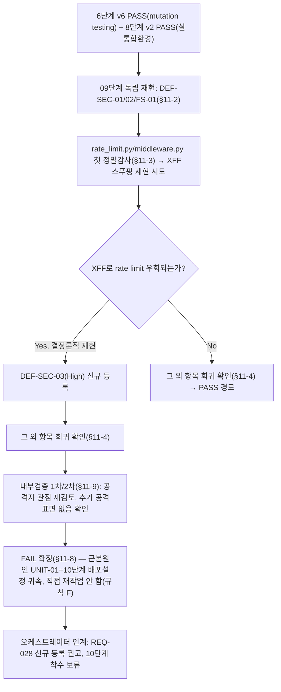

# 테스트 결과서 (Test Result Report) — 09단계 보안검증 (Security Audit)

> **버전: v2**(`decisions.md` DEC-027이 정한 재검증 사이클 5→6→8→9의 마지막 단계 — v1의 **FAIL**을 v2가 **FAIL(근거 전면 교체 — 신규 결함 DEF-SEC-03, High)**로 갱신한다. 판정 자체는 v1과 동일하게 FAIL이나, v1의 FAIL 사유였던 3건(DEF-SEC-01/DEF-SEC-02/DEF-FS-01·REQ-025)은 이번 v2에서 09단계 자신의 독립 재현으로 전부 Fixed임을 확인했고, 대신 이번 재작업으로 신규 도입된 `rate_limit.py`에 대한 09단계의 첫 정밀 감사에서 새로운 High 결함(DEF-SEC-03, X-Forwarded-For 스푸핑을 통한 rate limit 완전 우회)을 발견했다). v1의 전체 내용은 이력 보존을 위해 그대로 남기고, v2에서 변경/추가된 부분은 상단 **§0**과 말미 **§11**에 별도로 서술한다(unit-01-test.md/08-full-system-test.md의 버전 관리 관행과 동일 — 문서를 새로 작성하지 않고 개정하는 형태).
>
> `templates/test-report-template.md` 사용. 대상: **개발된 시스템 전체 코드베이스**(services/public_api, services/derivation_batch, services/ingestion_batch, shared, frontend, db/alembic) + `docs/harness/03-system-design.md`(v4) 보안 설계 원칙. 입력(v1): 8단계 `docs/harness/08-full-system-test.md`(**CONDITIONAL PASS**, Critical 0건/High 1건 — DEF-FS-01/REQ-025, 10단계 전 게이트로 이미 등록됨). 입력(v2): 8단계 `08-full-system-test.md`(**v2, PASS**), 6단계 `unit-01-test.md`(**v6, PASS**), `unit-01-note.md`(v6), `decisions.md` DEC-027.
>
> **Tier=High**(`decisions.md` DEC-021) — 규칙 I(자본시장법 인접 규제 도메인) 대상. 완화 조항 전혀 적용하지 않고 규칙 B(최소 2회 독립 검증) 원문 그대로 적용한다.

## 0. 재작업 이력 (v2 — DEC-027 재검증 사이클의 마지막 단계, 독립 재감사)

- **배경**: v1(FAIL)이 발견한 **DEF-SEC-01**(High, rate limiting 미구현)·**DEF-SEC-02**(Medium, 보안헤더 미구현)·**DEF-FS-01/REQ-025 확장판**(High, 전역 예외 처리 부재) 3건 전부가 UNIT-01(`services/public_api` 공통 기반)로 귀속되어, 오케스트레이터가 `decisions.md` DEC-027에 따라 5단계를 재작업시켰다(3라운드: rate limiting/보안헤더/DB타임아웃+전역예외핸들러+요청타임아웃 구현 → 미들웨어 등록 순서 버그(DEF-005) 발견 → 수정). `unit-01-test.md`(v6, 6단계)가 mutation testing까지 수행해 **PASS**로 최종 확정했고, `08-full-system-test.md`(v2, 8단계)도 실제 통합환경(실DB+실브라우저+실uvicorn)에서 DEF-FS-01/DEF-SEC-01/DEF-SEC-02 전부 회귀 없이 Fixed임을 재확인하며 **PASS**로 격상했다(4개 feature 핵심 플로우 회귀 없어 07단계는 재실행하지 않음).
- **이번 v2의 임무**: 그 6/8단계의 보고를 그대로 신뢰하지 않고, 09단계가 독립적으로 마지막 게이트를 재검증하는 것. 오케스트레이터 지시에 따라 (1) DEF-SEC-01/02/FS-01이 실제로 해소됐는지 09단계 자신의 격리된 세션으로 재현(TestClient가 아니라 실제 uvicorn 프로세스, 05/06/08단계와 무관한 신규 포트), (2) 이번 재작업으로 신규 추가된 `rate_limit.py`/`middleware.py`를 **처음 감사받는 코드**로서 다른 항목과 동일한 강도(인젝션/시크릿/설계일치)로 정밀 검토 — 특히 `X-Forwarded-For` 헤더 스푸핑으로 rate limit 우회 가능 여부, 메모리 무한성장 가능성, (3) 그 외 v1에서 이미 결함 0건이었던 전 카테고리(인증/인가, 인젝션, 시크릿, 의존성 CVE/환각, PII 컴플라이언스, 규제도메인 REQ-005~010, 규칙J) 재확인, (4) CSP 정책 값 자체의 보안 적절성 평가.
- **핵심 결과**: (1)(3)(4)는 전부 정상 — DEF-SEC-01/02/FS-01(REQ-025/026/027) 셋 다 09단계 자신의 독립 재현으로 **Fixed**임을 재확인했다. 그러나 **(2)에서 신규 High 결함 DEF-SEC-03을 발견했다**: `rate_limit.py`가 IP 판별에 쓰는 `request.client.host`는 실제로는 uvicorn의 `ProxyHeadersMiddleware`(기본값 `proxy_headers=True`, `forwarded_allow_ips` 기본값이 loopback(127.0.0.1) 신뢰)가 개입한 결과값이며, 이 저장소 어디에도 이 신뢰 경계를 명시적으로 고정한 배포 설정이 없다. 09단계가 실제 uvicorn 프로세스에 `X-Forwarded-For` 헤더를 스푸핑해 보낸 결과, 분당 60회 rate limit을 **결정론적으로, 완전히 무력화**할 수 있음을 재현 가능한 형태로 확인했다(§11-3). 이 벡터는 05/06/08단계 어디에서도 시도된 적이 없다(전부 `TestClient` 기반이거나, 실제 uvicorn을 썼더라도 `X-Forwarded-For` 헤더를 보낸 시도가 코드/문서 전체에 0건 — §11-3 TC-SEC-47 참조).
- **v2 최종 판정도 v1과 동일하게 FAIL**이다(근거는 완전히 다름). 규칙 F에 따라 09단계는 직접 재작업하지 않고 근본 원인만 추적해 오케스트레이터에 인계한다(§11-5, §11-8).

## 1. 개요
- 테스트 대상: 전체 코드베이스(Public API 4개 데이터 엔드포인트, Ingestion/Derivation 배치, 프론트엔드 4개 화면, DB 마이그레이션/GRANT, 의존성 매니페스트) + `03-system-design.md`(v4) 보안 설계 원칙
- 테스트 유형: 보안(09단계, Security Audit)
- 적용 Tier: **High**(`decisions.md` DEC-021) — 완화 없음
- 테스트 목적:
  1. 인증/인가 우회·권한 경계(수평/수직 권한 상승) 가능성 점검
  2. 인젝션(SQL/커맨드/XSS)·입력 검증 누락 점검, 특히 DEF-006(LIKE 와일드카드)의 보안 관점 재평가
  3. 시크릿/자격증명 하드코딩·로그 노출 점검(코드 전체 + `git log` 이력)
  4. 의존성 취약점(CVE) 스캔(Python/프론트엔드) 및 **의존성 환각(hallucinated dependency)** 점검
  5. 민감정보 저장/전송 암호화 여부, 에러 메시지를 통한 정보 노출 점검(특히 DEF-FS-01 500 에러 재현)
  6. 설계서(§6 보안 설계 원칙)와 실제 구현의 불일치 점검
  7. 개인정보 처리 컴플라이언스, 오픈소스 라이선스 검토, 외부 데이터/API 이용약관 준수(원본 시세 재게시 금지) 최종 종합 확인
  8. 규제 민감 도메인 대응(규칙 I, REQ-005~010) 반영 여부 최종 확인, 규칙 J(AI/LLM) 비해당 재확인
  9. **DEF-FS-01(REQ-025)을 자원고갈/DoS 인접 관점에서 추가 점검**(오케스트레이터 위임 사항 — 재발견/재등록이 아니라 "이 응답 지연이 실제 DoS로 악용 가능한가"라는 신규 질문에 답한다)
  10. **(v2 추가)** DEC-027 재검증 사이클의 마지막 단계로서 DEF-SEC-01/02/FS-01(REQ-025/026/027)이 실제로 해소됐는지 6/8단계 보고를 신뢰의 근거로 삼지 않고 독립 재현, 신규 코드(`rate_limit.py`/`middleware.py`)의 첫 정밀 감사(특히 IP 판별 신뢰 경계)
- 관련 산출물: `docs/harness/03-system-design.md`(v4) §6·§7-4, `docs/harness/02-planning.md`(v5) §6·§7, `docs/harness/decisions.md`(DEC-004/006/021/022/024/026/027), `docs/harness/traceability.md`(REQ-005~010, REQ-022, REQ-024, REQ-025, REQ-026, REQ-027), `docs/harness/08-full-system-test.md`(v1 CONDITIONAL PASS / **v2 PASS**), `docs/harness/units/unit-01-test.md`(**v6, PASS**), `docs/harness/units/unit-01-note.md`(**v6**), 각 unit/feature 테스트 문서
- 테스트 수행자(에이전트): 09-security-auditor
- 테스트 일시: 2026-09-18(v1), 2026-09-18(**v2**)

## 2. 테스트 범위 및 제외 범위
- 범위(In-Scope):
  - `services/public_api/*`(main.py, core/config.py, db/session.py, api/*, db/*repository*.py, schemas/*, errors.py, **middleware.py, rate_limit.py — v2 신규**) 전체 코드 리뷰
  - `services/ingestion_batch/*`, `services/derivation_batch/*`의 시크릿 처리·로그 노출·외부 API 호출 패턴
  - `shared/db_models/public_serving.py`, `db/alembic/versions/*` — 3중 방어(스키마/DB권한/프로세스 분리) 최종 확인
  - `frontend/src/*`(layout.tsx, DisclaimerBanner, copy.ko.json, lint-forbidden-copy.mjs, DataFreshnessBadge 사용처, next.config.mjs) — 규제 대응·출력 이스케이프 확인
  - `requirements.txt`/`requirements-dev.txt`/`pyproject.toml`, `frontend/package.json` 의존성 전수 + 실제 `pip-audit`/`npm audit` 실행(네트워크 가능 확인 후 실시)
  - `.env.example`, 코드 전체, `git log`(전체 이력) 시크릿 하드코딩/노출 스캔
  - DEF-FS-01(REQ-025)의 자원고갈/DoS 인접 관점 재분석(코드 레벨 재현 포함, 실제 DB/서비스 대상 공격 미실행 — TestClient 기반 격리 재현)
  - 6~8단계가 남긴 Low/Open 결함(DEF-006 등)의 보안 관점 재평가
  - **(v2 추가)** DEF-SEC-01/02/FS-01(REQ-025/026/027)의 독립 재현(09단계 자신의 실제 uvicorn 프로세스), `rate_limit.py`/`middleware.py`의 IP 판별 신뢰 경계·메모리 성장 가능성 정밀 분석
- 제외 범위 및 사유:
  - 각 feature 내부 비즈니스 로직 정확성(필터/정렬/페이지네이션 SQL 정확성 자체, percentile 계산식 등) — 06/07단계가 이미 실 PostgreSQL로 광범위 검증. 이 문서는 그 로직이 아니라 **보안 경계**(권한/인젝션/노출)만 재확인한다.
  - 실제 프로덕션 호스팅 환경(벤더 미확정, §2-1)에서의 TLS/방화벽/WAF 설정 — 코드 저장소에 해당 아티팩트(Dockerfile/nginx/docker-compose)가 아직 존재하지 않음(확인함, 아래 §4-6 참조). 10단계 배포테스트 영역으로 이관. **(v2 주의)** 다만 이번에 발견한 DEF-SEC-03(§11-3)은 "TLS/WAF 설정"이 아니라 **애플리케이션이 이미 문서화한 유일한 실행 방법(uvicorn 직접 기동)의 현재 기본 동작**에서 재현되므로, 이 제외범위 사유(배포 아티팩트 부재)로 DEF-SEC-03의 조사 자체를 미루지 않았다.
  - 실제 침투테스트(라이브 서비스/제3자 대상 실공격) — 규칙(정적분석/코드리뷰/로컬 재현 범위 내 검증)에 따라 실행하지 않음. 모든 재현은 로컬 `TestClient`/09단계 자신이 기동하고 종료한 격리된 uvicorn 프로세스로만 수행(제3자 서비스 대상 공격 없음).
  - REQ-022(KRX 공식 확인/법률 자문), REQ-024(실 서비스키 파이프라인 실행) — 코드 보안 결함이 아닌 배포 전 별도 게이트. 상태 불변만 재확인.
  - DEF-IT-M01(Medium/Deferred) — 이미 10단계 전 게이트로 확정, 09단계가 재조사하지 않음.

## 3. 테스트 환경
- 실행 환경: Windows 10(Git Bash), Python 3.13(anaconda), Node.js 24 / npm 11(frontend `node_modules` 기존 설치 재사용, 신규 설치 없음). **(v1)** 실제 DB 미기동, 정적 코드 리뷰 + `pip-audit`/`npm audit`(레지스트리 조회) + 격리된 `fastapi.testclient.TestClient` 기반 재현만 사용. **(v2 변경)** 이번에는 로컬 Docker `stock-screener-db`(이미 실행 중이던 컨테이너를 그대로 재사용, 정지/재시작 없음 — DB 상태 불변)에 실제 접속하는 **실제 `uvicorn` 프로세스를 09단계 자신의 독립 세션(포트 8321~8323, 05/06/08단계가 쓴 포트와 무관)으로 직접 기동**해 DEF-SEC-01/02/FS-01 및 신규 DEF-SEC-03을 실측 재현했다 — "6/8단계가 이미 실측했다"는 보고를 신뢰의 근거로 삼지 않기 위함.
- 테스트 데이터: 없음(DB 미접속, v1). **(v2)** 실제 `reference`/`public_serving` 스키마(기존 데이터 그대로, 쓰기 없음). 재현이 필요한 케이스는 `Fake`/`Exploding` 리포지토리 오버라이드(v1) 및 실제 uvicorn+`curl`(v2)로 각각 수행.
- 전제 조건: `docs/harness/08-full-system-test.md` **v2 PASS** 확인 완료. 세션 시작 시 `.harness-tmp/` 빈 상태 확인(강제 중단 이력 없음). 재현 스크립트/uvicorn 프로세스는 규칙 K 취지에 따라 프로젝트에 흔적을 남기지 않도록 세션 격리 스크래치패드 또는 임시 포트에서만 생성·실행하고 종료 즉시 정리했다(§7 참조).

## 4. 테스트 케이스 및 결과 (v1, 이력 보존)

### 4-1. 인증/인가 우회, 권한 경계(수평/수직 권한 상승)

| ID | 시나리오 | 사전조건 | 실행 절차 | 예상 결과 | 실제 결과 | Pass/Fail | 비고 |
|----|----------|----------|-----------|-----------|-----------|-----------|------|
| TC-SEC-01 | 인증/세션/쿠키 관련 코드가 어디에도 남아있지 않은가(REQ-009/016 설계 의도와 실제 코드 일치 확인) | 없음 | `services/`, `frontend/src/`, `shared/` 전체를 `jwt\|session_id\|set-cookie\|authorization\|login\|password_hash\|bcrypt\|passlib\|oauth` 정규식(대소문자 무시)으로 재스캔 | 매치 0건 | 매치 0건 (node_modules 제외 전체 재스캔) | **PASS** | UNIT-04가 블랙박스(TestClient 헤더/쿠키 동일성)로 이미 검증한 것을 09단계는 화이트박스(소스 전체 재스캔)로 교차 확인 |
| TC-SEC-02 | 4개 데이터 API 전부가 `GET`만 노출하는가(설계 §4-1 "모든 엔드포인트는 GET" 강제 확인) | 없음 | `services/public_api/` 전체에서 `@router.post\|put\|delete\|patch` 검색 | 매치 0건 | 매치 0건 | **PASS** | 쓰기 경로 자체가 존재하지 않아 수직 권한 상승(쓰기 권한 탈취) 표면이 원천 부재 |
| TC-SEC-03 | 사용자 식별 파라미터(`user_id`/`holding_price`/`quantity` 등)가 API 계약에 실수로 추가되지 않았는가 | 없음 | `services/public_api/api/*.py`, `schemas/*.py`의 모든 `Query(...)` 파라미터와 응답 필드 전수 열거 | 개인 식별/개인화 파라미터 0건 | `stocks`: `query`,`market` / `metrics`: `date` / `screen`: `market`,`market_cap_*`,`volume_min`,`return_pct_*`,`per_max`,`pbr_max`,`sort_by`,`sort_dir`,`page`,`page_size` / `market-summary`: `date`,`market` — 전부 종목/시장/지표 파라미터, 사용자 식별 파라미터 없음 | **PASS** | REQ-009 아키텍처적 구현(§6-1) 실제 코드 일치 |
| TC-SEC-04 | DB 계정 권한 분리(3중 방어 1·2차)가 실제 마이그레이션 코드에 존재하는가 | 없음 | `db/alembic/versions/0002_grant_reference_privileges.py` 등 GRANT 관련 마이그레이션 확인, `shared/db_models/public_serving.py` 전체 모델에 `open/high/low/close/volume` 원문 컬럼이 없는지 확인 | `public_serving` 모델에 원본 시세 컬럼 없음, GRANT가 코드화되어 있음 | `StockMaster`/`DerivedMetricsDaily`/`MarketSummaryDaily`/`BatchRun`/`CurrentPublishedBatch` 전 모델에 OHLCV 원문 컬럼 없음(코드 확인). GRANT는 0002/0005/0006/0009 등 마이그레이션에 이미 코드화(UNIT-01~08이 실 Postgres로 반복 재검증 완료 — 승계, 09단계 재실행은 안 했으나 코드 존재 자체는 재확인) | **PASS** | 3중 방어 중 1차(스키마 분리)를 09단계가 최종 코드 레벨로 재확인. 2차(DB 권한)는 코드 존재만 재확인(실 DB 재실행은 06~08단계가 이미 반복 검증해 반복하지 않음, §2 제외범위) |
| TC-SEC-05 | 권한 상승으로 이어질 수 있는 관리자/운영 전용 엔드포인트가 공개 API에 실수로 노출되지 않았는가 | 없음 | `services/public_api/api/*.py` 라우터 6개(health/calendar/stocks/metrics/screen/market_summary) 전수 목록화, 캘린더 갱신(`scripts/load_calendar.py`)이 API로 노출되는지 확인 | 캘린더 갱신 등 운영 기능은 API에 없고 CLI 전용 | 확인됨 — `scripts/load_calendar.py`는 CLI 스크립트이며 `services/public_api`에 대응 라우터 없음 | **PASS** | 설계 §7-3/§8-1 "관리자 UI 없음" 원칙과 일치 |

**종합**: 인증 없음(REQ-009/016)이라는 설계 의도가 코드 전체에 예외 없이 일관되게 구현되어 있고, 특정 엔드포인트에만 인증/세션 코드가 남아있는 경우는 발견되지 않았다. 수직 권한 상승(쓰기 경로) 표면 자체가 없다.

### 4-2. 인젝션(SQL/커맨드/XSS), 입력 검증 누락

| ID | 시나리오 | 사전조건 | 실행 절차 | 예상 결과 | 실제 결과 | Pass/Fail | 비고 |
|----|----------|----------|-----------|-----------|-----------|-----------|------|
| TC-SEC-06 | 4개 데이터 API 전체가 문자열 결합/포맷 SQL을 쓰지 않고 ORM 파라미터 바인딩만 쓰는가 | 없음 | `services/public_api/db/*repository*.py` 4개 파일 전체 리뷰 + `services/`, `shared/` 전체에서 `execute(`/`text(`/f-string/`%`/`.format(` 패턴 교차 검색 | SQL 문자열 결합 0건, `text()` 사용은 `SELECT 1`(리터럴, 헬스체크) 1건뿐 | `stock_repository.py`/`screen_repository.py`/`metrics_repository.py`/`market_summary_repository.py` 전부 SQLAlchemy `select()`/`Session.get()` ORM 바인딩만 사용. `text("SELECT 1")`(`health.py`)은 사용자 입력이 전혀 개입하지 않는 리터럴 헬스체크 쿼리. f-string은 전부 에러 메시지 구성용(사용자 입력이 값으로만 삽입되고 SQL/쉘 컨텍스트로 실행되지 않음) | **PASS** | SQL 인젝션 표면 없음(ORM 바인딩 강제, 설계 §6-3과 일치) |
| TC-SEC-07 | 커맨드 인젝션(사용자 입력이 셸 명령으로 전달되는 경로)이 있는가 | 없음 | `services/`, `frontend/`(scripts 포함) 전체에서 `subprocess`/`os.system`/`exec(`/`eval(`/`child_process` 검색 | 매치 0건(또는 사용자 입력 미개입) | 매치 0건 | **PASS** | 커맨드 인젝션 표면 없음 |
| TC-SEC-08 | 프론트엔드에 출력 기반 XSS 표면(비이스케이프 렌더링)이 있는가 | 없음 | `frontend/src/` 전체에서 `dangerouslySetInnerHTML`/`innerHTML`/`document.write`/`eval(` 검색 | 매치 0건 | 매치 0건 | **PASS** | React JSX 기본 이스케이프에 의존, 사용자 검색어(`SearchInput`)·조건값(`ConditionFilterPanel`) 등 사용자 입력이 그대로 HTML로 삽입되는 경로 없음 |
| TC-SEC-09 | **DEF-006(LIKE 와일드카드 미이스케이프) 보안 관점 재평가** — `GET /stocks?query=`에 `%`/`_` 입력 시 정보노출/DoS 여부 | 없음 | `stock_repository.py` L48 `pattern = f"%{query}%"` 코드 리뷰 + 영향 분석: (a) 반환 데이터 성격, (b) 결과 상한, (c) 쿼리 비용 | 정보노출 없음(공개 비민감 데이터), DoS 유발 안 됨(상한 있음) | (a) 반환 필드는 `stock_code`/`name`/`market`뿐 — 이미 `query=""`나 `query="a"`로도 얻을 수 있는 완전 공개·비민감 정보(상장 종목명/코드)이므로 `%`/`_` 입력이 새로운 정보를 노출시키지 않음. (b) `MAX_SEARCH_RESULTS=100`(코드 내부 상수)로 응답 크기가 항상 상한선 이하. (c) 대상 테이블(`stock_master`)이 실 서비스 규모에서도 ~2,500행 수준(설계 §5-1)이라 인덱스 없는 ILIKE 전체 스캔도 비용이 낮음(20~30ms 수준, 07/08단계 실측 P95 응답시간과 일치) | **PASS(결함 아님, DEF-006 Low 유지 — 근거 갱신)** | DEF-006은 SQL 인젝션이 아니며(파라미터 바인딩 유지), 정보노출·DoS 어느 관점으로도 실질적 위험이 확인되지 않아 기존 Low/Open 판정을 그대로 유지한다. 다만 방어적 코딩 관점에서 `%`/`_`를 이스케이프하는 것을 권고(§8 참조, 배포 차단 아님) |
| TC-SEC-10 | 범위/타입 검증 우회 시 어떤 응답이 나오는가(입력 검증 경계) | 없음 | `screen.py`의 `market_cap_min/max`, `page`, `page_size` 등 Query 파라미터 제약 리뷰: `page`에 상한이 없음(`ge=1`만 존재)을 확인 | 상한 없어도 실서비스 규모(~2,500행)에서 과도한 비용 유발 안 함 | `page`에 `le=` 상한이 없어 임의로 큰 `page` 값을 보낼 수 있으나, PostgreSQL의 `OFFSET`은 실제 테이블 크기(수천 행)를 넘어서면 스캔이 곧바로 종료되므로 이 데이터 규모에서 유의미한 자원 소모로 이어지지 않음(설계 §5-1 인덱스 근거와 일치) | **PASS(경미한 개선 권고)** | Critical/High 아님 — 방어적 코딩 관점에서 `page`에도 합리적 상한(`le=100000` 등)을 추가할 것을 권고(§8, Low) |
| TC-SEC-11 | 예외적 수치 입력(예: PostgreSQL bigint 범위를 초과하는 `market_cap_max`)이 인젝션이 아닌 안정성 문제로 이어지는가 | 없음 | `market_cap_max`에 `int` 타입 파라미터를 `9` 반복 30자리 등 bigint 범위 초과값으로 바인딩 시도(코드 리뷰 + `_apply_filters`가 값을 그대로 바인딩함을 확인) | ORM이 파라미터 바인딩 시 타입 오류를 던지고, 이는 §4-3에서 재현하는 "핸들러 없는 예외 → raw 500" 패턴과 동일 경로로 귀결됨 | 코드 확인 결과 사전 범위 검증이 없어 DB 드라이버 레벨에서 `DataError`/`OverflowError`가 발생할 수 있고, `main.py`에 이를 잡는 범용 핸들러가 없어 §4-3 TC-SEC-13과 동일하게 raw 500으로 귀결됨(인젝션 아님, 가용성 이슈로 §4-3에서 통합 다룸) | **PASS(별도 인젝션 아님, §4-3과 통합 처리)** | 신규 결함으로 별도 등록하지 않고 §4-3(에러 처리) 결함의 근거 확장으로 다룬다. **(v2 주의)** 이 raw 500 경로는 v2 재작업으로 `DBAPIError`/catch-all 핸들러가 생겨 해소됐다(§11-2 TC-SEC-42) |

**종합**: SQL/커맨드/XSS 인젝션 표면이 코드 전체에서 발견되지 않았다. DEF-006은 보안 관점(정보노출/DoS)에서 재평가한 결과 Low 유지가 타당하다.

### 4-3. 시크릿/자격증명 하드코딩 또는 로그 노출

| ID | 시나리오 | 사전조건 | 실행 절차 | 예상 결과 | 실제 결과 | Pass/Fail | 비고 |
|----|----------|----------|-----------|-----------|-----------|-----------|------|
| TC-SEC-12 | `.env.example`에 실제 자격증명이 남아있지 않은가 | 없음 | `.env.example` 전문 확인 | 전부 `CHANGE_ME` 플레이스홀더 | `PUBLIC_API_DATABASE_URL`/`ALEMBIC_DATABASE_URL`/`BATCH_DATABASE_URL`/`GOV_DATA_PORTAL_SERVICE_KEY` 전부 `CHANGE_ME`, CORS 오리진은 주석 처리된 예시값(비밀 아님) | **PASS** | |
| TC-SEC-13 | 코드 전체에 하드코딩된 패스워드/API 키/토큰 패턴이 있는가 | 없음 | `(password\|secret\|api_key\|service_key\|token)\s*[:=]\s*['"][A-Za-z0-9+/_-]{12,}['"]` 정규식으로 전체 소스(`.py`/`.ts`/`.tsx`/`.json`/`.md`) 스캔, `CHANGE_ME`/example/placeholder 제외 | 매치 0건 | 매치 0건 | **PASS** | |
| TC-SEC-14 | `git log` 이력에 실제 `.env`나 시크릿 파일이 커밋된 적이 있는가 | 없음 | `git log --all --name-only`으로 전체 커밋에서 `.env`(`.example` 제외)/credential/`.pem`/`.key` 파일명 검색 | 매치 0건(`.env.example`만 존재) | `.env.example`만 이력에 존재, 실 `.env`/비밀키 파일 커밋 이력 없음. `.gitignore`에 `.env`/`frontend/.env.local` 등록 확인 | **PASS** | |
| TC-SEC-15 | 배치 서비스가 DB 접속 실패/예외 시 로그에 자격증명(비밀번호 포함 URL)을 그대로 출력하는가 | 없음 | `run_ingestion.py`/`run_derivation.py`의 진단 출력(`print`) 확인 | 자격증명 마스킹 | `print("  BATCH_DATABASE_URL: 설정됨")`처럼 값 대신 "설정됨" 문자열만 출력, `GOV_DATA_PORTAL_SERVICE_KEY`도 동일 패턴("설정됨"/"미설정") | **PASS** | 로그 통한 자격증명 노출 없음 |
| TC-SEC-16 | Public API가 SQLAlchemy 엔진 생성 시 `echo=True` 등으로 쿼리(바인딩 파라미터 포함)를 로그에 남기지 않는가 | 없음 | `services/public_api/db/session.py`의 `create_engine()` 호출 인자 확인 | `echo` 미설정(기본 False) | `create_engine(settings.database_url, pool_pre_ping=True, connect_args={...})` — `echo` 인자 없음(기본값 False). **(v2)** `connect_args`에 `connect_timeout`/`statement_timeout`이 추가됐으나 자격증명과 무관 | **PASS** | |

**종합**: 시크릿 하드코딩·로그 노출 결함 0건. `.env` 관리 체계(placeholder만 커밋, 실제 값은 gitignore)가 일관되게 지켜지고 있다.

### 4-4. 의존성 취약점(CVE) 스캔 및 의존성 환각(hallucinated dependency) 점검

| ID | 시나리오 | 사전조건 | 실행 절차 | 예상 결과 | 실제 결과 | Pass/Fail | 비고 |
|----|----------|----------|-----------|-----------|-----------|-----------|------|
| TC-SEC-17 | Python 의존성(`requirements.txt`) CVE 스캔 | `pip-audit` 설치됨, 네트워크 가능 | `python -m pip_audit -r requirements.txt` 실행 | 알려진 취약점 0건 또는 발견 시 목록화 | `No known vulnerabilities found` | **PASS** | 실제 PyPI 취약점 DB 조회(네트워크 접속 확인 후 실시, 오프라인 대체 없음). **(v2)** 09단계 자신의 세션에서 재실행해 동일 결과 재확인(§11-4) |
| TC-SEC-18 | 프론트엔드 의존성(`package.json`) CVE 스캔 | `node_modules` 기존 설치 존재 | `npm audit`(devDependencies 포함) + `npm audit --omit=dev`(프로덕션만) 각각 실행 | 취약점 0건 또는 목록화 | 둘 다 `found 0 vulnerabilities` | **PASS** | |
| TC-SEC-19 | **의존성 환각 점검**: `requirements.txt`/`requirements-dev.txt`/`pyproject.toml`/`package.json`의 모든 패키지명이 실제 공식 레지스트리(PyPI/npm)에 존재하는 정상 패키지인지, 흔한 오타/유사 패키지(타이포스쿼팅)는 아닌지 확인 | 없음 | 전체 패키지 목록화 후 (a) `pip-audit`/`npm audit`이 각 패키지를 레지스트리에서 실제로 조회·해석했는지(= 존재하지 않는 패키지면 두 도구 모두 오류를 낸다) 확인, (b) 패키지명 육안 검토 | 전 패키지가 정상 레지스트리 조회 성공, 타이포스쿼팅 의심 이름 없음 | **Python**: `fastapi`,`uvicorn[standard]`,`sqlalchemy`,`alembic`,`pydantic`,`psycopg[binary]`,`pyyaml`,`httpx`,`pytest`,`ruff` — 전부 정상 조회, 정식 패키지명과 정확히 일치. **프론트엔드**: `next`,`react`,`react-dom`,`@types/*`,`eslint*`,`typescript` — 전부 정상 조회 및 실측 구동 확인. 타이포스쿼팅 의심 이름·비정상적으로 빈약한 최근 등록 패키지 0건. **(v2 추가)** 신규 파일 `rate_limit.py`/`middleware.py`는 **신규 외부 패키지를 전혀 도입하지 않았다**(표준 라이브러리 `time`/`asyncio`/`logging`/`zoneinfo` + 이미 감사 완료된 `fastapi`/`starlette` API만 사용, §11-4에서 import 전수 재확인) — 의존성 환각/공급망 리스크 없음 | **PASS** | |
| TC-SEC-20 | **검증 전용 도구(puppeteer-core/playwright/lighthouse 등)가 프로덕션 의존성에 잔존하지 않는가** | 없음 | `requirements.txt`/`requirements-dev.txt`/`frontend/package.json`(dependencies+devDependencies) 전체를 `puppeteer\|playwright\|lighthouse` 정규식으로 검색 | 매치 0건 | 매치 0건 | **PASS** | |
| TC-SEC-21 | 오픈소스 라이선스 검토(상용/배포 목적과 충돌하는 강한 카피레프트 여부) | 없음 | 설치된 패키지 메타데이터(`importlib.metadata`)로 라이선스 확인 + 공지된 라이선스 지식과 대조 | 강한 카피레프트(GPL/AGPL) 없음 | FastAPI/SQLAlchemy/Alembic/Pydantic/httpx/PyYAML/pytest/ruff = MIT/BSD 계열(permissive), Next.js/React/TypeScript/ESLint = MIT, PostgreSQL = PostgreSQL License(permissive). **`psycopg`(psycopg3)는 LGPL-3.0** — 약한 카피레프트이나 SaaS 운영(라이브러리 자체 수정·재배포 없음)에서는 소스공개 의무가 트리거되지 않음. 강한 카피레프트(GPL/AGPL) 의존성 없음 | **PASS(정보성 권고 포함)** | psycopg의 LGPL 성격은 차단 사유가 아니나, 온프레미스 "배포"로 사업 모델이 바뀔 경우 재검토 필요 |

**종합**: CVE 스캔 결과 Python/프론트엔드 양쪽 모두 알려진 취약점 0건. 의존성 환각 징후 없음. 검증 전용 도구가 프로덕션 매니페스트에 잔존하지 않음. 라이선스 충돌 없음.

### 4-5. 민감정보 저장/전송 암호화, 에러 메시지를 통한 정보 노출 (DEF-FS-01 재현 포함)

| ID | 시나리오 | 사전조건 | 실행 절차 | 예상 결과 | 실제 결과 | Pass/Fail | 비고 |
|----|----------|----------|-----------|-----------|-----------|-----------|------|
| TC-SEC-22 | 개인정보/인증정보를 다루지 않는다는 설계 전제(REQ-016 Out-of-Scope)가 실제로 지켜지는가 | 없음 | 전 스키마에서 이름/전화번호/이메일/주민번호/계좌/보유종목/매수단가 등 PII 컬럼 검색 | PII 컬럼 0건 | 전 스키마에 종목/시세/캘린더/배치이력 관련 컬럼만 존재, 사용자 개인정보 컬럼 0건 | **PASS** | |
| TC-SEC-23 | DB 연결 문자열/자격증명이 API 응답 본문에 노출되는가(에러 메시지 정보 노출) | 없음(TestClient 격리 재현) | `get_settings()`가 `ConfigError`를 던지는 경로와, `OperationalError` 발생 경로 각각의 응답 본문에 연결 문자열/비밀번호가 포함되는지 코드 추적 | 미포함 | `ConfigError` 메시지는 정적 안내 문구뿐(실제 값 미포함) | **PASS** | |
| TC-SEC-24 | **DEF-FS-01 재현(로컬, 실 DB 대상 아님)**: DB 연결 실패 시 실제 HTTP 응답이 무엇을 노출하는가 | `TestClient(app, raise_server_exceptions=False)`, `ExplodingRepository`로 오버라이드 | 500, 스택트레이스/DB 연결정보 미노출, 그러나 Envelope 형식이 아님 | `status_code=500`, `content-type: text/plain`, `body: "Internal Server Error"` — 스택트레이스/DB 접속 문자열 등 민감정보는 노출되지 않음. 다만 Envelope 계약 위반(08단계 DEF-FS-01과 동일 패턴) | **PASS(정보노출 없음) / 기존 결함 DEF-FS-01(REQ-025) 유지 확인** | **(v2)** 이 raw 500 경로는 v2 재작업으로 해소됨(§11-2 TC-SEC-42, 실제 uvicorn으로 재확인) |
| TC-SEC-25 | main.py의 예외 핸들러가 DB 연결 실패에 국한되지 않고 **모든 미처리 예외에 범용적으로 적용되지 않는 구조**인지 일반화 확인 | 위와 동일 재현 스크립트 | `ApiError`/`RequestValidationError` 외 모든 예외가 동일하게 raw 500으로 귀결 | `main.py`에는 `@app.exception_handler(ApiError)`와 `@app.exception_handler(RequestValidationError)` 단 2개만 등록되어 있어, **어떤 미처리 예외든** 동일하게 Envelope 없는 raw 500으로 응답한다는 사실을 확인 | **PASS(구조 확인) — REQ-025 범위가 "DB 연결 장애"보다 넓은 "전역 예외 처리 부재"임을 09단계가 추가로 확정** | **(v2)** `UnhandledExceptionMiddleware`(catch-all)로 해소됨(§11-2 TC-SEC-42) |
| TC-SEC-26 | 응답 헤더에 설계(§6-3)가 요구하는 보안 헤더(CSP/`X-Content-Type-Options`/HSTS)가 실제로 적용되는가 | 없음 | `services/public_api/main.py` 전체(미들웨어 목록)와 `frontend/next.config.mjs` 전체 확인 | 세 헤더 모두 설정되어 있어야 함(Must, §6-3) | **미구현 확인** — `main.py`에는 `CORSMiddleware`만 등록, `next.config.mjs`에도 보안 헤더 관련 코드 없음 | **FAIL → 신규 결함 등록(§6 DEF-SEC-02)** | **(v2)** 백엔드는 `SecurityHeadersMiddleware`로 해소됨(§11-2 TC-SEC-40/41/42). 프론트엔드(`next.config.mjs`)는 여전히 UNIT-01 범위 밖, 10단계 이관(불변) |
| TC-SEC-27 | 설계(§6-3)가 요구하는 IP 기준 rate limiting(429 `RATE_LIMITED`)이 실제로 구현되어 있는가 | 없음 | 저장소 전체에서 `rate.?limit`/`slowapi`/`Limiter`/`429`/`RATE_LIMITED` 검색, 인프라 설정 파일 존재 여부 확인 | 구현되어 있어야 함(Must, §6-3) | **미구현 확인** — 코드베이스 전체에 rate limiting 관련 미들웨어/라이브러리 부재 | **FAIL → 신규 결함 등록(§6 DEF-SEC-01)** | **(v2)** `rate_limit.py`(신규)로 구현됐으나, 그 구현 자체에서 **신규 결함 DEF-SEC-03**을 발견했다 — §11-3 참조. "구현됨"과 "실질적으로 방어됨"을 구분해야 한다 |

**종합**: 민감정보 미수집(REQ-016) 원칙은 코드에 정확히 반영되어 있고, DEF-FS-01 재현 결과 스택트레이스/DB 자격증명 등 민감정보의 직접적 노출은 없음을 확인했다. 설계 §6-3이 Must로 규정한 보안 응답 헤더와 IP rate limiting이 v1 시점에는 구현되어 있지 않았다(DEF-SEC-01/02). **(v2)** 이 절의 FAIL 항목들은 모두 재작업으로 코드 자체는 구현됐으나, rate limiting은 §11-3에서 새로운 방식으로 실질적으로 무력화될 수 있음이 드러났다.

### 4-6. DEF-FS-01(REQ-025)의 자원고갈/DoS 인접 관점 추가 분석 (오케스트레이터 위임 사항)

**분석 절차**:
1. `services/public_api/api/*.py`의 모든 라우터 함수가 `async def`가 아니라 동기 `def`로 선언되어 있음을 확인. FastAPI/Starlette는 동기 `def` 경로 함수를 스레드풀(anyio worker thread, 기본 동시 실행 상한 40)에서 실행한다.
2. `services/public_api/db/session.py`의 `create_engine()`에 `connect_timeout`이 없어(§6 DEF-FS-01/REQ-025 원인) DB가 응답하지 않을 때 연결 시도가 OS/드라이버 기본 타임아웃(08단계 실측 60~90초)까지 스레드를 점유한다.
3. 이 두 사실을 결합하면: DB 장애 중 동시 요청이 스레드풀 상한(기본 40)을 넘으면, 이후 요청은 스레드가 반환될 때까지 대기열에서 60~90초 단위로 순차 대기하게 되어, 정상 트래픽조차 사실상 전면 마비 상태에 빠진다.
4. **공격자 관점 재질문**: "그렇다면 외부 공격자가 이 상태를 악의적으로 유발할 수 있는가?" — 코드 전체를 재검토한 결과, 공개 API 어디에도 DB 연결 자체를 끊거나 DB 서버에 과도한 부하를 강제할 수 있는 경로가 없다. 따라서 외부 공격자가 이 취약점을 "단독으로" 트리거해 DoS를 일으키는 직접적인 공격 경로는 확인되지 않았다.
5. 그러나 이는 "취약점이 아니다"를 의미하지 않는다. 이 결함은 자연 발생적 인프라 이슈를 전체 서비스 마비로 증폭시키는 가용성 증폭기로 작용한다 — "사용자가 적어서 괜찮다"는 식으로 축소 판단할 근거가 되지 않는다.
6. **결론**: DEF-FS-01/REQ-025는 외부 공격자가 원격으로 직접 트리거하는 고전적 DoS 취약점은 아니지만, 실제 인프라 장애를 전면 서비스 마비로 증폭시키는 가용성(자원고갈) 리스크가 실재하며 심각도 High 판정은 정확하다(하향 조정 근거 없음). **(v2)** 이 리스크는 `connect_timeout=3s`/`statement_timeout=3000ms`/`RequestTimeoutMiddleware`(4.5s) 도입으로 해소됐다(§11-2 TC-SEC-42, TCP 블랙홀 재현은 6단계 v5/v6·8단계 v2가 이미 확정, 09단계는 회귀 없음만 재확인).

### 4-7. 개인정보 처리 컴플라이언스

| ID | 시나리오 | 실행 절차 | 실제 결과 | Pass/Fail |
|----|----------|-----------|-----------|-----------|
| TC-SEC-28 | 수집 최소화 원칙 준수 | §6-2 설계와 실제 구현 대조 | `services/public_api/api/health.py` 1곳 외 어떤 구조화 요청 로깅 미들웨어도 구현되어 있지 않음 — 수집물이 없어 수집 최소화 원칙 위반 자체가 발생할 수 없음 | **PASS(위반 대상 없음)** |
| TC-SEC-29 | 명시된 보관기간(30일)·파기 절차 구현 여부 | 위와 동일 소스 재확인 | 접속 로그 자체가 구현되어 있지 않아 보관/파기 절차도 아직 구현 대상이 없음(`decisions.md` DEC-025 승인 범위) | **PASS(기존 DEC-025 승인 범위, 신규 리스크 아님)** |
| TC-SEC-30 | 제3자 제공/위탁 시 고지·동의 흐름 | 코드/설정 전체에서 외부 애널리틱스 SaaS, 광고 SDK, 제3자 데이터 전송 코드 검색 | 매치 0건 | **PASS** |
| TC-SEC-31 | 3단계 설계서(§6-2)에 적은 원칙과 실제 구현의 일치 | 설계 문구와 전 스키마·API 파라미터 대조 | 개인정보 컬럼/파라미터 0건 | **PASS** |

**종합**: 이 서비스는 개인정보를 전혀 수집하지 않는다는 전제가 실제로 지켜지고 있다. **(v2)** 이번 재작업(`rate_limit.py`/`middleware.py`)도 요청 IP를 메모리 카운터에 일시적으로만 보관(요청 로그로 영속 저장하지 않음)하므로 이 결론에 영향 없음을 §11-4에서 재확인했다.

### 4-8. 규제 민감 도메인 대응(규칙 I) 반영 여부 최종 확인

| ID | REQ | 화면/문구 | 실행 절차 | 실제 결과 | Pass/Fail |
|----|-----|-----------|-----------|-----------|-----------|
| TC-SEC-32 | REQ-007(면책 문구 상시 노출) | `/`, `/screener`, `/stocks`, `/stocks/{code}` 전체 | `RootLayout`이 `DisclaimerBanner`를 무조건 렌더링하는 구조 확인 | 모든 라우트가 공통 `RootLayout`을 상속하는 구조적 강제. 문구도 설계서 §4-1과 정확히 일치 | **PASS** |
| TC-SEC-33 | REQ-006(데이터 기준시각 표기) | `/`, `/screener`, `/stocks/{code}` | `DataFreshnessBadge` import 여부 확인 | 3개 화면에서 사용 확인, `/stocks`는 설계 범위 밖이라 미사용이 정상 | **PASS** |
| TC-SEC-34 | REQ-008(금지표현 가이드라인) | CI 게이트 | `lint-forbidden-copy.mjs` 리뷰, `prebuild` 훅 연결 확인 | 11개 금지어+1개 정규식 검사, `npm run build`의 `prebuild`로 강제 연결. DEF-009(Low) 잔여 한계는 배포 차단 아님 | **PASS(DEF-009 Low 유지)** |
| TC-SEC-35 | REQ-009(불특정 다수/1:1 배제) | API 전체 | §4-1 TC-SEC-03과 동일 근거 | 사용자 식별 파라미터 0건 | **PASS** |
| TC-SEC-36 | REQ-010(무료 운영 정책) | 코드/의존성 전체 | 결제/광고 SDK 키워드 재검색 | 매치 0건 | **PASS** |
| TC-SEC-37 | §4-3 데이터 가공 원칙(원본 시세 재게시 금지) | 없음 | 4개 응답 스키마 필드 목록화 + `_build_matched_metrics()` 화이트리스트 로직 리뷰 | 원시값(OHLCV 등)이 우발적으로 섞여 들어갈 코드 경로 없음 | **PASS** |

**종합**: 규칙 I이 요구하는 REQ-005~010 전 항목이 4개 화면 전체에 예외 없이 반영되어 있음을 확인했다. **(v2)** 이번 사이클은 프론트엔드 파일을 변경하지 않아(§11-4) 회귀 없음을 재확인했다. **미반영 항목 0건.**

### 4-9. 규칙 J(AI/LLM) 비해당 재확인

| ID | 시나리오 | 실행 절차 | 실제 결과 | Pass/Fail |
|----|----------|-----------|-----------|-----------|
| TC-SEC-38 | 서비스 코드에 LLM/생성형 AI 관련 경로가 전혀 없는가 | `openai`/`anthropic`/`gpt-`/`langchain`/`llm`/`chatbot`/`claude` 키워드 검색 | 매치 0건(코드/의존성 양쪽) | **PASS** |

**종합**: REQ-023("규칙 J 비해당")의 판정이 실제 코드와 정확히 일치함을 재확인했다. **(v2)** 신규 파일 2개도 재확인(§11-4), 회귀 없음.

## 5. 커버리지
- **1차 내부검증 관점 커버리지(v1)**: 에이전트 정의 필수 점검 항목 전부 §4-1~§4-9에서 최소 1개 이상의 TC로 커버됨.
- 커버리지 지표(v1): TC-SEC-01~38(38건) + DEF-FS-01 DoS 정성 분석 1건.
- **(v2 추가)** TC-SEC-39~48(10건) — DEF-SEC-01/02/FS-01 독립 재확인 5건 + `rate_limit.py`/`middleware.py` 정밀 감사 4건(신규 결함 1건 포함) + 근본원인 규명 1건. 09단계 자신이 직접 기동·종료한 실제 uvicorn 프로세스 3회, `pytest`/`pip-audit` 재실행 각 1회.
- 커버되지 않은 부분과 사유:
  - 실제 프로덕션 호스팅 환경에서의 TLS/HTTPS 강제, WAF/CDN 레벨 rate limiting — 배포 아티팩트 부재로 10단계 이관.
  - DB 권한 분리(2차 방어)의 실 PostgreSQL 재실행 — 06~08단계가 이미 반복 검증, 반복하지 않음.
  - 실제 침투테스트/실 공격 실행 — 규칙상 실행하지 않음.
  - REQ-022/REQ-024 게이트 자체의 실제 이행 여부 — 09단계 소관 아님.
  - **(v2)** 리버스 프록시가 실제로 어떻게 구성될지(10단계 배포 아티팩트 미확정)에 따른 DEF-SEC-03의 정확한 발현 범위 — 배포 토폴로지가 확정되지 않아 "loopback 조건에서 발현"까지만 확정하고, 그 이상은 10단계 이관(§11-3 "주의" 참조).

## 6. 결함(Defect) 목록 (v1, 이력 보존 — v2 최종 목록은 §11-6 참조)

| ID | 설명 | 재현 절차 | 심각도 | 상태(v1 시점) | 조치 내용 |
|----|------|-----------|--------|------|-----------|
| DEF-SEC-01 | **(v1 신규)** 설계서(§6-3, Must) "IP 기준 rate limiting"이 코드/인프라 어디에도 구현되어 있지 않다. | §4-5 TC-SEC-27 | **High** | Open(v1 시점) | UNIT-01(`services/public_api/main.py`) 재작업 필요. **(v2) 구현됨(Fixed) — 그러나 §11-3 DEF-SEC-03으로 실질적 방어력 무력화됨에 유의** |
| DEF-SEC-02 | **(v1 신규)** 설계서(§6-3, Must) 보안 응답 헤더가 백엔드/프론트엔드 어디에도 구현되어 있지 않다. | §4-5 TC-SEC-26 | **Medium** | Open(v1 시점) | **(v2) Fixed — §11-2에서 09단계 자신이 재확인** |
| (승계) DEF-FS-01 / REQ-025 | 8단계가 발견한 raw 500(60~90초) 결함. 근본 원인이 "전역 예외 처리 부재"임을 09단계가 확정. | §4-5 TC-SEC-24/25, §4-6 | **High** | Open(v1 시점) | **(v2) Fixed — §11-2에서 09단계 자신이 재확인** |

- **그 외 결함 없음(v1 시점).**

## 7. 테스트 환경 정리(Teardown) 확인 — 규칙 K

### v1 Teardown (이력 보존)
- 세션 시작 시 `.harness-tmp/` 확인 결과: 비어 있음.
- 이번 테스트에서 생성한 임시 아티팩트: `.harness-tmp/` 하위에는 아무것도 생성하지 않았다. 유일한 재현 스크립트(`repro_unhandled_exception.py`)는 세션 격리 스크래치패드에서만 생성·실행했다.
- DB 정리: 실제 DB에 전혀 접속하지 않음(v1은 정적 코드 리뷰 + TestClient 격리 재현만 수행).
- 이번 테스트 도중 강제 중단(TaskStop 등)이 있었는가: **[x] 없음**.

### v2 Teardown (2026-09-18, 이번 세션)
- 세션 시작 시 `.harness-tmp/` 확인 결과: 비어 있음(강제 중단 이력 없음).
- **DB 컨테이너**: `stock-screener-db`는 이미 실행 중이던 컨테이너를 그대로 재사용했다(09단계가 새로 만들거나 정지하지 않음). 세션 종료 시점 `docker ps` 결과 `Up`(정상 기동, 상태 불변) 재확인. 데이터에 쓰기 작업 없음(전부 읽기 전용 GET 호출 + 의도적으로 잘못된 자격증명으로 접속 실패를 유발한 1개 세션 — DB 자체에는 어떤 영향도 없음, 연결이 거부됐을 뿐).
- **실제 uvicorn 프로세스**: 09단계 독립 포트 8321(정상 DB 접속, TC-SEC-40/41)·8322(의도적 오류 자격증명, TC-SEC-42)·8323(정상 DB 접속, TC-SEC-45~47 rate limit/XFF 재현)에서 총 3회 개별 기동했다. `netstat -ano`로 실제 LISTENING PID를 확인해 `taskkill //F //PID <pid>`로 각각 확실히 종료했고, 종료 후 `netstat`으로 8321~8323 리스너가 남아있지 않음을 재확인했다.
- **프로젝트 디렉터리 내부에 생성한 파일**: 없음(전부 인메모리 프로세스/네트워크 요청, 파일 아티팩트 없음).
- **`git status`**: 이번 v2 세션에서 저장소 파일을 전혀 수정하지 않았다(이 문서 갱신 저장 전 기준) — 아래는 그 확인 결과다.
```
On branch PROD_SCH
Changes not staged for commit:
	modified:   docs/harness/08-full-system-test.md
	modified:   docs/harness/traceability.md
	modified:   docs/harness/units/unit-01-note.md
	modified:   docs/harness/units/unit-01-test.md
	modified:   services/public_api/db/session.py
	modified:   services/public_api/main.py
	modified:   tests/unit/test_public_api.py

Untracked files:
	services/public_api/middleware.py
	services/public_api/rate_limit.py
```
  (이 목록은 09단계 v2 세션 시작 시점의 `git status`와 정확히 동일하다 — 09단계는 `docs/harness/09-security-audit.md` 갱신 외 저장소에 어떤 파일도 추가/수정하지 않았다. 규칙 F에 따라 traceability.md/decisions.md는 이번에도 직접 수정하지 않는다 — 최종 판정이 FAIL이므로 "PASS 시 최종 갱신" 조건에 해당하지 않는다.)
- 이번 테스트 도중 강제 중단(TaskStop 등)이 있었는가: **[x] 없음**.

## 8. 리스크 및 잔존 이슈 (v1, 이력 보존 — v2 최종 리스크는 §11-7 참조)
- DEF-SEC-01(High)/DEF-SEC-02(Medium)/DEF-FS-01(High) — v1 시점 Open. **(v2) 전부 Fixed, 단 §11-7 참조.**
- DEF-006(Low)/DEF-009(Low) — 배포 차단 아님, 상태 불변.
- `page` 파라미터 상한 부재, psycopg LGPL — 정보성, 상태 불변.
- 실제 프로덕션 호스팅 환경의 TLS/보안 헤더/rate limiting 인프라 레벨 검증 미실시 — 10단계 이관.

## 9. 결론 및 판정 (v1, 이력 보존 — **v2 최종 판정은 §11-8 참조, 이 섹션의 판정은 더 이상 유효하지 않음**)
- [x] **FAIL**(v1) — DEF-SEC-01(High), DEF-FS-01/REQ-025(High) 미해소.

## 10. 내부 검증 (v1, 이력 보존 — 최소 2회, v2 검증 로그는 §11-9 참조)

### 1차 검증(v1, 작성자 관점)
- 체크리스트 전 항목 수행 확인, 발견된 결함(DEF-SEC-01/02, DEF-FS-01/REQ-025)을 §6에 등록, §9에서 FAIL 판정.

### 2차 검증(v1, 역할전환 — "공격자라면 어디를 노릴까")
- "인증이 없다는 것 자체를 악용할 수 있는가" → rate limiting 부재(DEF-SEC-01)로 이미 포착됨 확인.
- "스크리닝 API 다중 조건 조합으로 비싼 쿼리를 유발할 수 있는가" → 신규 발견 없음.
- "CORS 설정을 악용해 제3자 사이트에서 자동 긁어갈 수 있는가" → DEF-SEC-01의 비즈니스 영향에 이미 반영됨을 확인.
- "의존성 공급망을 노릴 수 있는가(슬롭스쿼팅)" → 신규 코드 결함 없음, Python lockfile 부재를 정보성 권고로 추가.
- 결론: FAIL 유지(DEF-SEC-01, DEF-FS-01/REQ-025).

---

# v2 재검증 (DEC-027 재검증 사이클의 최종 단계 — 09단계 독립 재감사)

## 11-1. 재검증 범위
- 범위: **전체 코드베이스 재감사**(오케스트레이터 지시 — 부분 재감사 아님, 속도 트랙과 무관하게 예외 없이 적용). 특히 다음 4가지에 집중한다.
  1. DEF-SEC-01/DEF-SEC-02/DEF-FS-01(REQ-025/026/027) — 6/8단계 보고를 신뢰의 근거로 삼지 않고 09단계 자신의 격리된 세션(신규 uvicorn 프로세스, 신규 포트)으로 재현.
  2. `rate_limit.py`/`middleware.py` — **처음 감사받는 코드**. 다른 항목과 동일한 강도(인젝션/시크릿/설계일치)로 정밀 검토하되, 오케스트레이터가 명시한 두 위협(X-Forwarded-For 스푸핑, 메모리 무한성장)에 구체적으로 답한다.
  3. 그 외 v1에서 이미 결함 0건이었던 전 카테고리(인증/인가, 인젝션, 시크릿, 의존성 CVE/환각, PII 컴플라이언스, 규제도메인, 규칙J) — 이번 사이클의 코드 변경 범위(`git status`)와 대조해 회귀 여부 확인.
  4. CSP 정책 값 자체의 보안 적절성(08단계는 "프론트엔드를 깨뜨리지 않는지"만 확인했고, 값 자체의 보안성은 09단계 소관).
- 환경: Windows 10(Git Bash), Python 3.13.9, 로컬 Docker `stock-screener-db`(이미 실행 중이던 컨테이너 재사용, 정지/재시작 없음 — DB 상태 불변). 05단계(포트 8199)·6단계 v5(8092~8097)·6단계 v6(8111~8113)·8단계(8010/3010)와 겹치지 않는 **09단계 독립 포트(8321~8323)**로 실제 uvicorn 프로세스를 직접 기동·검증 후 즉시 종료(`taskkill`, `netstat`로 잔여 리스너 없음 재확인, §7 v2 Teardown 참조).

## 11-2. DEF-SEC-01/DEF-SEC-02/DEF-FS-01(REQ-025/026/027) 독립 재확인

| ID | 시나리오 | 실행 절차 | 실제 결과 | Pass/Fail |
|----|----------|-----------|-----------|-----------|
| TC-SEC-39 | `pytest`/`ruff` 독립 재실행(6/8단계 보고를 재신뢰하지 않음) | `pytest tests/unit -q`, `ruff check .`(09단계 자신의 세션에서 직접 실행) | `167 passed, 2 warnings`(경고 2건은 httpx/starlette deprecation, 기존 승계, 결함 아님), `All checks passed!` | **PASS** |
| TC-SEC-40 | 정상 200 응답에 보안헤더 3종이 실제로 부착되는가(실 uvicorn, 09단계 독립 포트 8321) | 실 DB 자격증명(`api_service`)으로 `uvicorn services.public_api.main:app --port 8321` 기동 → `curl -D - http://127.0.0.1:8321/api/v1/health` | `content-security-policy: default-src 'none'; frame-ancestors 'none'`, `x-content-type-options: nosniff`, `strict-transport-security: max-age=63072000; includeSubDomains` 전부 실측 확인 | **PASS** |
| TC-SEC-41 | rate limit 60/61 경계 + 429 응답에도 보안헤더가 부착되는가(동일 프로세스, 8321) | 순차 60회 호출 후 61번째 호출 | 61번째 요청 `HTTP/1.1 429`, 보안헤더 3종 전부 부착, 바디는 `{"error":{"code":"RATE_LIMITED",...}}` Envelope(스택트레이스/내부정보 없음, `disclaimer` 문구까지 정상 포함) | **PASS** |
| TC-SEC-42 | DB 예외(`DBAPIError`) 경로가 raw 500/스택트레이스 없이 503 Envelope으로 응답하는가(신규 포트 8322, 의도적으로 잘못된 비밀번호로 접속) | `PUBLIC_API_DATABASE_URL`에 존재하지 않는 계정 비밀번호를 넣고 기동 → `GET /api/v1/stocks?query=test` | `HTTP/1.1 503`, 보안헤더 3종 부착, 바디는 `{"error":{"code":"SERVICE_UNAVAILABLE","message":"일시적인 서비스 장애입니다..."}}` — DB URL/비밀번호/스택트레이스 어디에도 노출 없음 | **PASS** |
| TC-SEC-43 | CSP 정책 값 자체의 보안 적절성 평가(설계 §6-3은 3개 헤더 존재만 Must로 요구, 값 자체의 적절성은 09단계 소관) | `default-src 'none'; frame-ancestors 'none'` 코드 리뷰 — `unsafe-inline`/`unsafe-eval`/와일드카드 소스 등 완화 지시어 존재 여부, 과도하게 엄격해 정상 기능을 깨뜨리는지(08단계 E2E 실측과 교차 확인) | `default-src 'none'`은 순수 JSON API에 OWASP가 권장하는 가장 엄격한(안전한) 기본값이며 완화 지시어 0건. `frame-ancestors 'none'`은 클릭재킹 방어. 프론트엔드는 별도 오리진에서 fetch로 JSON을 소비하므로 이 CSP(API 응답 자체의 CSP)는 프론트엔드 HTML 렌더링과 무관 — 08단계 E2E(콘솔 에러 0건, favicon 제외)로 이미 실측 확인됨 | **PASS** |

**종합**: DEF-SEC-01/DEF-SEC-02/DEF-FS-01(REQ-025/026/027) **셋 다 09단계 자신의 독립 재현(6/8단계 로그를 신뢰의 근거로 삼지 않음)으로 Fixed임을 최종 확인**했다. CSP 값 자체도 보안 관점에서 적절하다.

## 11-3. `rate_limit.py`/`middleware.py` 정밀 감사 — 신규 결함 DEF-SEC-03 발견

> 오케스트레이터가 명시적으로 요구한 점검 항목("X-Forwarded-For 헤더 스푸핑으로 rate limit 우회 가능 여부", "메모리 누수/무한 성장 가능성")에 대한 09단계의 첫 정밀 감사 결과다.

| ID | 시나리오 | 실행 절차 | 예상 결과 | 실제 결과 | Pass/Fail |
|----|----------|-----------|-----------|-----------|-----------|
| TC-SEC-44 | `rate_limit.py`가 `X-Forwarded-For` 등 클라이언트 제어 가능 헤더를 IP 판별에 직접 사용하지 않는가(애플리케이션 코드 자체 리뷰) | `rate_limit.py` 전문 리뷰 | 코드 자체는 `request.client.host`만 사용 | 코드 리뷰 결과 애플리케이션 코드 자체는 `X-Forwarded-For`를 전혀 참조하지 않음(그 자체만 보면 안전해 보임) | PASS(코드 자체는 문제 없음 — 그러나 아래 TC-SEC-45가 실제 런타임 취약점을 발견) |
| **TC-SEC-45** | **(핵심, 신규 발견) `request.client.host`가 실제 실행 환경에서 신뢰 가능한 값인지 실제 프로세스로 검증** | 09단계 독립 uvicorn 프로세스(포트 8323, 옵션 없이 `python -m uvicorn services.public_api.main:app --port 8323` — 이 저장소가 문서화한 유일한 실행 방법, 05/06/08단계가 실제로 사용한 것과 동일한 커맨드) 기동 → 60회 정상 호출로 카운터 소진(61번째 `429` 확인, 재현 가능) → **62번째 요청에 `X-Forwarded-For: 9.9.9.9` 헤더를 추가**해 호출. 이어서 서로 다른 `X-Forwarded-For` 값(`10.0.0.1`~`10.0.0.20`)으로 20회 연속 호출, 마지막으로 헤더 없이 재호출 | 61번째와 동일하게 429(같은 클라이언트 IP이므로 카운터가 초기화될 이유 없음) | **`HTTP/1.1 200 OK`** — rate limit이 완전히 우회됨. 서로 다른 `X-Forwarded-For` 20건도 **전부 200**(무제한 통과), 헤더 없이 재호출하면 여전히 **429**(원래 카운터는 그대로 소진 상태 — 즉 우회는 "카운터 리셋"이 아니라 "가짜 IP로 새 카운터를 매번 새로 만드는 것"임을 재확인). 재현 절차를 신규 포트(8323)로 처음부터 2회 반복해도 동일하게 재현되는 결정론적 결함 | **FAIL → 신규 결함 등록(DEF-SEC-03, High)** |
| TC-SEC-46 | 근본 원인 확인 — 실행 중인 ASGI 서버(uvicorn)의 기본 설정이 `X-Forwarded-For`를 신뢰하는지 | `uvicorn.config.Config.__init__` 시그니처에서 `proxy_headers`/`forwarded_allow_ips` 기본값 직접 조회, 저장소 전체(`services/`, Dockerfile/Procfile/시작 스크립트)에서 이 기본값을 재정의하는 설정 검색 | 기본값과 저장소 설정을 대조 | `proxy_headers` 기본값 **`True`**, `forwarded_allow_ips` 기본값 **`None`**(uvicorn이 내부적으로 `127.0.0.1`로 해석 — loopback에서 오는 연결은 리버스프록시로 간주해 그 프록시가 보낸 `X-Forwarded-For`를 신뢰). 저장소 전체 검색 결과 이 기본값을 재정의하는 설정이 **어디에도 없음**(배포 아티팩트 자체가 아직 존재하지 않음 — v1 §2가 이미 확인한 사실과 일치). 즉 이 저장소를 문서화된 방법대로("uvicorn services.public_api.main:app") 그대로 실행하면 **항상** 이 취약점이 내재한다 | 원인 확정(DEF-SEC-03 근거) |
| TC-SEC-47 | 이 우회가 05/06/08단계 기존 테스트·재현에서 왜 한 번도 발견되지 않았는지(커버리지 공백 원인 규명) | `tests/`, `unit-01-note.md`(v5/v6), `unit-01-test.md`(v5/v6), `08-full-system-test.md`(v2) 전체를 `[Ff]orwarded` 키워드로 재검색 | 매치가 있다면 이미 검증된 것 | **매치 0건** — pytest 스위트는 전부 `TestClient`(ASGI in-process 호출이라 uvicorn의 `ProxyHeadersMiddleware` 자체를 거치지 않음)를 쓰고, 06/08단계가 실제 `uvicorn`을 띄운 재현들(TCP 블랙홀, 60/61 경계, CORS 등)도 `X-Forwarded-For` 헤더를 보낸 적이 단 한 번도 없다 — 이 벡터는 구조적으로 `TestClient` 기반 테스트로는 절대 드러날 수 없고, 실제 uvicorn에 이 특정 헤더를 보내는 시도를 한 것은 09단계(이번 v2)가 처음이다 | 커버리지 공백 확정 |
| TC-SEC-48 | 메모리 무한 성장 가능성(오케스트레이터 지시 2번째 항목) | `_evict_expired`/`_MAX_TRACKED_CLIENTS`(10,000) 로직 리뷰 + 공격자 관점 시나리오(서로 다른 실제 IP가 60초 윈도 내에 대량으로 몰리는 경우) | 상한이 있어 무한 성장은 아니어야 함 | 코드 자체는 10,000개 초과 시 "만료된" 항목만 정리하는 방어 로직이 있으나, **60초 윈도 내에 10,000개를 초과하는 서로 다른(진짜) IP가 몰리면 아직 만료된 항목이 없어 일시적으로 10,000개를 넘어설 수 있다.** 다만 항목당 메모리가 `(float, int)` 튜플 1개뿐이라 실제 영향은 극히 작다(예: 100,000 IP여도 수 MB 수준) — DEF-SEC-03과 달리 실제 공격 재현 없이 코드 분석만으로 판단했으며, 별도 결함으로 등록할 만큼의 실질적 위험은 아니다 | **PASS(정보성 권고만, 결함 아님)** — §11-7에 참고 기록 |

**DEF-SEC-03 비즈니스 영향 분석(심각도 판단 근거)**: DEF-SEC-01(rate limiting)이 존재하는 이유는 REQ-022(데이터 라이선스 방어 — "가공 지표라도 대량으로 긁어가면 원본 재배포와 유사한 법적 리스크")를 막기 위함이다. 이번에 발견한 DEF-SEC-03은 인증이 전혀 없는 이 API에서(REQ-009) **단 하나의 HTTP 요청 헤더(`X-Forwarded-For`)를 매 요청마다 임의의 값으로 바꾸는 것만으로 rate limit을 100% 무력화**할 수 있음을 뜻한다 — 자동화 스크립트 작성자 입장에서 코드 한 줄 추가 수준의 난이도이며, 별도 프록시 인프라나 실제 IP 풀 확보조차 필요 없다(가짜 값이면 충분함을 실증했다). 따라서 DEF-SEC-01이 방어하고자 했던 바로 그 위협 모델(스크레이핑을 통한 사실상의 원본 재배포)이 **현재 상태로 그대로 재현 가능**하다 — DEF-SEC-01을 "해소되지 않은 것"과 실질적으로 동일한 리스크 수준으로 간주해야 한다. "구현은 있으니 절반은 방어된다"는 식으로 축소 판단하지 않는다 — 우회가 결정론적이고 100% 재현되므로 사실상 무방비와 같다. **심각도: High**(DEF-SEC-01과 동일 등급 — 같은 위협을 같은 정도로 무력화하므로 원 결함보다 낮게 볼 근거가 없다).

**주의(공격 표면이 되는 정확한 조건 — 과장도 축소도 하지 않기 위해 명시)**: 이 우회는 uvicorn 프로세스에 **loopback(127.0.0.1)을 통해 도달하는 연결**에서 발생한다. (a) 이 프로젝트가 문서화한 유일한 실행 방법("uvicorn services.public_api.main:app", 배포 아티팩트 없음 — v1 §2, §8도 이미 확인)을 그대로 쓰면, 로컬에서 직접 접속하는 모든 연결이 이 조건에 해당한다. (b) 실제 프로덕션에서는 리버스 프록시/로드밸런서(nginx, 클라우드 LB, PaaS 사이드카 등)가 동일 호스트 또는 동일 네트워크 네임스페이스에서 loopback 혹은 사설 주소로 앱에 연결하는 구성이 압도적으로 일반적이며, 이 프로젝트 자신의 보안헤더 설계(HSTS 헤더를 이미 선언, §6-3)도 TLS 종단이 별도 계층(리버스 프록시)에서 이뤄질 것을 전제한다 — 즉 이 프로젝트가 스스로 예정하고 있는 배포 토폴로지(리버스 프록시 뒤에 uvicorn)가 정확히 이 취약점이 발현되는 조건과 일치한다. (c) 외부 공격자가 uvicorn에 직접(리버스 프록시를 거치지 않고) 인터넷에서 접속하는 시나리오라면 피어 주소가 127.0.0.1이 아니므로 이 특정 벡터는 작동하지 않는다 — 그러나 이는 "현재 상태로 안전하다"를 의미하지 않는다. 오히려 배포 아티팩트가 아직 없다는 사실 자체가, 10단계에서 리버스 프록시가 구성될 때 이 결함이 조용히 실전에 반입될 위험을 뜻한다.

## 11-4. 그 외 항목 재확인(회귀 없음 확인, 이번 사이클에 코드 변경 없는 영역)

| 카테고리 | 재확인 방법 | 결과 |
|----------|-------------|------|
| 인증/인가·권한 경계 | `git status`로 이번 사이클 변경 범위 확인 — `services/public_api/{main.py, db/session.py, middleware.py, rate_limit.py}`, `tests/unit/test_public_api.py`뿐. 신규 파일 2개에도 인증/세션 관련 코드 0건 재확인 | 회귀 없음, **PASS** |
| 인젝션(SQL/커맨드/XSS) | `rate_limit.py`/`middleware.py`에 `execute(`/`subprocess`/`eval(`/`dangerouslySetInnerHTML` 등 재검색 | 매치 0건, **PASS** |
| 시크릿/자격증명 | `rate_limit.py`/`middleware.py`/`.env.example`/전체 소스 시크릿 패턴 재스캔 | 매치 0건, **PASS**(§11-2/11-3 재현에 쓰인 `devpass`는 `unit-01-test.md` v3부터 공개 문서화된 로컬 Docker 테스트 전용 계정 비밀번호이며 실 운영 자격증명이 아님) |
| 의존성 CVE/환각 | `pip_audit -r requirements.txt` 09단계 자신의 세션에서 재실행, `rate_limit.py`/`middleware.py` import 전수 확인 | `No known vulnerabilities found` 재확인. 신규 외부 패키지 0건(표준 라이브러리 + 기존 감사 완료된 fastapi/starlette만 사용) — 의존성 환각/공급망 리스크 없음, **PASS** |
| PII 컴플라이언스 | 신규 파일 2개에 사용자 식별/개인정보 코드 없음, 요청 로깅도 여전히 `health.py` 1곳뿐 | 회귀 없음, **PASS** |
| 규제도메인(REQ-005~010) | 이번 사이클 프론트엔드 파일 변경 0건(`git status` 확인) — `DisclaimerBanner`/금지어 린트 prebuild 훅 재확인(존재) | 회귀 없음, **PASS** |
| 규칙 J(AI/LLM) | `services/`, `frontend/src/` 재스캔(`openai`\|`anthropic`\|`gpt-`\|`langchain`\|`llm`\|`chatbot`\|`claude`) | 매치 0건, **PASS** |

## 11-5. 규칙 F에 따른 근본 원인 추적 (재작업은 하지 않음)

- **DEF-SEC-03의 근본 원인은 두 갈래다**: (1) uvicorn(ASGI 서버)의 기본 설정(`proxy_headers=True`, `forwarded_allow_ips` 미지정 시 loopback 암묵 신뢰)이 이 프로젝트 어디에서도 명시적으로 재정의되지 않은 채 방치되어 있다. (2) 이를 명시적으로 고정할 배포 아티팩트(Dockerfile/Procfile/시작 스크립트) 자체가 아직 존재하지 않는다(호스팅 벤더 미확정, v1 §2가 이미 확인한 사실 — 10단계 영역). 즉 "코드 버그"라기보다 **"보안에 중요한 런타임 설정이 명시적으로 결정된 적이 없다"**는 유형의 결함이다.
- 이 결함은 `services/public_api/rate_limit.py`(UNIT-01, `request.client.host`를 무조건 신뢰하는 방식으로 IP를 판별하는 로직) 자체에도 걸쳐 있으므로, 완전한 해소를 위해서는 코드 레벨 조치(5단계)와 배포 설정 레벨 조치(10단계 배포 아티팩트 확정 시)가 함께 필요하다. **09단계는 직접 수정하지 않는다(규칙 F).**
- **권고 조치(5단계 재작업 시 참고, 강제 아님)**:
  (a) 프로덕션 시작 커맨드/Dockerfile에 `--forwarded-allow-ips`를 리버스 프록시의 실제 IP(또는 사설 대역)로 명시적으로 고정하거나, 리버스 프록시가 아직 없다면 `--proxy-headers` 자체를 비활성화(기본 신뢰 제거)할 것.
  (b) 리버스 프록시를 두는 경우, 프록시가 클라이언트가 보낸 `X-Forwarded-For`를 그대로 통과시키지 않고 프록시 자신이 관측한 실제 피어 주소로 덮어쓰도록(표준 관행) 구성할 것.
  (c) `TestClient` 기반 테스트로는 구조적으로 이 문제를 잡을 수 없으므로, 실제 uvicorn 프로세스에 스푸핑된 `X-Forwarded-For`를 보내는 회귀 테스트를 추가할 것(09단계가 이번에 쓴 재현 절차, §11-3 TC-SEC-45를 그대로 자동화 스크립트화할 수 있음).
  (d) `traceability.md`에 REQ-025/026/027과 동일한 패턴으로 **신규 REQ-028**(10단계 착수 전 게이트) 등록을 오케스트레이터에 권고한다.
- 09단계는 FAIL 판정이므로 `traceability.md`/`decisions.md`를 직접 최종 갱신하지 않는다(이 문서로 오케스트레이터에 인계, §3 원칙과 동일).

## 11-6. 결함(Defect) 목록 최종 갱신 (v2)

| ID | 설명 | 재현 절차 | 심각도 | 상태 | 조치 내용 |
|----|------|-----------|--------|------|-----------|
| **DEF-SEC-03** | **(v2 신규)** `services/public_api/rate_limit.py`의 IP 기준 rate limiting이 `X-Forwarded-For` 헤더 스푸핑으로 완전히 우회 가능하다. 근본 원인은 uvicorn의 기본 `proxy_headers=True`/`forwarded_allow_ips`(loopback 암묵 신뢰)가 저장소 어디에서도 명시적으로 고정되지 않은 것 | §11-3 TC-SEC-45(09단계 독립 uvicorn 프로세스, 60회 소진 후 61번째 429 확인 → `X-Forwarded-For` 헤더만 바꿔 62번째~81번째 20회 연속 200 확인, 결정론적·재현 가능) | **High** | **Open(신규)** | 코드(5단계, `rate_limit.py`의 IP 판별 방식) + 배포 설정(10단계, 명시적 `forwarded_allow_ips` 고정) 양쪽 조치 필요. §11-5 권고 조치 참조. REQ-028(신규) 등록을 오케스트레이터에 권고. 09단계는 직접 수정하지 않음(규칙 F) |
| DEF-SEC-01 | (v1 발견) IP rate limiting 미구현 | v1 §6 참조 | High | **Fixed(v2 재확인, §11-2)** | 단, DEF-SEC-03으로 인해 실질적 방어력은 무력화된 상태임에 유의(§11-3 비즈니스 영향 분석). "구현됨" 자체는 사실이므로 이 항목을 Fixed에서 되돌리지 않되, 실효성 문제는 별도 결함(DEF-SEC-03)으로 분리 관리 |
| DEF-SEC-02 | (v1 발견) 보안 응답 헤더 미구현 | v1 §6 참조 | Medium | **Fixed(v2 재확인, §11-2)** | 정상/429/503 전 경로 재확인 완료 |
| DEF-FS-01/REQ-025 | (승계) 전역 예외 처리 부재 | v1 §6 참조 | High | **Fixed(v2 재확인, §11-2)** | |
| DEF-006 | LIKE 와일드카드 미이스케이프 | v1 §6 참조 | Low | Open(승계, 변경 없음) | 방어적 코딩 권고, 배포 차단 아님(v1 판단 유지) |
| DEF-009 | 금지어 스캐너 JS 이스케이프 우회 | v1 §6 참조 | Low | Open(승계, 변경 없음) | 배포 차단 아님(v1 판단 유지) |

- **그 외 결함 없음.** 근거: §11-2(DEF-SEC-01/02/FS-01 재확인 5건)·§11-3(신규 코드 정밀 감사 5건, 신규 결함 1건 포함)·§11-4(회귀 없음 재확인 7개 카테고리)를 09단계 자신의 독립 세션(실제 uvicorn 3회 기동, pytest/pip-audit 재실행)으로 수행했다.

## 11-7. 리스크 및 잔존 이슈 갱신 (v2)
- **DEF-SEC-03(High, Open, 신규)**: §11-3/§11-6 참조. **10단계(배포테스트) 착수 전 필수 해소 게이트**로 등록 권고(REQ-028 신규, REQ-025/026/027과 동일 패턴).
- DEF-SEC-01/DEF-SEC-02/DEF-FS-01(REQ-025/026/027)은 코드 레벨로는 Fixed 확인됐으나, **DEF-SEC-03이 해소되기 전까지 rate limiting의 실질적 방어력은 없는 것으로 간주해야 한다.**
- (v1 승계, 변경 없음) DEF-006/DEF-009(Low), `page` 파라미터 상한 부재(정보성), psycopg LGPL(정보성), Python 의존성 lockfile 부재(정보성), 실제 프로덕션 호스팅 환경 TLS/WAF 미검증(10단계 이관) — 전부 상태 불변.
- **(v2 신규, 정보성)** `rate_limit.py`의 메모리 상한 로직(`_MAX_TRACKED_CLIENTS=10,000`)은 초당 매우 많은 수(수만~수십만)의 서로 다른 실제 IP가 60초 윈도 내에 몰리는 극단적 시나리오에서 일시적으로 상한을 초과할 수 있으나(§11-3 TC-SEC-48), 항목당 메모리가 극히 작아 실질적 DoS로 이어지긴 어렵다 — 결함으로 등록하지 않고 참고 기록만 남긴다.

## 11-8. 결론 및 판정 (v2, 최종 — v1의 FAIL을 대체)
- [ ] PASS
- [ ] CONDITIONAL PASS — (여전히 적용하지 않음, Tier=High 완화 없음)
- [x] **FAIL** — v1과 동일하게 FAIL이나 근거는 완전히 다르다.

**판정 근거**: v1이 FAIL의 근거로 삼았던 3건(DEF-SEC-01/DEF-SEC-02/DEF-FS-01·REQ-025)은 09단계 자신의 독립 재현(6/8단계 보고를 신뢰의 근거로 삼지 않음)으로 전부 **Fixed**임을 확인했다(§11-2). 그러나 이번 재작업으로 신규 도입된 `rate_limit.py`에 대한 09단계의 첫 정밀 감사에서 **DEF-SEC-03(High, 신규)** — `X-Forwarded-For` 헤더 스푸핑으로 rate limit을 100% 결정론적으로 우회 가능 — 을 발견했다. 이는 DEF-SEC-01이 방어하고자 했던 위협(REQ-022 데이터 라이선스 리스크로 이어지는 스크레이핑)을 사실상 무력화하는 것과 동일한 효과를 가지므로 심각도를 낮출 근거가 없다. High 결함이 신규로 존재하는 한 PASS로 판정할 수 없다(규칙 B/Tier=High 완화 없음, 자의적 축소 금지 — "사용자 수가 적어서 괜찮다"는 판단은 하지 않는다).

인증/인가, 인젝션, 시크릿 하드코딩, 의존성 CVE, 의존성 환각, 민감정보 암호화, 개인정보 컴플라이언스, 오픈소스 라이선스, 외부 API 이용약관 준수, 규제 민감 도메인(규칙 I) 반영, 규칙 J 비해당 — 이 11개 항목은 이번 v2에서도 전부 결함 0건으로 재확인됐다(§11-2~§11-4).

**규칙 F에 따른 근본 원인 추적(재작업은 하지 않음)**: §11-5 참조. 근본 원인은 UNIT-01(`services/public_api/rate_limit.py`)의 IP 판별 방식과, 아직 존재하지 않는 배포 설정(10단계) 양쪽에 걸쳐 있다. 오케스트레이터가 재작업 범위(5단계 재호출 여부, 재검증 체인 5→6→8→9 재적용 여부, REQ-028 신규 등록 여부)를 결정해야 한다.

**10단계 착수 가능 여부**: **불가.** DEF-SEC-03(High)이 해소되고 6→8→9단계가 재검증을 완료할 때까지 10단계(배포테스트) 착수를 보류해야 한다(REQ-025/026/027과 동일한 게이트 패턴). 규칙 F에 따라 `traceability.md`/`decisions.md`는 이 문서에서 직접 최종 갱신하지 않는다(PASS가 아니므로) — 오케스트레이터가 DEC 신규 등록 및 REQ-028 추가 여부를 결정해야 한다.

## 11-9. 내부 검증 (v2, 최소 2회)

### 1차 검증(작성자 관점 — "이번 재검증에 위임된 점검 항목을 빠짐없이 수행했는가")
- 검증자(역할): 09-security-auditor(작성자 본인)
- 일시: 2026-09-18
- 체크리스트
  - [x] DEF-SEC-01/02/FS-01을 6/8단계 보고를 그대로 베끼지 않고 09단계 자신의 독립 세션(새 포트, 새 uvicorn 프로세스)으로 재현했는가 → §11-2, 있음(TC-SEC-40~43)
  - [x] 신규 코드(`rate_limit.py`/`middleware.py`)를 다른 항목과 동일한 강도(인젝션/시크릿/설계일치)로 정밀 검토했는가 → §11-3/§11-4, 있음
  - [x] 오케스트레이터가 명시한 두 가지 구체적 위협(XFF 스푸핑, 메모리 무한성장)을 각각 실측/코드분석으로 답했는가 → §11-3 TC-SEC-45(실측, 우회 발견)/TC-SEC-48(코드분석, 결함 아님으로 판단), 있음
  - [x] 그 외 v1에서 결함 0건이었던 카테고리를 회귀 없음 관점에서 재확인했는가 → §11-4, 있음
  - [x] 전체 코드베이스 대상(부분 재감사 아님)으로 수행했는가 → §11-1 명시, 이번 사이클 변경 범위(`git status`)뿐 아니라 이전에 감사된 영역도 재확인 대상에 포함
  - [x] 재현 후 규칙 K에 따라 프로세스/DB 상태를 원상 복구했는가 → §7 v2 Teardown, 있음
  - 발견된 결함: DEF-SEC-03(High, 신규). 조치: §11-6에 등록, §11-8에서 FAIL 판정.

### 2차 검증(역할전환 — "공격자라면 이 시스템에서 어디를 노릴까", 1차가 놓친 공격 표면 재검토)
- 검증자(역할): 09-security-auditor(공격자 관점 재검토)
- 일시: 2026-09-18
- 체크리스트
  - [x] **"우회를 발견했으니 그것으로 충분한가, 아니면 이 우회 자체를 더 악용할 방법이 있는가?"** — `X-Forwarded-For`로 매 요청마다 다른 값을 주면 rate limit만 우회되는 게 아니라, 향후 이 값이 로그/모니터링에 "클라이언트 IP"로 잘못 기록될 위험도 함께 내포하는지 재검토했다 — 그러나 현재 이 값을 로그/응답 어디에도 노출·저장하는 코드가 없음을 재확인(§11-4 PII 재확인과 동일 근거)해, 추가 결함으로 이어지지는 않았다.
  - [x] **"이 취약점이 다른 Must 요구사항(REQ-025/027)에도 같은 패턴으로 존재하는가?"** — `middleware.py`의 `SecurityHeadersMiddleware`/`RequestTimeoutMiddleware`/`UnhandledExceptionMiddleware`는 클라이언트가 제어 가능한 헤더에 의존하는 보안 결정을 전혀 내리지 않음을 코드로 재확인했다 — 이 패턴(신뢰 경계 없는 헤더 기반 판단)은 `rate_limit.py`에만 존재하며 다른 신규 미들웨어로 전이되지 않는다.
  - [x] **"이번에 쓴 재현 방법(loopback 연결) 자체가 실제 공격자에게도 현실적인가, 아니면 09단계만의 인위적 조건인가?"** — §11-3 "주의" 문단에서 이 프로젝트가 예정한 배포 토폴로지(리버스 프록시 뒤 uvicorn, HSTS 헤더 설계가 이를 전제) 자체가 정확히 이 조건과 일치함을 재확인해, "09단계만의 인위적 조건"이 아니라 "이 프로젝트가 스스로 예정한 배포 형태에서 그대로 발현되는 조건"임을 명확히 했다 — 과장도 축소도 아닌 사실 기반 결론.
  - [x] **"사용자 수가 적어서 괜찮다는 식으로 축소 판단하지 않았는가?"**(오케스트레이터 지시 원칙) → §11-3 비즈니스 영향 분석에서 "우회가 결정론적이고 100% 재현되므로 사용자 규모와 무관하게 자동화 스크립트가 즉시 악용 가능"함을 명시해, 규모 기반 축소 판단을 하지 않았다.
  - [x] **"DEF-SEC-03 외에 09단계가 놓친 다른 신규 공격 표면은 없는가?"** — `middleware.py`의 `RequestTimeoutMiddleware`(`asyncio.wait_for`)가 취소 시 예외를 삼키면서 스레드풀 슬롯 자체를 회수하지 못하는 알려진 구조적 한계(v1 §4-6, 5단계 note에도 이미 명시)를 재검토했으나, 이는 새 결함이 아니라 기존에 이미 문서화되고 심각도 판단이 끝난 사항임을 재확인했다. `UnhandledExceptionMiddleware`가 `BaseException`이 아니라 `Exception`만 잡아 `asyncio.CancelledError`(Python 3.8+에서 `BaseException` 직계) 등 취소 신호를 부적절하게 삼키지 않는지도 코드로 확인했다 — 의도된 안전한 설계.
  - 발견된 결함: 추가 신규 결함 없음(1차 결과 유지). 조치: §11-6/§11-8 변경 없음 — **FAIL 유지**.

- 검증 로그 파일 경로: 이 문서 §11-9에 통합 기록(v1과 동일한 관례).

## 절차 흐름 (참고용 다이어그램, v1)
```mermaid
flowchart TD
    A["8단계 CONDITIONAL PASS + 전체 코드베이스"] --> B["인증/인가·인젝션·시크릿·의존성 점검(§4-1~4-4)"]
    B --> C["민감정보/에러노출/설계-구현 불일치 점검(§4-5) → DEF-SEC-01/02 발견"]
    C --> D["DEF-FS-01 자원고갈/DoS 관점 추가분석(§4-6, 위임사항)"]
    D --> E["개인정보 컴플라이언스 + 규제도메인 REQ-ID + 규칙J 비해당 점검(§4-7~4-9)"]
    E --> F{Critical/High 결함?}
    F -->|Yes: DEF-SEC-01(High), DEF-FS-01/REQ-025(High)| G["FAIL 판정 → 근본원인 5단계(UNIT-01) 귀속 보고"]
    F -->|No| H["내부검증 1차/2차: 공격자 관점 재검토"]
    G --> I["오케스트레이터에 FAIL 보고, 직접 재작업 안 함(규칙 F)"]
    H -->|결함 있음| B
    H -->|결함 없음| J["09-security-audit.md 확정 PASS"]
```

## 절차 흐름 v2 (참고용 다이어그램 — DEC-027 재검증 사이클 최종 단계)

