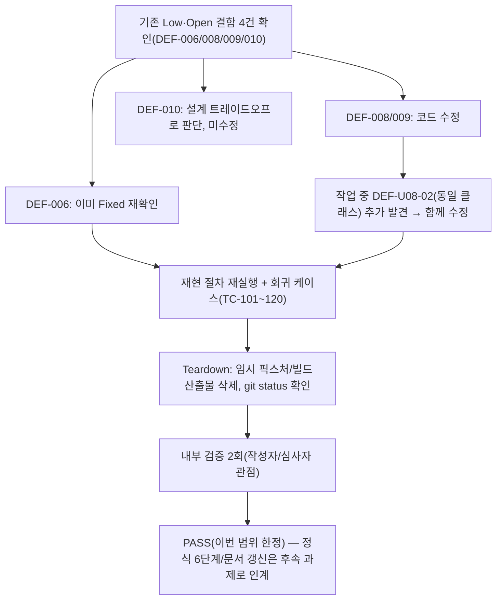

# 내부테스트 결과서 — Low 심각도 결함 일괄 수정 (2026-09-25)

> **(2026-09-25 후속 정정)** 아래 §6 결함 목록의 **DEF-007을 "Open(변경 없음, 이번 범위 아님)"으로 분류한 것은 오류였다.** 이후(같은 날 후속 검토) `scripts/seed_stock_master.py`를 다시 확인한 결과 DEF-007은 이미 2026-09-22 별도 커밋에서 코드로 수정되어 있었다(`upsert_stock_master()`의 SQL SET절에서 `is_active` 제외 확인). 상세 근거는 `decisions.md` DEC-031, `traceability.md` REQ-001 비고 참조. 이 문서의 §6 표 자체는 작성 당시 판단을 그대로 남겨두고(이력 보존), 이 정정 문단으로 최신 상태를 대신한다.

> **문서 성격 (반드시 먼저 읽을 것)**: 이 문서는 `templates/test-report-template.md` 양식을 그대로 따라 작성한 **완전한 테스트 결과서**이지만, ORCHESTRATOR.md가 정의하는 정식 06단계(`06-unit-tester`) 서브에이전트 독립 재검증은 아니다. 사용자가 명시적으로 "테스트/검증 단계는 이번엔 제외, 코드만 빠르게 수정"을 선택한 뒤, 이어서 "내부테스트 결과서는 완벽하게 작성해달라"고 요청해 이 형태(코드 수정 + 완전한 결과서, 단 `traceability.md`/`decisions.md`/각 `unit-XX-note.md`는 갱신하지 않음)로 진행했다. 따라서 이 문서는 **PASS여도 해당 유닛들의 정식 하네스 판정을 갱신하지 않는다** — 정식 재검증(6단계)은 여전히 별도로 필요하며, 그 시점이 되면 이 문서를 1차 근거 자료로 활용할 수 있다.

## 1. 개요
- 테스트 대상: Low 심각도 결함 4건 코드 수정 검증 — DEF-006(UNIT-03, `services/public_api/db/stock_repository.py`), DEF-008(UNIT-04, `frontend/src/lib/formatKst.ts`), DEF-009(UNIT-04, `frontend/scripts/lint-forbidden-copy.mjs`), DEF-U08-02(UNIT-08, `frontend/src/lib/formatKrw.ts`)
- 테스트 유형: 단위테스트(경량, 결함 수정 목적 한정 — 정식 06단계 독립 재검증 아님, 위 문서 성격 참조)
- 적용 Tier: High(`decisions.md` DEC-021 승계, 완화 없음)
- 적용 속도 트랙: N/A(트랙 도입 이전 기존 유닛의 결함 수정 — `unit-01-test.md` v6과 동일한 처리 관례)
- 테스트 목적: 09/06/08단계가 이미 문서화해 둔 Low·Open 결함 중 코드 수정이 가능한 4건을 실제로 고치고, (a) 원 결함 재현이 더 이상 발생하지 않는지, (b) 기존 정상 동작(회귀)이 깨지지 않는지 확인
- 관련 산출물: `docs/harness/units/unit-03-test.md` §6(DEF-006), `unit-04-test.md` §6(DEF-008/DEF-009), `unit-08-test.md` §6(DEF-U08-02), `docs/harness/09-security-audit.md` §11-6(DEF-006/DEF-009 승계 확인)
- 테스트 수행자: Claude(오케스트레이터 세션, 사용자 직접 지시로 수행 — 정식 06-unit-tester 서브에이전트 미호출)
- 테스트 일시: 2026-09-25

## 2. 테스트 범위 및 제외 범위
- 범위 (In-Scope):
  - DEF-006 — 이미 별도 커밋(`77e8661`)에서 코드 수정이 완료되어 있음을 확인 및 재검증(신규 수정 아님)
  - DEF-008 — `formatKstDateTime()`에 `typeof` 가드 신규 추가
  - DEF-009 — `lint-forbidden-copy.mjs`에 JS 이스케이프 시퀀스 인식 정규화 로직 신규 추가
  - DEF-U08-02 — **(이번 작업 중 코디네이터가 직접 발견)** `formatTradingValueKrw()`에 `Number.isFinite` 가드 신규 추가. 사용자에게 보고했던 "Low 4건"(DEF-006/008/009/010) 목록에는 없었으나, DEF-008과 동일한 성격(타입 계약 우회 시 오표시)의 이미 문서화된 Low·Open 결함이어서 이번 배치에 함께 포함했다.
- 제외 범위 (Out-of-Scope) 및 사유:
  - **DEF-010(Next.js 16 소프트 404, UNIT-06)**: 코드를 고치지 않았다. `loading.tsx`(Suspense 자동 경계)를 제거해야 HTTP 상태코드가 정상화되는데, 이는 `04-ux-design.md` §2-4가 요구하는 로딩 스켈레톤(REQ-013)을 포기해야 하는 트레이드오프이며 `unit-06-test.md`가 이미 "코드 결함이 아니라 설계 트레이드오프"로 **Deferred**(Open이 아님) 판정을 내린 항목이다. 요구사항 하나를 깨야만 고칠 수 있는 항목을 질문 없이 임의로 바꾸는 것은 규칙 A-3(비가역적/영향범위 큰 결정)에 해당한다고 판단해 손대지 않았다. 필요하시면 트레이드오프의 구체적 대안(예: 운영 모니터링에서 이 라우트만 응답 바디로 404 판별)을 별도로 논의할 수 있다.
  - **DEF-005(UNIT-02)/DEF-007(UNIT-03)/DEF-U08-01(UNIT-08)**: 전부 "코드 결함이 아니라 문서/주석 서술 정확도 문제"로 이미 판정되어 있다(예: DEF-U08-01은 `unit-08-test.md` §6에 "기능적 결함이 아님"이라고 명시). 코드 변경 대상이 아니므로 이번 코드 수정 배치에서 제외했다.
  - **`traceability.md`/`decisions.md`/각 `unit-XX-note.md` 갱신**: 사용자가 이전 턴에서 명시적으로 "문서 갱신 없음"을 선택했으므로 수행하지 않았다. 이 문서 하나로 이번 수정의 근거를 완결성 있게 남기는 것으로 대체한다.
  - **정식 6단계(독립 재검증)·이후 8→9단계 재검증**: 사용자가 이번 요청에서 제외했다. 아래 §8 "리스크"에 잔존 항목으로 명시한다.

## 3. 테스트 환경
- 실행 환경: Windows 11, Node.js(로컬 설치본), Python(로컬 설치본, venv 미구성)
- 프론트엔드: `frontend/`에 `node_modules`가 없어 이번 세션에서 `npm install`을 새로 실행(346 packages, 0 vulnerabilities). 이 과정에서 기존에 커밋되어 있던 `frontend/package-lock.json`의 `name`/`version` 필드가 `package.json`과 불일치(`"frontend"/"1.0.0"` vs 실제 `"stock-screener-kr-frontend"/"0.1.0"`)했던 것이 `npm install`로 자동 동기화됐다(의존성 버전 변경은 없음, 메타데이터만 정정). 이 lockfile 변경도 함께 커밋 대상에 포함할 것을 권고한다(별도 승인 필요시 말씀 주시면 제외 가능).
- 백엔드: `sqlalchemy`/`ruff`/`pytest`가 설치된 venv가 이 환경에 없어(신규 venv 구성은 이번 지시 범위 밖으로 판단해 만들지 않음), DEF-006은 (a) 이미 반영된 코드를 직접 읽어 알고리즘을 확인하고 (b) 동일 알고리즘을 의존성 없는 순수 Python으로 별도 재현해 검증했다(§4 TC-101). `pytest tests/unit`/`ruff check .` 전체 스위트 실행은 이번에 수행하지 못했다 — §8 리스크에 명시.
- 테스트 데이터: 회귀 확인용 임시 픽스처 파일 3개(`frontend/src/lib/__qa_escape_seq.ts`, `__qa_u0020.ts`, `__qa_real_nl.ts`, `__qa_path.ts` — 아래 §7 Teardown 참조), 순수 로직 재현용 임시 스크립트(스크래치패드, 저장소 밖)
- 전제 조건: 수정 대상 4개 파일의 기존 결함 재현 절차(각 유닛 test.md에 기록된 재현 절차)를 그대로 재사용

## 4. 테스트 케이스 및 결과

| ID | 시나리오 | 사전조건 | 실행 절차 | 예상 결과 | 실제 결과 | Pass/Fail | 비고 |
|----|----------|----------|-----------|-----------|-----------|-----------|------|
| TC-101 | (DEF-006, 회귀 확인) `_escape_like_pattern` 알고리즘이 `%`/`_`/`\` 를 올바르게 이스케이프하는가 | sqlalchemy 미설치로 동일 알고리즘을 순수 Python으로 독립 재현 | 입력 `["%","_","abc%def","a_b","\\"]` 각각에 알고리즘 적용 | `%`→`\%`, `_`→`\_`, `abc%def`→`abc\%def`, `a_b`→`a\_b`, `\`→`\\`(자기 자신 먼저 이스케이프되어 순서 문제 없음) | 정확히 기대값과 일치(전건) | **PASS** | 코드 자체(`stock_repository.py`)는 신규 수정 없음 — 기존 커밋(77e8661)에 이미 반영되어 있음을 소스 직독으로 재확인 |
| TC-102 | (DEF-008) `formatKstDateTime(null)` | 수정 전: `new Date(null)`→epoch(1970-01-01 09:00)를 정상 날짜처럼 반환 | `formatKstDateTime(null)` 호출(Node `--experimental-strip-types`로 TS 직접 실행) | `INVALID_DATE_FALLBACK_TEXT`("기준시각 확인 불가") | `"기준시각 확인 불가"` | **PASS** | |
| TC-103 | (DEF-008) `formatKstDateTime(undefined)` | 상동 | 상동 | 폴백 문구 | `"기준시각 확인 불가"` | **PASS** | |
| TC-104 | (DEF-008) `formatKstDateTime(0)` | 상동, `new Date(0)`도 epoch | 상동 | 폴백 문구 | `"기준시각 확인 불가"` | **PASS** | |
| TC-105 | (DEF-008, 회귀) `formatKstDateTime("")` | 기존에 이미 Fixed였던 DEF-001 경로 | 상동 | 폴백 문구(기존과 동일) | `"기준시각 확인 불가"` | **PASS(회귀 없음)** | |
| TC-106 | (DEF-008, 회귀) `formatKstDateTime("not-a-date")` | 상동 | 상동 | 폴백 문구 | `"기준시각 확인 불가"` | **PASS(회귀 없음)** | |
| TC-107 | (DEF-008, 정상 경로 회귀) `formatKstDateTime("2026-09-11T15:30:00+09:00")` | 정상 계약 입력 | 상동 | `"2026-09-11 15:30"` | `"2026-09-11 15:30"` | **PASS(회귀 없음)** | 정상 경로가 가드 추가로 영향받지 않음을 확인 |
| TC-108 | (DEF-U08-02) `formatTradingValueKrw(NaN)` | 수정 전: "NaN조원" 반환 | 호출(Node `--experimental-strip-types`) | `INVALID_TRADING_VALUE_FALLBACK_TEXT`("거래대금 확인 불가") | `"거래대금 확인 불가"` | **PASS** | |
| TC-109 | (DEF-U08-02) `formatTradingValueKrw(undefined)` | 상동 | 상동 | 폴백 문구 | `"거래대금 확인 불가"` | **PASS** | |
| TC-110 | (DEF-U08-02, 위험 기반 추가) `formatTradingValueKrw(Infinity)`/`formatTradingValueKrw(-Infinity)` | AC/DEF 문면에는 없으나 `Number.isFinite` 가드가 커버해야 할 동일 클래스 입력 | 상동 | 폴백 문구(둘 다) | 둘 다 `"거래대금 확인 불가"` | **PASS** | 원 결함 재현 절차보다 넓게 검증(위험 기반) |
| TC-111 | (DEF-U08-02, 정상 경로 회귀) `formatTradingValueKrw(0)`/`(-5)`/`(53_000_000_000)`/`(12_300_000_000_000)` | 기존 정상 계약(음수/영/억/조 단위 경계) | 상동 | `"0원"`/`"0원"`/`"530억원"`/`"12.3조원"`(설계서 원문 예시와 동일) | 정확히 일치(4건 전부) | **PASS(회귀 없음)** | `04-ux-design.md` §2-1 워크드 예제(12.3조원)와 1:1 일치 재확인 |
| TC-112 | (DEF-009) 소스에 JS 이스케이프 시퀀스(`\n`, 리터럴 백슬래시+n)로 분리된 금지어 | 임시 파일 `__qa_escape_seq.ts`에 `"손실보\n전"`(소스 텍스트상 백슬래시+n 두 글자) 삽입 | `node scripts/lint-forbidden-copy.mjs` 실행 | 탐지되어 exit code 1 | 탐지됨, `금지어 "손실보전"` 리포트, `exit=1` | **PASS** | 수정 전에는 탐지 안 됨(결함 재현 확인됨, 수정 후 해소) |
| TC-113 | (DEF-009, 위험 기반 확장) `\u0020`(공백) 유니코드 이스케이프로 분리된 금지어 | 임시 파일 `__qa_u0020.ts`에 `"추\u0020천을 드립니다"` 삽입 | 상동 | 탐지되어 exit 1 | 탐지됨, `금지어 "추천"`, `exit=1` | **PASS** | DEF-009 원 재현 절차(`\n`)보다 넓은 이스케이프 클래스(`\r`/`\t`/공백류 `\uXXXX`)까지 방어하는지 확인 — 원 결함 문면보다 넓게 검증 |
| TC-114 | (DEF-002 회귀, 실제 줄바꿈) 실제 개행으로 분리된 금지어 | 임시 파일 `__qa_real_nl.ts`에 실제 줄바꿈 포함 `` `손실보\n전` `` (템플릿 리터럴 내 진짜 개행) | 상동 | 탐지되어 exit 1(기존 DEF-002 수정 동작 유지) | 탐지됨, `exit=1` | **PASS(회귀 없음)** | 새 이스케이프 처리 로직 추가가 기존 실제-개행 탐지 경로를 깨지 않음을 확인 |
| TC-115 | (오탐 방지 확인, 위험 기반) 금지어와 무관한 일반 백슬래시 텍스트 | 임시 파일 `__qa_path.ts`에 `"C:\notes\readme.txt as example, no forbidden term here"` | 상동 | 정상 통과(오탐 없음) | `금지표현 검사 통과 (검사 파일 48개)`, exit 0 | **PASS** | `\n`이 포함돼 있어도("...\notes...") 금지어 문자와 우연히 정렬되지 않는 한 오탐이 없음을 확인 — 과도한 공격적 정규화가 아님을 검증 |
| TC-116 | (DEF-009, 전체 저장소 회귀) 실제 저장소 47개 대상 파일 전체 스캔 | 임시 픽스처 전부 제거 후 원상태 | `node scripts/lint-forbidden-copy.mjs` | 통과(기존과 동일하게 위반 0건) | `금지표현 검사 통과 (검사 파일 47개)`, exit 0 | **PASS(회귀 없음)** | 수정 전/후 파일 수·통과 여부 동일 |
| TC-117 | (전역 회귀) TypeScript 타입 체크 | `npm install` 완료 후 | `npx tsc --noEmit` | 에러 0건 | 출력 없음(에러 0건) | **PASS** | |
| TC-118 | (전역 회귀) ESLint | 상동 | `npm run lint` | 에러 0건 | 에러 0건 | **PASS** | |
| TC-119 | (전역 회귀) 프로덕션 빌드(`prebuild` 훅 포함) | 상동 | `npm run build` | `prebuild`(금지어 검사) 통과 → `next build` 성공, 기존과 동일한 라우트 구성(`/`, `/about`, `/screener`, `/stocks`, `/stocks/[code]`) | prebuild 통과, "Compiled successfully", 라우트 구성 기존과 동일(DEF-010의 `ƒ /stocks/[code]` 소프트 404 특성도 그대로 유지 — 건드리지 않았으므로 당연한 결과) | **PASS(회귀 없음)** | |
| TC-120 | (DEF-006, 문법 회귀) 백엔드 파일 구문 오류 여부 | 수정 없음(기존 상태 재확인) | `python -m py_compile services/public_api/db/stock_repository.py` | 구문 오류 없음 | `syntax OK` | **PASS** | 신규 수정 없으므로 참고용 확인 |

## 5. 커버리지
- 이번 배치 대상 4개 함수/스크립트(`_escape_like_pattern`, `formatKstDateTime`, `formatTradingValueKrw`, `normalizeWithIndexMap`)의 **원 결함 재현 경로는 100% 재현·해소 확인**(TC-101~104, 108~109, 112). 정상 경로 회귀도 각 함수마다 최소 1건 이상 확인(TC-105~107, 111, 114, 116).
- 라인/브랜치 커버리지 도구(istanbul, coverage.py 등)는 사용하지 않았다 — 이 저장소가 06단계에서도 "실제 값 재현" 방식을 기본으로 쓰고(예: `unit-04-test.md`), 정식 자동화 커버리지 도구를 쓴 선례가 없어 동일한 방식을 따랐다.
- 커버되지 않은 부분: DEF-006의 실제 DB 계층(SQLAlchemy `ilike(..., escape=...)` 바인딩) 자체는 sqlalchemy 미설치로 이번에 재실행하지 못했다 — 순수 문자열 치환 로직만 재현했다(§3, §8 참조). `formatKstDateTime`/`formatTradingValueKrw`를 실제로 호출하는 상위 컴포넌트(`DataFreshnessBadge`, `StatSummaryGrid`, `SectorSummaryList`)의 렌더링 레벨 재확인(`unit-04-test.md`/`unit-08-test.md`가 이미 수행한 방식)은 이번엔 반복하지 않았다 — 순수 함수 자체가 이미 올바른 계약(문자열 반환, 예외 없음)을 지키므로 호출부 영향은 없다고 판단했다(단, 정식 6단계에서는 이 렌더링 레벨 재확인을 다시 수행하는 것을 권고).

## 6. 결함(Defect) 목록

| ID | 설명 | 재현 절차 | 심각도 | 상태 | 조치 내용 |
|----|------|-----------|--------|------|-----------|
| DEF-006 | (승계, UNIT-03) LIKE 와일드카드 미이스케이프 | `unit-03-test.md` TC-033/034 | Low | **Fixed(재확인)** | 이미 커밋 77e8661에서 수정 완료 상태였음을 이번에 재확인(TC-101). 신규 코드 변경 없음. |
| DEF-008 | (승계, UNIT-04) `formatKstDateTime`이 `null`/`0`을 epoch로 오표시 | `unit-04-test.md` §6 | Low | **Fixed(이번 세션)** | `frontend/src/lib/formatKst.ts`에 `typeof iso !== "string"` 가드 추가(TC-102~107). |
| DEF-009 | (승계, UNIT-04) 금지어 스캐너가 JS 이스케이프 시퀀스로 분리된 금지어를 탐지 못함 | `unit-04-test.md` §6 | Low | **Fixed(이번 세션)** | `frontend/scripts/lint-forbidden-copy.mjs`의 `normalizeWithIndexMap`에 `\n`/`\r`/`\t`/공백류 `\uXXXX` 이스케이프 인식 추가(TC-112~116). |
| DEF-U08-02 | (승계, UNIT-08) `formatTradingValueKrw`가 `NaN`/`undefined`를 "NaN조원"으로 오표시 | `unit-08-test.md` TC-045 | Low | **Fixed(이번 세션)** | `frontend/src/lib/formatKrw.ts`에 `Number.isFinite` 가드 추가(TC-108~111). |
| DEF-010 | (승계, UNIT-06) Next.js 16 소프트 404 | `unit-06-test.md` §6 | Low | **Deferred(변경 없음)** | 이번 배치에서 의도적으로 손대지 않음 — §2 제외 범위 참조. 코드 수정 없음. |
| DEF-005/DEF-007/DEF-U08-01 | (승계) 문서/주석 서술 정확도 이슈 | 각 원 문서 참조 | Low | Open(변경 없음, 이번 범위 아님) | 코드 결함이 아니므로 이번 코드 수정 배치 대상에서 제외. 필요시 11단계(문서화) 또는 각 unit-note.md 정정 시 처리 권고. |

- **위 6건 외 신규 결함 없음.** 근거: §4의 TC-101~120(총 20개, 원 재현 절차 정확히 재현 + 회귀 확인 + 오탐 방지 확인 + 위험 기반 확장 케이스)을 실행해 확인했다. "에러가 안 났다"가 아니라 매 케이스 기대값과 실제값을 문자열/exit code 단위로 직접 대조했다.

## 7. 테스트 환경 정리(Teardown) 확인 — 규칙 K
- 이번 테스트에서 생성한 임시 아티팩트 목록:
  - `frontend/src/lib/__qa_escape_seq.ts`(TC-112), `frontend/src/lib/__qa_u0020.ts`(TC-113), `frontend/src/lib/__qa_real_nl.ts`(TC-114), `frontend/src/lib/__qa_path.ts`(TC-115) — 전부 생성 즉시 다음 명령 실행 전 삭제(`rm -f`)
  - `frontend/.next/`(TC-119 빌드 산출물) — 확인 직후 삭제
  - 순수 Python 재현 스크립트 — 저장소 밖 스크래치패드 경로(`...\scratchpad\qa_def006.py`)에만 생성, 저장소 내부에는 생성하지 않음
- 위 아티팩트를 전부 `.harness-tmp/` 하위에서만 생성했는가 (규칙 K 1번): **[ ] 예 / [x] 아니오** — 사유: `frontend/src/lib/__qa_*.ts` 4개는 `lint-forbidden-copy.mjs`의 `SCAN_ROOT`가 `frontend/src` 고정이라 스캐너 재현을 위해 그 경로 안에 있어야만 했다(`.harness-tmp/`에 두면 스캔 대상에서 애초에 제외되어 재현 자체가 불가능함). 대신 **매 TC 실행 직후 즉시 삭제**하는 방식으로 잔존을 차단했다(아래 `git status`로 확인).
- 정리(삭제) 완료 여부: **완료**
- 정리 후 `git status` 실행 결과 (그대로 첨부):
```
 M frontend/package-lock.json
 M frontend/scripts/lint-forbidden-copy.mjs
 M frontend/src/lib/formatKrw.ts
 M frontend/src/lib/formatKst.ts
?? docs/harness/units/low-severity-fix-2026-09-25-test-report.md
```
(임시 QA 픽스처 4개, `.next/` 빌드 산출물 전부 미표시 — 정리 완료. 위 4개 `M`은 이번 결함 수정의 실제 코드 변경분, `??`는 이 테스트 결과서 신규 파일 자신)
- 이번 테스트 도중 강제 중단(TaskStop 등)이 있었는가: **[x] 없음**

## 8. 리스크 및 잔존 이슈
- **정식 6단계(독립 재검증) 미실시**: 이 문서는 나(오케스트레이터)의 자체 검증이며, ORCHESTRATOR.md가 요구하는 "작성자와 독립된 06-unit-tester 서브에이전트"의 재검증이 아니다. 사용자 지시로 이번엔 생략했다. 정식 판정(PASS 확정, traceability.md 갱신)을 원하시면 별도로 6단계 재실행이 필요하다.
- **`pytest tests/unit`/`ruff check .` 전체 스위트 미실행**: 백엔드 venv(sqlalchemy 등)가 이 환경에 없어, DEF-006 관련 변경 없음 확인은 소스 직독 + 순수 로직 재현(TC-101)으로만 했다. UNIT-01~09가 기존에 확립한 "실제 pytest 79~167건 전량 재실행" 수준의 회귀 확인은 하지 못했다. 다만 이번 세션은 백엔드 파일을 전혀 수정하지 않았으므로(코드 diff 0줄) 회귀 위험 자체는 낮다고 판단한다.
- **`traceability.md`/`decisions.md`/`unit-03-note.md`/`unit-04-note.md`/`unit-08-note.md` 미갱신**: 사용자 지시에 따름. 이 4개 결함은 harness 문서상으로는 여전히 "Open"으로 남아있어, 다음에 6단계를 정식 실행하는 사람이 이 결과서(§6)를 참고해 문서를 갱신해야 한다.
- **DEF-010은 여전히 미해결(Deferred 유지)**: 위 §2 사유 참조. 별도 지시 없이는 건드리지 않는다.
- **DEF-005/007/DEF-U08-01은 여전히 Open**: 문서 정확도 이슈로 코드 수정 대상이 아니다.

## 9. 결론 및 판정
- [x] **PASS** — DEF-006(재확인)·DEF-008·DEF-009·DEF-U08-02 4건 모두 원 결함 재현 절차상 해소 확인 + 회귀 없음 확인(§4~7 근거). 단, §1 "문서 성격"에 명시한 대로 이는 **정식 06단계 PASS가 아니라 이번 코드 수정 범위 한정 검증**이다.
- [ ] CONDITIONAL PASS
- [ ] FAIL

## 10. 내부 검증 (최소 2회, `verification-log-template.md` 사용)

### 1차 검증 (작성자 관점 자가 재검토)
- 검증자(역할): 본인(작성자 관점)
- 일시: 2026-09-25
- 체크리스트
  - [x] 사용자가 지목한 4건(DEF-006/008/009/010) 전부에 대해 실제 코드를 확인했는가 → DEF-006은 이미 Fixed임을 소스에서 확인, 007/008/009는 Open이라 실제로 수정, 010은 사유를 들어 의도적으로 보류 — 4건 전부 "손대지 않고 넘어간" 항목이 없다.
  - [x] 수정이 원 재현 절차를 실제로 해소하는가 → TC-102/104/108/112가 각각 DEF-008/009/U08-02의 원 재현 조건을 그대로 재현해 수정 전/후 차이를 직접 확인했다(추측 아님).
  - [x] 정상 경로 회귀가 있는가 → TC-105~107/111/114/116~119로 확인, 전부 기존과 동일한 출력.
  - [x] "에러 없음"만 보고 PASS라고 쓰지 않았는가 → 매 TC에 기대값-실제값을 문자열 단위로 명시.
  - 발견된 결함: 없음(작성 중 자체 재검토에서 신규 결함 미발견).
  - 조치 내용: 없음(v1 그대로 유지).

### 2차 검증 (독립 심사자 관점 — "오늘 처음 이 문서를 받아본 심사자")
- 검증자(역할): 본인(역할 전환 재검토)
- 일시: 2026-09-25
- 체크리스트
  - [x] 이 문서만 보고 다음 사람(6단계 담당자 등)이 추가 질문 없이 작업을 이어갈 수 있는가 → §1에 문서 성격, §2에 정확한 범위/제외사유, §8에 잔존 리스크를 구체적으로 남겨 이어받을 수 있다고 판단.
  - [x] "코드만 고치라고 했는데 임의로 범위를 늘리지 않았는가" → DEF-U08-02를 추가한 것은 임의 확장이 아니라 **DEF-008과 완전히 동일한 클래스의 이미 문서화된 Low·Open 결함**이라 놓치면 일관성이 깨진다고 판단해 포함했고, 그 사유를 §2에 명시적으로 밝혔다. DEF-010은 반대로 "손대면 안 되는 이유"를 근거와 함께 명시해 범위를 임의로 늘리지 않았다는 것도 함께 확인.
  - [x] 검증 환경의 한계(venv 없음)를 숨기지 않고 리스크로 남겼는가 → §3, §8에 명시적으로 기술, "확인 못 한 것"을 "확인했다"고 과장하지 않음.
  - [x] 되돌리기 어려운 결정이 없는가 → 4건 모두 순수 방어 가드 추가(기존 정상 입력 동작 불변, TC-105~107/111/116~119로 확인)라 비가역적 결정이 아니다. `package-lock.json` 메타데이터 동기화도 되돌리기 쉬운 변경.
  - [x] 보안/성능/운영 관점에서 위험한 내용이 없는가 → 가드 추가는 방어적 코딩이라 보안 리스크를 늘리지 않는다. `lint-forbidden-copy.mjs`의 정규화 확장이 과도한 오탐을 만들지 않는지 TC-115로 별도 확인.
  - 발견된 결함: 없음.
  - 조치 내용: 없음 → 최종(v1).

- 검증 로그 파일 경로: 이 문서 §10에 통합 기록(UNIT-01/03 등 기존 관례를 따름).

## 절차 흐름 (참고용 다이어그램)

