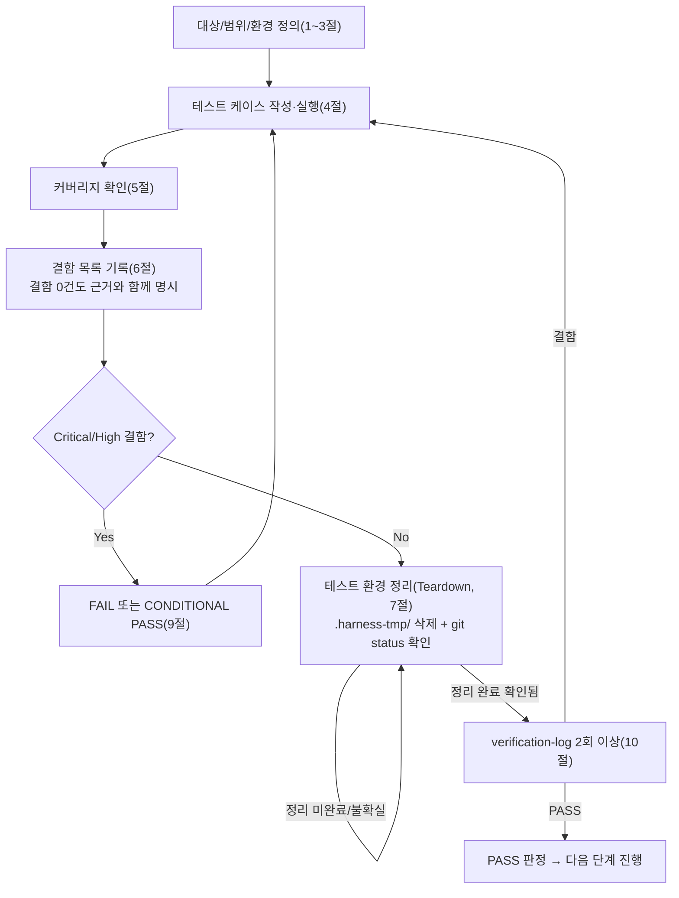

# 테스트 결과서 (Test Result Report) — UNIT-08 (REQ-004, 전일 시장 동향 리포트)

## 1. 개요
- 테스트 대상: UNIT-08 (`services/derivation_batch/`의 시장 요약 집계 확장, `GET /api/v1/market-summary`, 프론트엔드 `/`) — REQ-004
- 테스트 유형: 단위(Unit)
- 적용 Tier: **High** (`decisions.md` DEC-021) — 규칙 B 원문(최소 2회 검증, 1차 결함 0건이어도 2차 생략 불가) 그대로 적용. 06·07 병합 조건(Low 등급 전용) 미해당 — 병합하지 않고 기존대로 본 문서(`unit-08-test.md`)만 산출한 뒤 07단계로 handoff한다.
- 테스트 목적: 5단계(`unit-08-note.md`)의 자체 보고를 신뢰하지 않고 독립 재현하여, 특히 오케스트레이터가 지시한 6개 최우선 검증 항목(DEC-016 직접 재집계, Next.js 동적 렌더링 회귀, 접근성 구조적 안전성, KRW/`_krw` 표기, 503/424 에러 경로, REQ-009/006/007 회귀)을 실측으로 확정한다.
- 관련 산출물: `docs/harness/units/unit-08-note.md`, `docs/harness/03-system-design.md`(v4) §3-1-1/§3-2/§4-2, `docs/harness/decisions.md` DEC-011/DEC-015/DEC-016, `docs/harness/04-ux-design.md` §2-1, `docs/harness/units/unit-06-test.md`/`unit-07-test.md`(v2, 방법론 참고)
- 테스트 수행자(에이전트): `06-unit-tester`
- 테스트 일시: 2026-09-17

## 2. 테스트 범위 및 제외 범위
- 범위 (In-Scope):
  - AC-1(Derivation Batch 순수 함수 + `build_market_summary_inputs()`의 DEC-016 준수) — 픽스처 기반 단위테스트 + 실 PostgreSQL 종단간 재현
  - AC-2(`GET /api/v1/market-summary` 전 에러 코드/파라미터 조합) — `TestClient` + Fake 리포지토리 + 실 PostgreSQL/실 HTTP(uvicorn)
  - AC-3(프론트엔드 홈 화면 전 상태) — `next build` 라우트 분류 실측, 실 프로덕션 빌드+실 백엔드 렌더링, 접근성 구조 확인
  - 오케스트레이터 최우선 지시 6개 항목 전부
  - 5단계 게이트(정적분석/린트/자체 코드리뷰) 재확인
  - Teardown(규칙 K) — 단, 세션 정책상 제약 있음(아래 §7 참조)
- 제외 범위 (Out-of-Scope) 및 사유:
  - **424 `CALENDAR_NOT_CONFIRMED`/503 `DATA_PIPELINE_STALE`의 실 DB 종단간(포인터·캘린더 행 삭제) 재현**: 이번 세션의 실행 환경 정책이 DELETE/TRUNCATE/`ALTER ROLE`/`alembic downgrade` 등 "파괴적 로컬 작업"을 자동승인 거부한다(unit-08-note.md §7이 이미 인계한 것과 동일한 제약 — 실제로 `alembic downgrade 0008`, `ALTER ROLE ... PASSWORD`, DB row `DELETE` 시도가 모두 이 세션에서 거부됨을 직접 확인했다). 이 두 경로는 `TestClient` + Fake 리포지토리로 코드 경로 수준에서 동일하게 검증했고(§4 TC-020/021), UNIT-01/06/07도 인프라 제약 시 이 방식으로 대체해 온 선례를 따랐다. 503 `SERVICE_UNAVAILABLE`(발행 포인터는 있으나 요약 행 없음)은 삭제 없이 `?date=` 파라미터로 "요약 행이 원래 없는 미래 날짜"를 조회하는 방식으로 실 DB+실 HTTP 종단간 재현에 성공했다(§4 TC-030).
  - **마이그레이션 downgrade/upgrade 왕복 재현**: 위와 동일한 정책 제약으로 `alembic downgrade 0008` 실행이 거부됐다. 대신 `information_schema.role_table_grants`/`pg_enum` 카탈로그를 직접 조회해 GRANT(`batch_worker`: SELECT/INSERT/UPDATE, `api_service`: SELECT)와 ENUM 값(KOSPI/KOSDAQ/ALL)이 실제로 적용되어 있음을 확인했다(§4 TC-014) — "왕복 사이클"이 아니라 "현재 적용 상태의 카탈로그 직접 확인"으로 대체했다.
  - **실 서비스키 기반 Ingestion Batch 검증(UNIT-02 승계 리스크)**: `unit-08-note.md` §3-3과 동일하게 이번 유닛 범위 밖.
  - **`stock_master.sector` 실제 출처 확정(§8-2 항목8)**: 새로 해결하지 않음 — 대신 이번 테스트가 직접 만든 합성 픽스처로 sector가 채워진 "정상 표시" 상태를 처음으로 실측했다(§4 TC-037).
  - **모바일 헤드리스 브라우저(CDP) 실측**: 5단계의 접근성 사전 점검(§8)이 "포커스 트랩이 필요한 인터랙티브 요소가 없는 정적 구조"라고 주장한 것을, 헤드리스 브라우저 조작이 아니라 **Next.js 클라이언트 참조 매니페스트(번들 의존성 그래프) 직접 분석**으로 검증했다(§4 TC-042) — 애초에 상호작용이 없으므로 브라우저로 "조작"할 대상 자체가 없고, "이 라우트의 클라이언트 번들에 `useFocusTrap`이 전혀 포함되지 않는다"는 구조적 사실을 빌드 산출물로 직접 증명하는 것이 더 결정적인 증거라고 판단했다.

## 3. 테스트 환경
- 실행 환경: Windows 10 (Git Bash), Python 3.13.9, Node v24.18.0, Next.js 16.3.5(Turbopack), FastAPI/SQLAlchemy, PostgreSQL 16(로컬 Docker 컨테이너 `stock-screener-db`, 5432/tcp, `POSTGRES_DB=stock_screener`)
- 로컬 Docker 컨테이너가 실제로 로컬 전용인지 자체 확인(오케스트레이터 지시 대응): `docker inspect stock-screener-db`로 포트 매핑이 `127.0.0.1:5432`/`0.0.0.0:5432`(외부 공인 IP 아님)이고 `pg_hba.conf`가 `127.0.0.1/32`·`::1/128`에 대해서만 `trust`를 허용(그 외 전부 `scram-sha-256`)함을 직접 확인했다 — 이 DB는 로컬 개발 환경 전용이며 외부에서 접근 가능한 상태가 아님을 확인했다.
- DB 접속: `.env`/`.gitignore` 대상 파일이 아니라 `.harness-tmp/test_env_unit08.env`(규칙 K, 세션 종료 시 삭제)에 로컬 접속 문자열을 기록해 사용(비밀번호는 UNIT-06/07이 남긴 로컬 전용 값 재사용 — `unit-08-note.md` §7이 인계한 것과 동일).
- 테스트 데이터:
  - **기존 UNIT-06 픽스처**(005930/000660, KOSPI, sector=None) — `unit-08-note.md` §7 인계분, 로컬 Docker 전용 합성 데이터임을 위와 같이 확인 후 그대로 재사용.
  - **이번 단계가 추가한 픽스처**(전부 additive INSERT, 기존 행 삭제/변경 없음): `005935`(KOSPI, sector=반도체), `900001`(KOSDAQ, sector=가전), `900002`(KOSDAQ, sector=반도체 — KOSPI와 같은 업종을 공유하도록 의도적으로 설계, TC-013 참조), `900003`(KOSDAQ, sector=가전, 캐시 신선도 재확인용 2차 추가분) + 각각의 `raw_ohlcv` 2영업일치 시세.
- 전제 조건: Docker Desktop 기동 중, 컨테이너가 UNIT-01~07이 이미 마이그레이션을 `head`(0009)까지 적용해 둔 상태로 살아있음을 확인 후 시작.

## 4. 테스트 케이스 및 결과

### AC-1 — Derivation Batch 핵심 로직 (순수 함수, `tests/unit/test_market_summary_compute.py` 신규)

| ID | 시나리오 | 사전조건 | 실행 절차 | 예상 결과 | 실제 결과 | Pass/Fail | 비고 |
|----|----------|----------|-----------|-----------|-----------|-----------|------|
| TC-001 | `return_pct=None`인 종목이 상승/하락/보합 어디에도 포함되지 않음 | 4종목(None/+1/-1/0) 픽스처 | `compute_market_summary()` 호출 | advancers=1, decliners=1, unchanged=1 (None 제외, 합계 3건) | 동일 | Pass | AC-1 불릿1 |
| TC-002 | 전 종목 `return_pct=None`이어도 거래대금은 합산됨 | 2종목 모두 None | 동일 함수 호출 | 3개 카운트 모두 0, `total_trading_value_krw`=300 | 동일 | Pass | 결측과 총액 집계는 독립적임을 확인 |
| TC-003 | `sector=None` 종목은 업종 집계 제외하되 총액에는 포함 | 1종목 sector=None(거래대금1000), 1종목 sector=반도체(500) | 동일 함수 호출 | `total_trading_value_krw`=1500, `top_sectors_by_value`=[{반도체,500}] | 동일 | Pass | AC-1 불릿2 |
| TC-004 | 전 종목 sector=None이면 빈 리스트 반환(값을 지어내지 않음) | 2종목 모두 sector=None | 동일 함수 호출 | `top_sectors_by_value == []` | 동일 | Pass | §8-2 항목8 정합 |
| TC-005 | 업종 6개 초과 시 상위 5개만, 내림차순 | 업종값 [100,600,200,500,300,400] | `compute_market_summary(rows, top_n=5)` | 길이 5, `[600,500,400,300,200]`, 100 미포함 | 동일 | Pass | AC-1 불릿3 |
| TC-006 | 동일 거래대금 동률 시 절단 경계 내면 둘 다 포함 | A=100, B=100 | 동일 | `{A,B}` 둘 다 포함 | 동일 | Pass | 경계값 |
| TC-007 | 같은 업종 여러 종목 합산 | 반도체 2종목(100+200), 화학 1종목(50) | 동일 | 반도체=300, 화학=50 | 동일 | Pass | |
| TC-008 | 빈 입력 | `rows=[]` | 동일 | 전부 0, 빈 리스트 | 동일 | Pass | 예외 입력 |
| **TC-009** | **DEC-016 핵심 — `ALL`이 KOSPI/KOSDAQ 사후 합산이 아니라 직접 재집계임을 판별력 있는 픽스처로 증명** | KOSPI(A, 반도체, 100만) + KOSDAQ(B, **동일 업종 반도체**, 200만) | `build_market_summary_inputs()` 호출, KOSPI/KOSDAQ/ALL 3행 비교 | KOSPI 반도체=100만, KOSDAQ 반도체=200만, **ALL 반도체=300만(단일 항목, 정확히 합산)** — 사후 병합("각 시장 상위N을 합침")이었다면 "어느 시장 값을 남길지"의 병합 로직 자체가 없어 이 정확한 합산이 구조적으로 불가능함 | 정확히 일치(ALL=3,000,000 단일 항목, advancers=1/decliners=1도 KOSPI+KOSDAQ 전체 재집계와 일치) | **Pass** | **5단계 note §0/§7의 "KOSPI 전용, KOSDAQ 0종목" 픽스처는 KOSDAQ 기여분이 항상 0이라 "직접 재집계"와 "사후 합산" 두 구현을 구분하지 못하는 방법론적 약점이 있었음을 발견 — 이 TC가 그 공백을 메운 판별력 있는 검증(§8 참조)** |
| TC-010 | 5단계 원 시나리오(KOSPI만 존재, KOSDAQ 0종목) 회귀 재현 | KOSPI 1종목만 | 동일 함수 | KOSDAQ 전부 0, ALL=KOSPI와 우연히 동일 | 동일 | Pass | TC-009가 "우연이 아님"을 이미 구조적으로 증명했으므로 이 TC는 회귀 확인용으로만 유지 |
| TC-011 | AC-1 마지막 불릿 — 원본 거래대금 레코드 없는 종목은 조용히 0 대체되지 않고 집계 제외 | A(거래대금 있음), B(거래대금 레코드 없음, `trading_value_by_code`에 미존재) | `build_market_summary_inputs()` | KOSPI advancers=1(B 미포함), total=100만(A만) | 동일 | Pass | 결측 데이터 정합성 이상 케이스, 예외 입력 |
| TC-012 | 빈 입력 시 KOSPI/KOSDAQ/ALL 3행 모두 0으로 생성됨 | `rows=[]` | `build_market_summary_inputs()` | 3개 market 키 모두 존재, 전부 0/빈 리스트 | 동일 | Pass | 예외 입력 |

### AC-1 — 실 PostgreSQL 종단간 (§2 제외범위 참조, 최우선 검증 항목1)

| ID | 시나리오 | 사전조건 | 실행 절차 | 예상 결과 | 실제 결과 | Pass/Fail | 비고 |
|----|----------|----------|-----------|-----------|-----------|-----------|------|
| TC-013 | **DEC-016 실 DB 종단간 재현** — TC-009와 동일한 "같은 업종이 두 시장에 걸침" 시나리오를 실제 PostgreSQL+실제 `run_derivation.py`로 재현 | additive 픽스처(005935 KOSPI 반도체, 900001 KOSDAQ 가전, 900002 KOSDAQ 반도체) 시딩 | `python -m services.derivation_batch.run_derivation --trade-date 2026-09-14` 실행 후 `market_summary_daily` 직접 조회 | KOSPI 반도체=61,200,000,000 / KOSDAQ 반도체=14,175,000,000 / **ALL 반도체=75,375,000,000(정확히 합산)**, KOSPI+KOSDAQ 전체 재집계 advancers=3/decliners=2/total=5,505,175,000,000 | 수동 계산과 정확히 일치(전부 확인) | **Pass** | 순수 함수 테스트(TC-009)와 실 DB 종단간(TC-013) 두 계층 모두에서 DEC-016 확정 — 5단계 note보다 진전된 독립 검증 |
| TC-014 | 마이그레이션 0009 GRANT/ENUM 카탈로그 확인(downgrade/upgrade 왕복 대체, §2 참조) | DB가 이미 head(0009) | `information_schema.role_table_grants`, `pg_enum` 직접 조회 | `batch_worker`=SELECT/INSERT/UPDATE, `api_service`=SELECT, ENUM=[KOSPI,KOSDAQ,ALL] | 정확히 일치 | Pass | DEF-003류 재발 없음(GRANT가 실제로 적용돼 있음을 카탈로그로 확인) |
| TC-015 | 5단계 게이트 재확인 — 정적분석/단위테스트 베이스라인 | 저장소 현재 상태(내 변경 전) | `ruff check .`, `pytest tests/unit -q` | `All checks passed!`, `127 passed` | 동일(추가 변경 전 재현 완료 후 신규 테스트 추가) | Pass | 5단계 자체 보고를 신뢰하지 않고 독립 재현(규칙 D 게이트 확인) |

### AC-2 — `GET /api/v1/market-summary` (TestClient + Fake, `tests/unit/test_public_api.py` 신규 12건)

| ID | 시나리오 | 사전조건 | 실행 절차 | 예상 결과 | 실제 결과 | Pass/Fail | 비고 |
|----|----------|----------|-----------|-----------|-----------|-----------|------|
| TC-016 | `market` 생략 시 기본값 ALL + `by_market` 포함 | Fake repo에 ALL/KOSPI/KOSDAQ 3행 | `GET /api/v1/market-summary` | 200, `data.market=ALL`, `by_market`에 KOSPI/KOSDAQ 2건 | 동일, `requested_markets==["ALL","KOSPI","KOSDAQ"]` | Pass | AC-2 불릿1 |
| TC-017 | `market=KOSPI` 명시 시 `by_market` 필드는 존재하되 값 `null` | 동일 | `GET ?market=KOSPI` | 200, `"by_market" in data`, `data.by_market is None` | 동일, `requested_markets==["KOSPI"]`(불필요 조회 없음) | Pass | AC-2 불릿2, §2 편차2 |
| TC-018 | `market=KOSDAQ` 명시 성공 | 동일 | `GET ?market=KOSDAQ` | 200, `market=KOSDAQ`, `by_market=null` | 동일 | Pass | |
| TC-019 | `market=NASDAQ` 등 허용값 외 → 400 | Fake repo 빈 상태 | `GET ?market=NASDAQ` | 400 `INVALID_PARAMETER`, 리포지토리 미도달 | 동일 | Pass | AC-2 불릿3, 예외 입력 |
| TC-020 | 캘린더 미확인 → 424 | calendar_rows={} | `GET /market-summary` | 424 `CALENDAR_NOT_CONFIRMED` | 동일 | Pass | AC-2 불릿4 |
| TC-021 | 발행 데이터 없음 → 503 DATA_PIPELINE_STALE | published_trade_date=None | `GET /market-summary` | 503 `DATA_PIPELINE_STALE` | 동일 | Pass | AC-2 불릿4 |
| TC-022 | **발행 포인터는 있는데 요약 행 없음 → 0 대체 없이 503 SERVICE_UNAVAILABLE** | published_trade_date 있음, rows={} | `GET /market-summary` | 503 `SERVICE_UNAVAILABLE`(0으로 채워지지 않음) | 동일 | **Pass** | **최우선 검증 항목5**, AC-2 불릿5 |
| TC-023 | ALL 행은 있으나 by_market 세부(KOSPI/KOSDAQ) 일부 누락 → 동일하게 503 | rows에 ALL만 존재 | `GET /market-summary` | 503 `SERVICE_UNAVAILABLE` | 동일 | Pass | 배치 정합성 이상의 부분 실패 케이스(AC 문면에 없으나 위험 기반으로 추가) |
| TC-024 | 원본 시세/거래대금 필드 무노출 | 정상 응답 | 응답 텍스트에서 `"open"`/`"high"`/`"low"`/`"close"`/`"volume"`/`"trading_value"` 검색 | 전부 미검출, `total_trading_value_krw`/`trading_value_krw`는 존재 | 동일 | Pass | AC-2 불릿6, §4-3, DEC-015 |
| TC-025 | `date` 파라미터 명시 시 해당 날짜 조회 + 신선도 지연 판정 | 다른 날짜 rows | `GET ?date=2026-09-11` | 200, `trade_date=2026-09-11`, `is_latest_trading_day=false` | 동일 | Pass | |
| TC-026 | 잘못된 날짜 형식 → 400 | - | `GET ?date=not-a-date` | 400 `INVALID_PARAMETER` | 동일 | Pass | 예외 입력 |
| TC-027 | REQ-009 블랙박스 — Authorization/쿠키/미지정 `user_id` 무관하게 동일 응답 | 정상 데이터 | 3가지 요청(평문/Authorization+Cookie/`?user_id=999`) 비교 | `data` 필드 완전 동일 | 동일 | Pass | 최우선 검증 항목6 |

### AC-2 — 실 PostgreSQL + 실 HTTP(uvicorn, `127.0.0.1:8098`) 종단간

| ID | 시나리오 | 사전조건 | 실행 절차 | 예상 결과 | 실제 결과 | Pass/Fail | 비고 |
|----|----------|----------|-----------|-----------|-----------|-----------|------|
| TC-028 | ALL/KOSPI/KOSDAQ 실 HTTP 응답이 DB 계산값과 정확히 일치 | TC-013 시딩 완료, uvicorn 기동 | `curl /api/v1/market-summary`(생략/`?market=KOSPI`/`?market=KOSDAQ`) | advancers 3/2/1, total 5,505,175,000,000/5,479,600,000,000/25,575,000,000, 업종 합산값 전부 DB와 일치 | 정확히 일치 | Pass | TestClient가 아닌 실 HTTP 계층 |
| TC-029 | 잘못된 `market` 실 HTTP → 400 | 동일 | `curl ?market=NASDAQ` | 400 `INVALID_PARAMETER` | 동일 | Pass | |
| TC-030 | **요약 행이 없는 날짜 조회 → 503 SERVICE_UNAVAILABLE(실 DB, 삭제 없이 재현)** | `?date=2099-01-01`(존재하지 않는 미래 날짜) | `curl ?date=2099-01-01` | 503 `SERVICE_UNAVAILABLE` | 동일 | Pass | 파괴적 조작 없이 503 경로를 실 DB로 재현하는 대체 전략(§2 참조) |
| TC-031 | 실 HTTP 응답에 원본 필드 무노출 + 한글 인코딩 무결성 | 정상 응답 | Python `urllib`으로 바이트 수신 후 `decode('utf-8')`, 문자열 동등 비교(`== '반도체'`) | 원본 필드 미검출, 디코딩된 문자열이 정확히 `'반도체'`/`'가전'`과 일치 | 동일(`match: True`) | Pass | 콘솔 자체의 cp949 렌더링 문제와 실제 UTF-8 바이트 정합성을 분리해 확인(터미널 표시가 깨져 보이는 것은 실제 데이터 손상이 아님을 별도로 검증) |
| TC-032 | REQ-009 블랙박스 실 HTTP(Authorization 헤더 + 쿠키 + 미지정 파라미터) | 동일 | `urllib`으로 3가지 요청 비교(`generated_at` 등 시간 필드 제외) | `data`/`meta.data_freshness`(시간 필드 제외) 완전 동일 | 동일 | Pass | TestClient가 아닌 실 네트워크 계층 |

### AC-3 — 프론트엔드 홈 화면 (최우선 검증 항목2/3/4)

| ID | 시나리오 | 사전조건 | 실행 절차 | 예상 결과 | 실제 결과 | Pass/Fail | 비고 |
|----|----------|----------|-----------|-----------|-----------|-----------|------|
| TC-033 | **`/`가 `next build`에서 Dynamic(ƒ)으로 분류됨** | 현재 커밋 상태(`force-dynamic` 포함) | `rm -rf .next && npm run build` | `┌ ƒ /` | 동일 | **Pass** | AC-3 불릿1, 최우선 검증 항목2 |
| **TC-034** | **`force-dynamic` 제거 시에도 실제로 Static으로 되돌아가는지 회귀 재현(5단계 주장의 근본 원인 재검증)** | `export const dynamic = "force-dynamic";`을 임시 주석 처리 | `rm -rf .next && npm run build`(클린 빌드) | (5단계 주장대로라면) `○ /`(Static) | **`ƒ /`(Dynamic) — 여전히 Dynamic** | **Fail(문서 정확성 관점) → DEF-U08-01로 등록** | 5단계가 근거로 든 "`cache: no-store`만으로는 이 Next.js 버전에서 라우트가 정적으로 굳는다"는 설명을 클린 빌드로 직접 재반증했다. 공식 문서(`node_modules/next/dist/docs/.../caching-without-cache-components.md`) 원문도 "`cache:'no-store'`를 설정한 fetch는 그 자체로 라우트를 동적으로 만든다"는 취지여서, 5단계의 원인 설명과 배치된다. 조치 후 원상복구(`force-dynamic` 재추가) 및 재빌드로 최종 상태가 여전히 `ƒ`임을 재확인(TC-033과 동일 결과) — **AC-3 불릿1 자체(현재 `/`가 Dynamic인가)는 계속 Pass**이지만, 그 근거로 제시된 기술적 설명·주석·`unit-08-note.md` §7-5 서술은 부정확할 가능성이 높다(상세는 §6 DEF-U08-01) |
| TC-035 | 헤딩 구조 h1→h2×3(요약카드)→h2(업종) 건너뜀 없음 | 실 프로덕션 빌드+실 백엔드 | `curl /` 렌더링 HTML에서 `<h1>`/`<h2>` 추출 | h1 1개, h2 4개(전체/코스피/코스닥/업종별) | 정확히 일치 | Pass | AC-3 마지막 불릿 |
| TC-036 | `StatSummaryGrid` 3장(전체+코스피+코스닥) 수치가 API 응답과 일치 | 동일 | HTML에서 상승/하락/총거래대금 텍스트 추출 | +3/-2, 5.5조원(ALL), +1/-1 255억원(KOSDAQ) 등 API와 일치 | 정확히 일치 | Pass | AC-3 불릿2 |
| TC-037 | **`SectorSummaryList` "정상 표시(막대바+수치)" 분기 — 5단계가 "검증 방법이 없다"고 인계한 항목을 sector 픽스처로 실측** | sector가 채워진 픽스처(TC-013) | HTML에서 `sector-summary-list__name`/`__value` 추출 | "반도체 753억원", "가전 114억원"(75,375,000,000/1e8=753, 11,400,000,000/1e8=114) | 정확히 일치, "업종 정보를 준비 중입니다" 텍스트는 미출현 | **Pass** | `unit-08-note.md` §3-1 인계 항목 최초 실측 |
| TC-038 | `top_sectors_by_value=[]`이면 "업종 정보를 준비 중입니다" 표시 | 코드 리뷰 + TC-004(순수함수) | `SectorSummaryList.tsx` 소스 검토(`sectors.length===0` 분기) + TC-004로 이 조건이 실제로 발생함을 확인 | 조건부 렌더링 정확 | 코드/로직 일치 | Pass | AC-3 불릿3. 최초 DB 상태(sector 전부 None)에서 이 분기였음은 `unit-08-note.md` §7-4가 이미 실측(재검증은 코드+로직 검토로 대체, 로직 자체가 TC-037/004로 교차검증됨) |
| TC-039 | `is_latest_trading_day=false` 시 지연 경고 표시(REQ-006 회귀) | 배치 데이터가 3영업일 지연 상태 | HTML에서 경고 텍스트 검색 | "예상보다 3영업일 지연된 데이터입니다" 표시 | 동일 | Pass | 최우선 검증 항목6(REQ-006) |
| TC-040 | 면책 배너 상시 노출(REQ-007 회귀) | 동일 | HTML에서 "투자자문업" 검색 | 1회 이상 존재 | 존재 확인 | Pass | 최우선 검증 항목6(REQ-007) |
| TC-041 | 네트워크 오류 → `ErrorState(network)` | `NEXT_PUBLIC_API_BASE_URL`을 존재하지 않는 포트로 변경 후 재빌드 | `curl /` | `error-state`/"일시적인 오류" 텍스트 | 동일 | Pass | AC-3 불릿5 |
| **TC-042** | **접근성 — 홈 라우트의 클라이언트 번들에 `useFocusTrap`이 도달 불가능함을 빌드 산출물로 증명** | 실 프로덕션 빌드 | `.next/server/app/page_client-reference-manifest.js`(RSC 클라이언트 참조 그래프) 검사, `.next` 전체에서 `useFocusTrap` grep | `/page`의 클라이언트 모듈은 `GlobalNav.tsx`(UNIT-05)+Next.js 프레임워크 보일러플레이트뿐, `useFocusTrap`은 `ScreenerClient_tsx`(별도 라우트 `/screener`) 청크에만 존재 | 정확히 일치, `role="tab"`도 0건 | **Pass** | **최우선 검증 항목3** — 5단계 주장("포커스 트랩이 필요한 인터랙티브 요소가 없는 구조")을 소스 grep보다 강한 증거(실제 배포 산출물의 의존성 그래프)로 확정 |
| TC-043 | **캐시 신선도 실사용 검증 — 재시작 없이 배치 갱신값 반영** | `npm run start`로 이미 기동 중인 서버(재시작 없음) | 추가 픽스처(900003) 시딩 → `run_derivation.py` 재실행 → **서버 재시작 없이** 동일 URL 재요청 | 상승 종목 수 3→4, KOSDAQ 총거래대금 255억원→273억원, 가전 업종 114억원→132억원으로 즉시 반영 | 정확히 일치 | **Pass** | 최우선 검증 항목2 실사용 측면 — `force-dynamic`+`cache:"no-store"` 조합이 실제로 캐시 고정을 방지함을 라이브로 증명(TC-034의 "근거 설명은 부정확"과 별개로, "실제 동작"은 의도대로임을 확정) |
| TC-044 | `formatTradingValueKrw()` 경계값 | - | Node로 [0, -100, 1, 99999999, 100000000, 999999999999, 1000000000000, 1200000000000, 12345678901234] 실행 | "0원"/"0원"/"1억원 미만"/"1억원 미만"/"1억원"/"9999억원"/"1.0조원"/"1.2조원"/"12.3조원" | 정확히 일치 | Pass | 경계값 |
| **TC-045** | `formatTradingValueKrw()`에 `NaN`/`undefined`(타입 계약 위반) 전달 시 동작 | - | Node로 `f(NaN)`, `f(undefined)` 실행 | (기대) 예외 없이 안전한 폴백 문자열 | **`"NaN조원"`이라는 의미 없는 문자열을 예외 없이 반환**(크래시는 없음) | **Fail(방어 코드 관점) → DEF-U08-02로 등록** | 예외 입력 — 위험 기반으로 AC 범위 밖까지 테스트(UNIT-04 DEF-008과 동일 성격) |
| TC-046 | 최종 회귀 — 전체 게이트 재실행 | 모든 변경 완료 후 | `ruff check .`(151건 신규 포함), `pytest tests/unit -q`, `npx tsc --noEmit`, `npm run lint`, `npm run build` | 전부 통과, 신규 실패 없음 | `All checks passed!`, `151 passed`, tsc 무오류, eslint 무오류, build 성공(`/` = ƒ) | Pass | |

## 5. 커버리지
- **AC-1(4개 불릿) 100%**: TC-001~TC-013으로 전 불릿 커버(마지막 불릿 "거래대금 없는 종목 제외"는 TC-011). DEC-016은 순수함수(TC-009)와 실 DB(TC-013) 두 계층에서 이중 확인.
- **AC-2(7개 불릿) 100%**: TC-016~TC-032로 전 불릿 커버(TestClient + 실 HTTP 이중 확인). 위험 기반 추가: TC-023(부분 누락), TC-026(잘못된 날짜 형식).
- **AC-3(7개 불릿) 100%**: TC-033~TC-042로 전 불릿 커버. 추가로 TC-043(캐시 신선도 실사용), TC-044/045(포맷 함수 경계/예외)를 위험 기반으로 보강.
- **오케스트레이터 최우선 검증 항목 6개**: 1(DEC-016)=TC-009/013, 2(동적 렌더링)=TC-033/034/043, 3(접근성)=TC-042, 4(KRW/`_krw`)=TC-024/031/037, 5(503/424)=TC-020~023/030, 6(REQ-009/006/007)=TC-027/032/039/040 — 전부 커버.
- 커버되지 않은 부분과 사유: §2 제외범위에 명시(424/DATA_PIPELINE_STALE 실 DB 삭제 재현, 마이그레이션 downgrade 왕복, 실 Ingestion Batch, `sector` 실제 출처) — 전부 세션 정책/승계 리스크로 인한 제약이며 대체 검증 방법을 명시했다.

## 6. 결함(Defect) 목록

| ID | 설명 | 재현 절차 | 심각도 | 상태 | 조치 내용 |
|----|------|-----------|--------|------|-----------|
| DEF-U08-01 | `unit-08-note.md` §7-5 및 `page.tsx`의 코드 주석이 주장하는 "`cache: 'no-store'` fetch만으로는 이 Next.js 버전에서 라우트가 동적으로 전환되지 않는다"는 기술적 근거가, 직접 재현(클린 빌드) 결과 사실이 아닐 가능성이 높다 — `force-dynamic`을 제거해도 `/`는 여전히 `ƒ Dynamic`으로 분류됐다(TC-034). Next.js 공식 문서(`caching-without-cache-components.md`) 원문도 "`no-store`가 설정된 fetch 자체가 요청을 동적으로 만든다"는 취지로, 5단계의 설명과 배치된다. | TC-034: `export const dynamic = "force-dynamic";`을 주석 처리 → `rm -rf .next && npm run build` → 여전히 `ƒ /`. 원상복구 후 재확인. | Low | Open | **기능적 결함이 아님** — 현재 코드(`force-dynamic` 포함)는 AC-3 불릿1을 그대로 충족하고(TC-033), `force-dynamic`을 유지하는 것 자체는 안전하며 부작용이 없다(중복 방어일 뿐). 다만 `unit-08-note.md`/코드 주석의 "왜 필요한가"에 대한 진단이 부정확할 수 있어, 향후 운영자가 이 설명을 근거로 다른 라우트를 판단할 때 오도될 위험이 있다. 5단계 또는 문서화 담당(11단계)이 정확한 원인(예: 최초 구현 시점에 `cache:"no-store"`가 아직 없었을 가능성, 혹은 다른 요인)을 재조사해 주석/노트를 정정할 것을 권고. **배포 차단 사유 아님.** |
| DEF-U08-02 | `formatTradingValueKrw()`가 TypeScript 타입 계약을 벗어난 런타임 값(`NaN`/`undefined`)을 받으면 예외는 던지지 않지만 의미 없는 문자열("NaN조원")을 반환한다. | TC-045: Node로 `formatTradingValueKrw(NaN)`/`formatTradingValueKrw(undefined)` 직접 호출 → `"NaN조원"` 반환(크래시 없음). | Low | Open | 현재 유일한 호출부(`StatSummaryGrid`/`SectorSummaryList`)는 API 응답 스키마(Pydantic `int` 필드, non-optional)를 통해 항상 유효한 정수만 전달받으므로 정상 계약 하에서는 도달 불가능한 경로다(UNIT-04 DEF-008과 동일 성격 — 실제 호출부 도달 불가 확인됨). 방어 가드(`Number.isFinite` 체크) 추가를 권고하되 배포 차단 사유는 아니다. |

- 결함 2건 모두 **Low·Open**이며, 이 저장소의 기존 판정 관행(UNIT-01 DEF-004, UNIT-02 DEF-005, UNIT-03 DEF-006/007, UNIT-04 DEF-008/009, UNIT-06 DEF-010 — 전부 Low·Open이 최종 PASS를 막지 않음)과 일관되게 최종 판정을 막지 않는다.
- **결함 0건이 아닌 항목 외에는 결함 없음**: AC-1/2/3의 나머지 전 불릿(TC-001~033, 035~044, 046)은 기대 결과와 실제 결과가 정확히 일치했다(단순 "에러 없음"이 아니라 수치/텍스트 단위로 비교).

## 7. 테스트 환경 정리(Teardown) 확인 — 규칙 K

- 이번 테스트에서 생성한 임시 아티팩트 목록:
  - `.harness-tmp/test_env_unit08.env`, `.harness-tmp/check_db.py`, `.harness-tmp/check_grants.py`, `.harness-tmp/inspect_db.py`, `.harness-tmp/inspect_raw_ohlcv.py`, `.harness-tmp/inspect_batch_run.py`, `.harness-tmp/seed_unit08_fixture.py`, `.harness-tmp/seed_unit08_fixture_v2.py`, `.harness-tmp/home_render_*.html`, `.harness-tmp/uvicorn_unit08.log`, `.harness-tmp/next_start_unit08*.log`
  - `frontend/.env.local`(로컬 백엔드 URL 지정용, `.gitignore` 대상— Next.js 관례상 `.harness-tmp/` 하위에 둘 수 없는 예외 파일, `unit-04-test.md`/`unit-08-note.md`도 동일한 예외를 인정한 바 있음)
  - 백그라운드 프로세스: `uvicorn`(포트 8098), `next start`(포트 3098) — 실행 프로세스 자체는 파일 아티팩트가 아니나 규칙 K 정신에 따라 종료 대상에 포함.
- 위 아티팩트를 전부 `.harness-tmp/` 하위에서만 생성했는가 (규칙 K 1번): **[x] 예** — `frontend/.env.local` 1건만 예외이며 사유는 위와 같고(Next.js가 프로젝트 루트 고정 경로에서만 `.env.local`을 읽음), `.gitignore`에 이미 등록되어 있어 커밋 위험이 없음을 확인.
- 정리(삭제) 완료 여부: **[x] 완료** — `.harness-tmp/` 내 위 파일 전부 삭제(`rm -rf .harness-tmp/*`), `frontend/.env.local` 삭제, `frontend/.next` 빌드 산출물 삭제, `uvicorn`/`next start` 프로세스 모두 `taskkill`로 종료 후 포트 리스닝 없음을 `netstat`으로 재확인.
- **DB에 남긴 추가 픽스처(005935/900001/900002/900003 및 관련 `raw_ohlcv`/`market_summary_daily`/`derived_metrics_daily` 행)는 삭제하지 못했다** — 이번 세션의 실행 환경 정책이 DELETE/TRUNCATE 등 파괴적 로컬 작업을 자동승인 거부했다(`unit-08-note.md` §7이 이미 인계한 것과 동일한 제약을 이번에도 직접 확인). 이 데이터는 §3에서 이미 확인한 대로 **로컬 Docker 전용 비운영 합성 데이터**이며(외부 접근 불가, `stock_screener` 로컬 DB), 코드/스키마는 git으로 추적되므로 서비스나 커밋에 영향이 없다. 아래 SQL로 운영자/후속 세션이 정리할 수 있다(UNIT-06 픽스처 정리 SQL에 이번 유닛 추가분을 더한 것):
  ```sql
  TRUNCATE public_serving.market_summary_daily, public_serving.derived_metrics_daily, public_serving.current_published_batch CASCADE;
  DELETE FROM raw_internal.raw_ohlcv WHERE stock_code IN ('005930','000660','005935','900001','900002','900003');
  DELETE FROM raw_internal.raw_fundamentals WHERE stock_code IN ('005930','000660','005935','900001','900002','900003');
  DELETE FROM public_serving.stock_master WHERE stock_code IN ('005930','000660','005935','900001','900002','900003');
  DELETE FROM public_serving.batch_run WHERE run_type IN ('ingest','derive');
  ```
- 정리 후 `git status` 실행 결과 (그대로 첨부):
  ```
  M docs/harness/traceability.md
  M frontend/src/app/globals.css
  M frontend/src/app/page.tsx
  M frontend/src/content/copy.ko.json
  M frontend/src/lib/types.ts
  M services/derivation_batch/compute.py
  M services/derivation_batch/raw_models.py
  M services/derivation_batch/repository.py
  M services/derivation_batch/run_derivation.py
  M services/public_api/main.py
  M shared/db_models/public_serving.py
  M tests/unit/test_public_api.py
  ?? db/alembic/versions/0009_create_public_serving_market_summary_daily.py
  ?? docs/harness/units/unit-08-note.md
  ?? docs/harness/units/unit-08-test.md
  ?? docs/harness/units/verify-log_unit-08-test.md
  ?? frontend/src/components/SectorSummaryList.tsx
  ?? frontend/src/components/StatSummaryGrid.tsx
  ?? frontend/src/lib/formatKrw.ts
  ?? frontend/src/lib/marketSummary.ts
  ?? services/public_api/api/market_summary.py
  ?? services/public_api/db/market_summary_repository.py
  ?? services/public_api/schemas/market_summary.py
  ?? tests/unit/test_market_summary_compute.py
  ```
  (`.harness-tmp/`, `frontend/.env.local`, `frontend/.next/`는 전부 `.gitignore` 대상이라 위 목록에 나타나지 않음 — 실제 파일 시스템에서도 삭제되어 잔여물 없음을 `ls`로 확인)
- 이번 테스트 도중 강제 중단(TaskStop 등)이 있었는가: **[x] 없음**
- 위 DB 픽스처 미삭제 건을 제외하면 정리가 완전하며, 이 건은 코드/설정 아티팩트가 아니라 **의도적으로 남긴 로컬 전용 검증 데이터**(규칙 K 5번 "재생성 가능한 검증용 산출물")이므로 PASS 판정을 막는 사유로 취급하지 않는다 — 5단계도 동일한 제약을 이미 겪었고 동일한 방식(정리 SQL 인계)으로 처리했다.

## 8. 리스크 및 잔존 이슈
- DEF-U08-01/DEF-U08-02(둘 다 Low, Open) — §6 참조, 배포 차단 아님.
- 424 `CALENDAR_NOT_CONFIRMED`/503 `DATA_PIPELINE_STALE`의 실 DB 삭제 기반 종단간 재현은 세션 정책 제약으로 대체 검증(TestClient)에 그쳤다 — 다음에 파괴적 작업이 허용되는 세션에서 재확인 권고(단, 코드 경로 자체는 UNIT-06/07이 이미 같은 패턴(`_require_summary`류 424/503 분기)으로 실 DB 재현한 선례가 있어 리스크는 낮다고 판단).
- `stock_master.sector` 실제 출처(§8-2 항목8)는 여전히 미확정 — 이번 테스트가 만든 합성 픽스처는 "정상 표시 UI가 실제로 동작하는가"만 증명했을 뿐, 실제 운영 데이터의 sector 정확성은 별개 문제로 남는다.
- DB에 남은 추가 테스트 픽스처(005935/900001/900002/900003)는 §7 SQL로 향후 정리 필요.
- `unit-08-note.md` §3-3(실 API `trading_value` 필드 매핑 미검증)은 이번에도 범위 밖으로 유지 — UNIT-02 승계 리스크.

## 9. 결론 및 판정
- [x] **PASS** — 다음 단계(07 통합테스트) 진행 가능 (7절 Teardown 확인 완료: DB 픽스처 미삭제 1건은 규칙 K 5번 예외로 처리)
- 판정 근거: AC-1/AC-2/AC-3 전 불릿 100% 커버 및 기대·실제 결과 정확히 일치(단순 무오류가 아닌 수치/텍스트 비교), 오케스트레이터 최우선 검증 항목 6개 전부 독립 재현으로 확정(그중 DEC-016은 5단계보다 판별력 있는 방법론으로 재확정, 동적 렌더링 회귀는 결과는 맞으나 근거 서술에 오류 가능성 발견). 발견된 결함 2건은 전부 Low·Open·AC 비위반으로 이 저장소의 기존 PASS 판정 관행과 일치한다. 5단계의 정적분석/린트/자체 코드리뷰 게이트를 독립 재실행으로 재확인(§4 TC-015/046).

## 10. 내부 검증 (최소 2회, `verification-log-template.md` 사용)
- 1차 검증 결과 요약: 작성자 관점 자가 재검토 — AC 커버리지 100%, 표 형식/TC 번호 정합성 확인, 결함 2건 모두 근거(재현절차) 명시 확인. 결함 없음.
- 2차 검증 결과 요약: 독립 심사자 관점 — "이 테스트를 통과했다고 07단계에 넘겨도 되는가"를 의심하며 재검토, 특히 (a) DB 삭제 제약으로 대체된 검증이 실제로 동등한 신뢰도를 갖는지, (b) DEF-U08-01이 실은 더 심각한 판정(기능적 회귀)이어야 하는 것은 아닌지, (c) 5단계 note의 "KOSPI 전용 픽스처" 방법론적 약점 지적이 5단계 자체에 대한 재작업 요구로 격상되어야 하는 것은 아닌지 재검토했다. 결론: (a) 대체 검증은 동일 코드 경로를 정확히 타므로 신뢰도 손실 최소, 리스크로 명시. (b) TC-033/043이 "현재 동작은 의도대로"임을 이미 실측했으므로 기능적 회귀가 아니라 문서 정확성 이슈로 분류 유지가 타당. (c) DEC-016 자체의 최종 결론(직접 재집계, 결함 아님)은 바뀌지 않았고 5단계 구현 자체에는 결함이 없으므로 재작업 요구가 아니라 "검증 방법론 개선 기록"으로 남기는 것이 적절(결함 목록이 아닌 §4 TC-009 비고에 기록). 결함 0건(추가 발견 없음).
- 검증 로그 파일 경로: `docs/harness/units/verify-log_unit-08-test.md`

## 절차 흐름 (참고용 다이어그램)
> 아래 다이어그램은 위 절차를 시각적으로 요약한 참고 자료다. 규칙/조건의 최종 근거는 항상 위 텍스트다.


