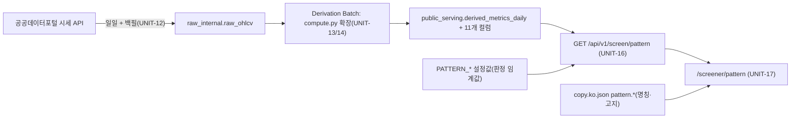

# 02. 설계서 — 패턴 스크리닝 "급등 전 압축주"

- 작성일: 2026-10-02 (KST) · 버전: v1 → 검증 후 v2(최종)
- 입력: [01 기획서](01-planning.md), `docs/harness/03-system-design.md`(v4+), 실제 코드(아래 §2 표의 경로는 전부 확인한 실존 경로)
- 실행 가능한 기준 정의: [`prototype/pattern_rules_reference.py`](prototype/pattern_rules_reference.py) — 이 문서의 수식과 **1:1**이며 개발 시 교차 대조 오라클로 쓴다.

## 0. 설계 원칙 (20년차 기준 — 기존 아키텍처를 깨지 않는 최소 변경)

1. **additive only**: 기존 `GET /screen`·`derived_metrics_daily` 기존 컬럼·기존 화면의 계약을 바꾸지 않는다. 새 컬럼(nullable)·새 엔드포인트·새 라우트만 추가한다.
2. **§4-3 데이터 가공 원칙 유지**: 응답에는 가격 원문이 없다. 모든 노출 값은 비율(%)·배수·불리언·일수다(`DEC-006`의 3중 분리 유지, `api_service`는 `raw_internal` 접근 불가).
3. **계산 파라미터 ≠ 판정 임계값**: 바꾸면 재계산이 필요한 값(배치에서 고정)과, 조회 시점에 적용되어 재시작만으로 바뀌는 값(설정)을 분리한다 → 사용자 "임계값 설정값으로 분리" 결정(DEC-032)을 코드 구조로 보장.
4. **명시적 실패**: 데이터가 부족하면 조용히 빼지 않고 `산정 불가 + 사유`로 노출한다(REQ-035). 3값 논리(TRUE/FALSE/NULL)를 DB에서 끝까지 유지한다.
5. **판정 로직 단일 출처**: 조건 식은 `build_condition_exprs()` **한 곳**에서 SQLAlchemy 식으로 만들고, 필터링(WHERE)과 응답용 충족 여부(SELECT)가 같은 식을 쓴다 → 필터와 표시가 어긋날 수 없다.

## 1. 구성도



## 2. 변경 지도 (실존 파일 기준)

| 구분 | 경로 | 변경 |
|---|---|---|
| 신규 | `shared/pattern_params.py` | 계산 파라미터 상수(§3-2). 배치와 API(정의 노출)가 공유 |
| 수정 | `services/derivation_batch/compute.py` | 순수 함수 추가(기존 함수 불변): `compute_pattern_metrics()` 등 |
| 수정 | `services/derivation_batch/repository.py` | `OHLCV_WINDOW_SIZE` 41→`PATTERN_WINDOW_ROWS`(100), `DerivedMetricsInput`·`upsert_derived_metrics`에 11개 컬럼 추가 |
| 수정 | `services/derivation_batch/run_derivation.py` | `StockDayMetrics`·`compute_stock_day_metrics`·`build_derivation_inputs` 확장. **`_validation_passed`는 불변**(패턴 지표 결측이 발행을 막지 않게) |
| 수정 | `shared/db_models/public_serving.py` | `DerivedMetricsDaily`에 11개 `Mapped` 컬럼 |
| 신규 | `db/alembic/versions/0011_add_pattern_metrics_to_derived_metrics_daily.py` | 컬럼 11개 추가(+CHECK). 현재 head는 0010 |
| 신규 | `services/public_api/core/pattern_config.py` | 판정 임계값 로더(`PATTERN_*`, 범위 검증, fail-fast) |
| 신규 | `services/public_api/db/pattern_repository.py` | `build_condition_exprs()`, `SqlPatternScreenRepository` |
| 신규 | `services/public_api/schemas/pattern.py` | 응답 Pydantic 모델(화이트리스트) |
| 신규 | `services/public_api/api/pattern.py` | `GET /screen/pattern` |
| 수정 | `services/public_api/main.py` | `include_router(pattern.router, prefix="/api/v1")` 1줄 + 기능 스위치 |
| 신규 | `scripts/backfill_ohlcv.py` | 과거 일봉 백필(§7) |
| 신규 | `scripts/pattern_threshold_report.py` | 임계값 보정 분포 리포트(읽기 전용) |
| 신규/수정 | `frontend/src/app/screener/pattern/page.tsx` 외 | 디자인서 §6 |
| 수정 | `frontend/src/content/copy.ko.json` | `pattern.*` 키 추가 |
| 수정 | `frontend/src/lib/errorMapping.ts` | `PATTERN_DATA_NOT_READY` 매핑 |

> `services/public_api/api/screen.py`, `db/screen_repository.py`, `schemas/screen.py`는 **수정하지 않는다.**

## 3. 데이터 모델

### 3-1. `derived_metrics_daily` 추가 컬럼 (마이그레이션 0011, 모두 nullable)

| 컬럼 | 타입 | 의미(단위) | 쓰임 |
|---|---|---|---|
| `sideways_range_pct` | NUMERIC | 최근 L(80)거래일 종가의 (최고−최저)/평균 ×100 (%) | c1 |
| `sideways_net_change_pct` | NUMERIC | (T일 종가−L일 전 종가)/L일 전 종가 ×100 (%) | c1 |
| `ma_convergence_pct` | NUMERIC | (max(MA5,MA10,MA20)−min(·))/MA20 ×100 (%) | c2 |
| `volatility_contraction_ratio` | NUMERIC | 최근 10일 일수익률 표준편차 ÷ 최근 60일 표준편차(모표준편차) | c2 |
| `ma60_gap_pct` | NUMERIC | (종가−MA60)/MA60 ×100 (%) | c3·c4 |
| `ma20_vs_ma60_gap_pct` | NUMERIC | (MA20−MA60)/MA60 ×100 (%) | c3 |
| `ma60_slope_pct` | NUMERIC | (MA60(T)−MA60(T−10))/MA60(T−10) ×100 (%) — **표시 전용**(판정 미사용) | 화면 보조 |
| `ma60_cross_up_days` | SMALLINT | 최근 10거래일 내 종가가 MA60을 **상향 돌파**한 가장 최근 시점까지의 일수(0=오늘). 없으면 NULL | c4 |
| `volume_ratio_5_60` | NUMERIC | 최근 5일 평균 거래량 ÷ 최근 60일 평균 거래량(배) | c5 |
| `recent_surge_flag` | BOOLEAN | 최근 20거래일 내 "일 등락률 ≥ +10% **그리고** 거래량 ≥ 직전 20일 평균×3" 인 날 존재 여부 | c9 |
| `pattern_metrics_status` | VARCHAR(24) + CHECK | `OK` / `INSUFFICIENT_HISTORY` / `SUSPECT_PRICE_JUMP`. 이전 배치 행은 NULL | 전 조건 게이트 |

- `volume_anomaly_score`(기존 컬럼)는 c5에서 **재사용**한다(재계산 안 함).
- **GRANT 불필요**: 0007과 동일하게 기존 테이블의 컬럼 추가이며 `batch_worker`(SELECT/INSERT/UPDATE)·`api_service`(SELECT)의 테이블 권한을 상속한다(0007 docstring 근거). 단, 적용 후 실제 역할로 접근 검증은 UNIT-14 필수.
- 인덱스 추가 없음: 조회는 항상 `trade_date`(+`market`) 단일 거래일(≈2,700행)로 좁혀지며 0008 인덱스가 이미 있다.
- `downgrade`: 11개 컬럼 drop(CHECK 포함). 가역.
- 구 배치 행은 `pattern_metrics_status IS NULL` → 모든 조건 `산정 불가`(사유 `METRIC_UNAVAILABLE`). 최신 발행 거래일만 서빙되므로 영향 없음.

### 3-2. 계산 파라미터 (`shared/pattern_params.py`, 고정 상수 — 바꾸면 배치 재계산)

| 상수 | 값 | 설명 |
|---|---|---|
| `PATTERN_LOOKBACK_DAYS` (L) | 80 | 횡보 판정 구간(약 4개월). "최소 수개월"의 제안 해석 |
| `PATTERN_MIN_ROWS` | 80 | 미만이면 `INSUFFICIENT_HISTORY` |
| `PATTERN_WINDOW_ROWS` | 100 | 종목당 일봉 조회 행 수(여유 20). 기존 41 대체 |
| `MA60_WINDOW` / `MA60_SLOPE_DAYS` / `CROSS_LOOKBACK_DAYS` | 60 / 10 / 10 | 60일선·기울기·돌파 관찰 |
| `VOL_SHORT` / `VOL_LONG` | 10 / 60 | 변동성 수축비 |
| `VR_SHORT` / `VR_LONG` | 5 / 60 | 거래량비 |
| `SURGE_LOOKBACK_DAYS` / `SURGE_RETURN_PCT` / `SURGE_VOLUME_MULT` | 20 / 10.0 / 3.0 | c9 대리 지표 |
| `PRICE_JUMP_LIMIT_PCT` | 31.0 | 일 변동 ±30% 초과 단절 = 수정주가 미반영 의심 |

필요 행 수 검산: MA60 상향돌파 탐지는 MA60(오프셋 k+1, k≤9)까지 → 70행, 수익률 표준편차 60일 → 61행, 급등 관찰 → 1+20+20=41행, 횡보 L=80행 → **최대 80 = `PATTERN_MIN_ROWS`**. 조회는 여유 포함 100.

### 3-3. 판정 임계값 (설정값, 조회 시 적용 — 기본값은 **사용자 확정 대기**)

| 환경변수 | 기본값 | 허용 범위(범위 밖이면 기동 실패) | 쓰임 |
|---|---|---|---|
| `PATTERN_RANGE_MAX_PCT` | 40.0 | 5 ~ 100 | c1 횡보 폭 상한 |
| `PATTERN_NET_CHANGE_MAX_PCT` | 15.0 | 1 ~ 50 | c1 순변화율 절댓값 상한 |
| `PATTERN_CONVERGENCE_MAX_PCT` | 3.0 | 0.5 ~ 10 | c2 이평 수렴 폭 상한 |
| `PATTERN_VOLATILITY_CONTRACTION_MAX` | 1.0 | 0.3 ~ 2.0 | c2 변동성 수축비 상한 |
| `PATTERN_MA60_APPROACH_BAND_PCT` | 5.0 | 1 ~ 15 | c3 접근 밴드, c4 돌파 직전 하단 |
| `PATTERN_MA60_EARLY_MAX_GAP_PCT` | 7.0 | 1 ~ 20 | c4 돌파 초입 상단(이를 넘으면 "크게 돌파") |
| `PATTERN_CROSS_EARLY_MAX_DAYS` | 10 | 1 ~ `CROSS_LOOKBACK_DAYS`(10) 정수 | c4 돌파 후 경과일 상한 |
| `PATTERN_VOLUME_RATIO_MIN` / `_MAX` | 1.0 / 2.5 | 0.5~3 / 1~10, **MIN < MAX** | c5 |
| `PATTERN_VOLUME_ANOMALY_MAX` | 3.0 | 0.5 ~ 10 | c5 오늘 거래량 폭발 배제 |
| `PATTERN_SCREEN_ENABLED` | `true` | `true`/`false` | **기능 스위치**(§9) |

- 사용자(요청자)는 임계값을 **바꿀 수 없다**(질의 파라미터로 받지 않음). 이유: (1) 임의 임계값 질의는 원천 데이터 역추정 수단이 되어 §4-3·REQ-022 방어 논리를 약화, (2) 쿼리 비용 통제, (3) "정의 = 서버 한 곳".
- 설정 오류는 **기동 시 즉시 실패**(`ConfigError`, 조용한 기본값 대체 금지) — `PUBLIC_API_DATABASE_URL`과 같은 정책.

## 4. 조건 정의 (기준 구현과 동일)

모든 비교는 **경계 포함**(≤, ≥)이며 입력은 종가·거래량 일봉(최신순, 0번=T). 결과는 `true`/`false`/`null(산정 불가)`.

### 4-1. 산정 가능 게이트
1. `len(window) < 80` → `INSUFFICIENT_HISTORY` — 모든 조건 `null`.
2. 최근 L−1개 일수익률 중 `|r| > 31%` 하나라도 있음, 또는 종가 ≤ 0 → `SUSPECT_PRICE_JUMP` — 모든 조건 `null`.
3. 개별 지표 분모가 0(예: 60일 수익률 표준편차 0, 60일 평균 거래량 0) → 해당 값 `NULL` → 그 값을 쓰는 조건은 3값 논리로 `null`(다른 항이 `false`면 `false`).

### 4-2. 조건 c1~c5, c9

| ID | 이름(원문 기준) | 판정식 (SQL과 동일 의미) |
|---|---|---|
| **c1** | 긴 횡보 | `sideways_range_pct ≤ RANGE_MAX` **AND** `ABS(sideways_net_change_pct) ≤ NET_CHANGE_MAX` |
| **c2** | 5·10·20일선 수렴 | `ma_convergence_pct ≤ CONVERGENCE_MAX` **AND** `volatility_contraction_ratio ≤ VOLATILITY_CONTRACTION_MAX` |
| **c3** | 60일선 접근 | `ABS(ma60_gap_pct) ≤ BAND` **AND** `ABS(ma20_vs_ma60_gap_pct) ≤ BAND` |
| **c4** | 60일선 돌파 직전/초기 | `(ma60_gap_pct ≥ −BAND AND ma60_gap_pct < 0)` **OR** `(ma60_gap_pct ≥ 0 AND ma60_gap_pct ≤ EARLY_MAX_GAP AND ma60_cross_up_days IS NOT NULL AND ma60_cross_up_days ≤ CROSS_EARLY_MAX_DAYS)` |
| **c5** | 거래량 폭발 전·점진 증가 | `volume_ratio_5_60 BETWEEN VR_MIN AND VR_MAX` **AND** `volume_anomaly_score < VOLUME_ANOMALY_MAX` |
| **c9** | 급등 이력 없음(뉴스 대리) | `recent_surge_flag IS FALSE`(TRUE이면 `false`, NULL이면 `null`) |

c4의 단계 해석(화면 표시용): `gap < −BAND`=60일선 한참 아래(미충족) · `−BAND ≤ gap < 0`=**돌파 직전** · `0 ≤ gap ≤ EARLY_MAX` & 최근 상향돌파=**돌파 초입** · `gap > EARLY_MAX`=**이미 크게 돌파**(미충족, 원문의 "탈락") · 위 범위지만 최근 돌파 없음=**60일선 위 안착**(미충족, 보수적 해석).

### 4-3. 정의 보정 이력 (프로토타입 검증에서 발견·반영 — 근거)
| 발견 | 조치 |
|---|---|
| 횡보를 "범위 ≤ 40%"만으로 판정하면 80일간 +42% 상승한 뚜렷한 추세도 통과 | **순변화율 \|net\| ≤ 15% 추가**(c1). 추세 합성 300건 중 오통과 0건 확인(L≥80) |
| 수렴을 "폭 ≤ 3%"만으로 판정하면 최근 변동성이 오히려 커진 경우도 통과(297/300 오통과) | **변동성 수축비 ≤ 1.0 추가**(c2). 오통과 56/300으로 감소 |
| "수렴 중(현재 폭 ≤ 10일 전 폭)" 방식은 이상 패턴의 통과율이 지나치게 낮음(90/300 vs 150/300) | 변동성 수축비 방식 채택, 폐기 |
| L=60은 추세를 구분 못함(오통과 119/300) | L=**80** 채택 |

## 5. API 명세 — `GET /api/v1/screen/pattern`

### 5-1. 요청 (전부 쿼리, 인증 없음 — REQ-009 개인정보 비수집 유지)

| 파라미터 | 타입/허용값 | 기본 | 검증 실패 |
|---|---|---|---|
| `market` | `ALL`\|`KOSPI`\|`KOSDAQ` | `ALL` | 400 `INVALID_PARAMETER` |
| `required` | 쉼표 구분, `c1,c2,c3,c4,c5,c9`의 비어있지 않은 부분집합, **중복·미지 ID·공백 금지** | 6개 전부 | 400 |
| `market_cap_min` | int ≥ 0 (KRW 원) | 없음 | 422→기존과 동일 처리 |
| `volume_min` | int ≥ 0 (주) | 없음 | 〃 |
| `sort_by` | `market_cap`\|`ma60_gap_pct`\|`sideways_range_pct`\|`ma_convergence_pct` | `market_cap` | 400 |
| `sort_dir` | `asc`\|`desc` | `desc` | 400 |
| `page` / `page_size` | ≥1 / 1~200 | 1 / 50 | 400 |

- `market_cap_min`·`volume_min`은 기존 `/screen` 의미와 동일하다(필터 전용, **응답에 원값 미노출** — `volume_raw` 처리와 동일).
- **점수·순위 정렬은 제공하지 않는다**(`sort_by`에 충족 개수·종합점수 없음 — REQ-034).

### 5-2. 응답 (`Envelope[PatternScreenData]`, 기존 envelope 재사용)

```json
{
  "meta": { "data_freshness": { "...기존과 동일..." }, "disclaimer": "...", "generated_at": "..." },
  "data": {
    "items": [
      {
        "stock_code": "005930", "name": "삼성전자", "market": "KOSPI",
        "conditions": {
          "c1": {"met": true,  "reason": null},
          "c2": {"met": false, "reason": null},
          "c3": {"met": null,  "reason": "INSUFFICIENT_HISTORY"},
          "c4": {"met": true,  "reason": null},
          "c5": {"met": true,  "reason": null},
          "c9": {"met": true,  "reason": null}
        },
        "metrics": {
          "sideways_range_pct": 18.2, "sideways_net_change_pct": -3.1,
          "ma_convergence_pct": 1.9, "volatility_contraction_ratio": 0.72,
          "ma60_gap_pct": -1.4, "ma20_vs_ma60_gap_pct": 0.6, "ma60_slope_pct": -0.8,
          "ma60_cross_up_days": null, "volume_ratio_5_60": 1.3,
          "volume_anomaly_score": 0.6, "recent_surge_flag": false
        },
        "ma60_stage": "BELOW_NEAR"
      }
    ],
    "total_count": 12, "page": 1,
    "definition": {
      "version": "v1",
      "thresholds": { "range_max_pct": 40.0, "net_change_max_pct": 15.0, "convergence_max_pct": 3.0,
                      "volatility_contraction_max": 1.0, "ma60_approach_band_pct": 5.0,
                      "ma60_early_max_gap_pct": 7.0, "cross_early_max_days": 10,
                      "volume_ratio_min": 1.0, "volume_ratio_max": 2.5, "volume_anomaly_max": 3.0 },
      "calc": { "lookback_days": 80, "ma60_window": 60, "cross_lookback_days": 10,
                "surge_lookback_days": 20, "surge_return_pct": 10.0, "surge_volume_mult": 3.0 }
    },
    "readiness": { "evaluated_count": 2650, "total_count": 2760, "ready_ratio": 0.96 }
  }
}
```
- `met=null`일 때 `reason` ∈ `INSUFFICIENT_HISTORY` | `SUSPECT_PRICE_JUMP` | `METRIC_UNAVAILABLE`(상태 OK인데 개별 값이 NULL, 또는 구 배치 행). 그 외엔 `null`.
- **응답 스키마는 화이트리스트**다. 가격(open/high/low/close)·거래량 원값·`*_raw`·시가총액 원값 필드를 **선언조차 하지 않는다**(`schemas/screen.py` 패턴). 테스트가 필드 집합을 고정한다.
- `ma60_stage`(표시 전용 문자열, c4 화면 문구용) ∈ `BELOW_FAR` | `BELOW_NEAR` | `CROSS_EARLY` | `ABOVE_SETTLED` | `EXTENDED` | `null`(산정 불가). **서버가 SQL `CASE`로 §4-2 c4와 같은 임계값·같은 경계로 산출**한다 — 프런트가 임계값으로 단계를 재계산하면 판정 로직이 두 곳이 되므로 금지(§0-5). 규칙: `gap < −BAND`→`BELOW_FAR` · `−BAND ≤ gap < 0`→`BELOW_NEAR` · `gap > EARLY_MAX_GAP`→`EXTENDED` · `0 ≤ gap ≤ EARLY_MAX_GAP`이면서 `ma60_cross_up_days`가 NULL 아님·`≤ CROSS_EARLY_MAX_DAYS`→`CROSS_EARLY`, 그 외→`ABOVE_SETTLED`. c4 `met`은 정확히 `BELOW_NEAR` 또는 `CROSS_EARLY`일 때 `true`(TC로 일치 검증).
- `definition`은 서버 설정을 그대로 노출 — 화면의 "조건 설명"이 문서·코드와 어긋나지 않게 하는 단일 출처다.
- `readiness.total_count`/`evaluated_count`는 `market` 필터 적용 후 "발행 거래일의 활성 종목 행 수 / `status='OK'` 행 수".

### 5-3. 에러

| 상황 | HTTP | `error.code` |
|---|---|---|
| 파라미터 오류 | 400 | `INVALID_PARAMETER` (기존) |
| 캘린더 미확인/이상 | 424 / 503 | `CALENDAR_NOT_CONFIRMED` / `SERVICE_UNAVAILABLE` (기존과 동일 흐름) |
| 발행 데이터 없음 | 503 | `DATA_PIPELINE_STALE` (기존) |
| 발행 거래일에 `status='OK'` 행이 **0건** | 424 | **`PATTERN_DATA_NOT_READY`** (신규, 메시지: "패턴 지표 산출에 필요한 시세 기간이 아직 부족합니다.") |
| 기능 스위치 off | 404 | **`FEATURE_DISABLED`** (신규) |
| rate limit / DB 타임아웃 | 429 / 503 | 기존 미들웨어 그대로 |

일부 종목만 `OK`이고 조건에 맞는 종목이 0건이면 **200 + 빈 목록**(에러 아님).

### 5-4. 구현 지침 (SQL)
- `build_condition_exprs(th) -> dict[str, ColumnElement]`: 각 식을 `case((status == 'OK', <식>), else_=None)`으로 감싸 상태 게이트를 구현한다. c4의 `IS NOT NULL`은 `ma60_cross_up_days.is_not(None)`.
- `required` 조건은 `expr.is_(True)`로 WHERE에 건다(FALSE·NULL 모두 제외). 응답의 `met`은 같은 `expr`을 SELECT한 값(`True/False/None`)이다.
- 3값 논리: SQLAlchemy `and_/or_`는 SQL `AND/OR`로 컴파일되어 `FALSE AND NULL = FALSE`가 유지된다(기준 구현 `_and3/_or3`와 동일). **Python에서 재판정하지 않는다.**
- 조회 순서: (1) 발행 거래일 확인(기존 로직 재사용) → (2) readiness 집계 → (3) 0건이면 424 → (4) count → (5) 정렬(2차 키 `stock_code ASC`, 결정론적 페이지네이션) → (6) 페이지 조회. `sort_by` 컬럼은 화이트리스트 매핑 딕셔너리로만 선택(문자열 연결 금지).
- `ORDER BY ... NULLS LAST`로 산정 불가 행을 뒤로 보낸다.

## 6. 보안 설계 (위협 모델)

| # | 위협 | 통제 | 검증(05 TC) |
|---|---|---|---|
| T1 | 입력 변조(`required`/`sort_by` 인젝션, 초대형 값) | 화이트리스트 파싱, 길이·개수 상한, SQLAlchemy 식만 사용(문자열 SQL 없음), `page_size ≤ 200` | TC-A 계열, TC-S01~04 |
| T2 | 원천 데이터 역추정·대량 수집(REQ-022 방어 약화) | 응답에 가격·원값 필드 없음, 임계값 사용자 입력 불가(오라클 차단), 기존 IP rate limit(`RateLimitMiddleware`) 자동 적용, 전체 내보내기 없음 | TC-S05~07 |
| T3 | 설정 변조/오설정으로 의미 변질 | 범위 검증 + 기동 실패, 정의를 응답 `definition`으로 공개(관측 가능) | TC-C 계열 |
| T4 | XSS | React 이스케이프 사용, `dangerouslySetInnerHTML` 금지, 문구는 정적 JSON | 린트·리뷰 |
| T5 | 백필 스크립트의 키 노출 | 서비스키는 환경변수에서만 읽고 **로그·예외 메시지·URL 출력 금지**(URL 로그 시 마스킹), `.env` 비커밋 유지 | TC-B05 |
| T6 | 백필의 외부 API 과호출 | 호출 간 최소 간격·지수 백오프·일일 호출 상한 인자, 재개 가능(이미 있는 날짜 건너뜀) | TC-B 계열 |
| T7 | 배치 쓰기 경계 | `batch_worker`만 쓰기, `api_service`는 SELECT만 — 0011 후 **실제 역할로 재검증** | TC-D05 |
| T8 | 개인정보 | 신규 수집·저장 없음(사용자 식별자 없음). 단, 폴더 `정찬욱주식현황요청_카톡/` 이미지에 카톡 이름·관심종목 포함 → **git 추적 제외 여부 미결(Q5)**, 저장소는 과거 공개 이력이 있음 | 커밋 전 확인 |
| T9 | DoS | 단일 거래일 ~2.7k행·기존 인덱스, 페이지 상한, 기존 요청 타임아웃(503 단락) | TC-P 계열 |
| T10 | 규제 오인 | 비예측 고지 상시 노출, 서열화 금지, 명칭 단일 출처, **기능 스위치로 배포 시점 통제**, REQ-022 범위에 명칭 포함 | TC-R 계열 |

신규 외부 의존성: **없음**(표준 라이브러리·기존 requirements). 새 의존성이 필요해지면 중단하고 질문한다(슬롭스쿼팅 방지 — 규칙 J 정신).

## 7. 백필 설계 — `scripts/backfill_ohlcv.py` (REQ-031)

- **목표**: 종목당 최소 80, 목표 130거래일. 대상 구간은 `reference.market_calendar`의 `is_trading_day=True`인 날(`shared.calendar_service`의 `CalendarRow`)을 최신→과거로 순회.
- **재사용**: `services/ingestion_batch/run_ingestion.py`의 `_fetch_all_ohlcv()`(페이지네이션, `MAX_PAGES=10`)와 `repository.upsert_ohlcv()`. `run_once()`는 **재사용하지 않는다** — 재무지표·PER/PBR까지 일일 처리하고 날짜마다 `batch_run`을 남기기 때문(백필은 시세만 필요).
- **batch_run 정책**: 서킷브레이커(`circuit_breaker.evaluate`, 최근 연속 실패 집계)를 오염시키지 않도록 **백필 1회 실행당 `batch_run` 1행**만 기록(`error_summary` 접두 `BACKFILL`), 날짜별 실패는 그 행의 요약과 stdout에 남긴다. 구현 전 `circuit_breaker`·`batch_run_repository`를 읽고 영향이 없음을 테스트로 입증(TC-B04).
- **인자**: `--days 130`, `--from/--to`, `--sleep 0.3`(호출 간격), `--max-calls`(일일 상한), `--dry-run`(호출 없이 대상 날짜·예상 호출 수만 출력).
- **멱등·재개**: upsert이며, 이미 `raw_ohlcv`에 해당 날짜 행이 충분하면(전체 종목 수의 90% 이상) 건너뛴다. 중단 후 재실행해도 안전(규칙 K 정신: 임시 아티팩트 없음).
- **0건 응답 처리**: 휴장/미배포로 0건이면 실패로 세지 않고 "데이터 없음"으로 기록하되, **캘린더상 거래일인데 0건**이면 경고로 남긴다(일일 배치의 +1영업일 지연 특성과 동일 원인 가능).
- **선행 확인(UNIT-11 스파이크, 코드 변경 없음)**: (a) API가 130거래일 전 `basDt`를 실제로 반환하는지 1~2일만 호출해 확인, (b) 일일 호출 한도 대비 필요 호출 수(날짜 수 × 페이지 수) 산정, (c) 서비스키 활성 상태. **불가·부족 시 구현으로 넘어가지 않고 사용자에게 질문**(기획서 Q1).
- **검증 쿼리**: `SELECT count(*) FILTER (WHERE n>=80) / count(*) FROM (SELECT stock_code, count(*) n FROM raw_internal.raw_ohlcv GROUP BY 1)`. 목표 ≥ 95%.

## 8. 성능 예산

| 항목 | 현재(실측) | 변화 | 목표/기록 |
|---|---|---|---|
| 종목당 일봉 조회 | 41행 × ~2.8k종목 쿼리 | 100행(≈2.4배 행 수, 쿼리 수 동일) | 배치 전후 소요시간 **측정·기록**, 기준: 증가분이 일일 스케줄 창을 넘지 않을 것 |
| `derived_metrics_daily` 크기 | 5,521행(3거래일) | 컬럼 11개 추가(대부분 NUMERIC) | 무시 가능 |
| API `/screen/pattern` | — | 단일 거래일 필터 + 조건식 | p95 ≤ 500ms(로컬 PG), `EXPLAIN`으로 seq scan 규모(≈2.7k행) 확인 |

개선 여지(이번 범위 밖, 측정 결과가 나쁠 때만): 종목별 쿼리를 1회 벌크 조회로 대체.

## 9. 운영·롤백

- **계산 파라미터 변경 시**: `shared/pattern_params.py` 수정 → 배치 재실행(`run_derivation --trade-date <발행일>`, 멱등 upsert)으로 최신 거래일만 재계산하면 충분(과거 행은 서빙 안 됨).
- **판정 임계값 변경 시**: 환경변수 수정 후 API 재시작만. 응답 `definition`이 즉시 새 값을 반영.
- **기능 스위치 `PATTERN_SCREEN_ENABLED=false`**: 엔드포인트가 404 `FEATURE_DISABLED`. 프런트는 `NEXT_PUBLIC_PATTERN_SCREEN_ENABLED === "false"`일 때 탭·라우트를 숨긴다(빌드 시점 값). → **명칭 법률 검토(Q4)가 끝나기 전에도 코드를 먼저 배포**할 수 있게 한다. (설계 자체판단, DEC-033 — 불필요하면 제거 가능)
- **롤백**: (1) 스위치 off, (2) 필요 시 `alembic downgrade 0010`(컬럼만 제거, 기존 기능 무영향), (3) 프런트 탭 비노출. 기존 `/screen`·화면은 어떤 경우에도 영향 없음(additive).
- **일일 배치 가동 확인**: 현재 마지막 적재일이 2026-09-21로 오늘(10-02)과 차이가 크다 — 이 기능의 전제로 `scripts/run_daily_batch.ps1` 스케줄 가동 상태를 UNIT-12 전에 점검한다(기능 개발 범위 밖이지만 선행 확인 항목).

## 10. 요구사항 ↔ 설계 매핑

| REQ | 설계 위치 |
|---|---|
| REQ-030 | §3-1, §3-2, §4 / 기준 구현 |
| REQ-031 | §7 |
| REQ-032 | §5, §3-3 |
| REQ-033 | 03 디자인서 + §5-2 `definition` |
| REQ-034 | §0-2·5, §5-1(서열화 금지), §9 스위치, 01 §1-2 |
| REQ-035 | §4-1, §5-2 `reason`, §5-3 `PATTERN_DATA_NOT_READY` |
| REQ-036 | §6, §8, §3-3 |
| REQ-037/038 | 01 §7 (설계 제외) |

## 11. 설계 결정 기록 (→ `decisions.md` DEC-033로 요약 등재)

| ID | 결정 | 대안과 기각 사유 | 비가역성 |
|---|---|---|---|
| D-1 | **전용 엔드포인트** `/screen/pattern` | 기존 `/screen`에 파라미터 12개 추가 → 기존 계약·`matched_metrics` 규칙(DEC-013)과 충돌, 회귀 위험 | Low |
| D-2 | **조회 시점 판정 + 수치 저장** | 불리언만 배치 저장 → 임계값 변경마다 재계산 | Medium |
| D-3 | **서버 고정 임계값**(사용자 입력 불가) | 사용자 조절 UI → 역추정·비용·정의 분산 | Low |
| D-4 | 조건식 **SQL 단일 출처** | Python 재판정 → 필터/표시 불일치 위험 | Low |
| D-5 | **3값 논리** 유지, 산정 불가 노출 | 결측 종목 조용히 제외 → 규칙 "명시적 실패" 위반 | Low |
| D-6 | **기능 스위치** 도입 | 없음 → 법률 검토 전 배포 선택지가 사라짐 | Low |
| D-7 | `required` 부분집합 선택 허용 | 6개 전부 고정 → 데이터가 적은 초기에 결과 0건 위험 | Low |
| D-8 | 백필 시 `batch_run` 1행/실행 | 날짜별 행 → 서킷브레이커 오염 | Low |
