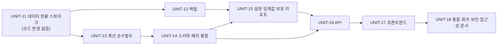

# 04. 개발 계획서 — 패턴 스크리닝 "급등 전 압축주"

- 작성일: 2026-10-02 (KST) · 버전: v1 → 검증 후 v2(최종)
- 입력: [01 기획서](01-planning.md) · [02 설계서](02-system-design.md) · [03 디자인서](03-ux-design.md) · [05 테스트계획](05-test-plan.md)
- 신규 번호: **UNIT-11 ~ UNIT-18** (기존 UNIT-01~10 다음). REQ-030~038.

## 0. 진행 방식 (이 프로젝트의 현재 규칙 반영)

- 13단계 하네스는 2026-09-22 사용자가 폐기했다(메모리 기록). **파이프라인·게이트 절차는 쓰지 않는다.** 대신 아래는 유지한다: ① 문서와 테스트로 먼저 정의 ② 유닛 단위 개발→즉시 테스트 ③ 편차는 기록 ④ 배포는 **사용자 승인 없이 절대 하지 않는다**(규칙 E).
- **한 번에 한 유닛**만 진행하고, 끝나면 결과(통과/실패/편차)를 **즉시** 보고한다.
- **모르면 멈추고 질문한다.** 문서와 현실이 다르면 임의로 맞추지 않는다. 아래 각 유닛의 "중단·질문 조건"은 필수다.
- 로컬 개발 서버(DB·백엔드 4001·프론트 4000)는 **내 테스트 후에도 켜 둔다.**
- 임시 DB·venv·파일은 `.harness-tmp/` 또는 임시 DB로만 만들고 **정상/중단 모두 정리**한다(규칙 K). 개발 DB(`stock_screener`)에 합성 데이터를 넣지 않는다.

## 1. 유닛 의존 관계

- UNIT-13·14·16·17은 **합성 픽스처만으로 개발·테스트 가능**(실데이터 백필 없이도). 백필 실행 승인이 늦어져도 병행 가능하다. 단 UNIT-15(보정)와 UNIT-18의 실데이터 검증은 백필 이후.

## 2. 유닛 상세

각 유닛 공통 완료 조건(DoD): ① 해당 TC(05)를 **먼저** 작성해 실패 확인 → 구현 → 통과 ② `ruff check .` 통과 ③ 기존 `pytest tests/unit` 무수정 통과 ④ `docs/pattern-screening/units/unit-NN-note.md`에 구현 요약·편차·남은 위험 기록 ⑤ 요청 범위 밖 변경 0건 ⑥ 비밀·키 로그/문서 노출 0건.

### UNIT-11 — 데이터 현황 스파이크 (REQ-031 선행, **코드·DB 변경 없음**)
- **하는 일**
  1. 재측정(읽기 전용): 종목당 일봉 수 분포, 마지막 적재일, `stock_master` 활성 종목 수.
  2. 일일 배치 상태: 마지막 적재일(2026-09-21)이 오래된 이유 — 스케줄러(`scripts/run_daily_batch.ps1`) 등록 여부 확인.
  3. 과거 `basDt` 가용성: `GovDataPortalClient.fetch_ohlcv(date, page_no=1, num_of_rows=1)`로 **최근 거래일 기준 −60·−130 거래일** 날짜 각 1회만 호출(총 2회)해 `totalCount>0` 확인. 키 활성 상태 확인. **키 값은 어디에도 출력 금지.**
  4. 필요 호출 수 산정: `(거래일 수) × ceil(종목수/PAGE_SIZE)` 와 일일 한도 대비.
  5. 종목 유형 현황: 이름 패턴(ETF 브랜드·`스팩`·우선주 접미 등)으로 `stock_master` 혼입 규모를 **개수로만** 집계(읽기 전용).
  6. 수정주가 여부: 현재 보유 25거래일 내 단일일 ±31% 초과 변동 종목 수(분할 의심) 집계.
- **산출물**: `docs/pattern-screening/units/unit-11-report.md`
- **🛑 중단·질문 조건**: 과거 날짜 응답 0건/오류, 한도 부족, 키 비활성, 또는 ETF·우선주·스팩이 다수 포함 → **구현으로 넘어가지 않고** 기획서 Q1·Q3를 사용자에게 질문.

### UNIT-12 — 과거 시세 백필 (REQ-031)
- **파일**: `scripts/backfill_ohlcv.py`(신규), `tests/unit/test_backfill_ohlcv.py`(신규). 기존 `run_ingestion.py`·`repository.py`는 **수정하지 않고 import해 재사용**(설계서 §7).
- **구현 요점**: 설계서 §7 그대로 — `_fetch_all_ohlcv`+`upsert_ohlcv`, `batch_run` 1행/실행(`BACKFILL` 접두), `--days/--from/--to/--sleep/--max-calls/--dry-run`, 이미 충분한 날짜 건너뜀, 캘린더 거래일인데 0건이면 경고, 키/URL 마스킹.
- **AC**: (a) `--dry-run`이 호출 없이 대상 날짜·예상 호출 수 출력 (b) 중단 후 재실행 시 중복 호출 없음 (c) 서킷브레이커 집계 비오염(TC-B04) (d) 예외·로그에 서비스키 미노출(TC-B05) (e) 실제 실행 후 `n≥80` 종목 비율 ≥ 95%.
- **🛑 실제 실행 전**: 예상 호출 수·소요시간을 사용자에게 보고하고 **승인 후** 실행(외부 API 쿼터 소모).

### UNIT-13 — 패턴 지표 순수 함수 (REQ-030)
- **파일**: `shared/pattern_params.py`(신규), `services/derivation_batch/compute.py`(함수 추가만), `tests/unit/test_pattern_compute.py`(신규).
- **구현 요점**: 기존 `compute.py` 스타일 유지(Decimal, `_QUANT` 4자리, 한국어 docstring에 정의 근거). 입력은 최신순 `OhlcvPoint` 리스트. 산정 불가 규칙은 설계서 §4-1. **기준 구현(`prototype/pattern_rules_reference.py`)을 오라클로** 300개 합성 시계열에서 11개 필드가 허용오차 내 일치(TC-U40).
- **AC**: TC-U01~U16·U40~U42 전부 통과 — 경계값(80행/79행, ±31.0%/31.1%, 급등 경계)·0 분모·Decimal 정밀도·윈도우 절단·오라클 300건 일치.

### UNIT-14 — 스키마·배치 통합 (REQ-030, REQ-035)
- **파일**: `db/alembic/versions/0011_*.py`, `shared/db_models/public_serving.py`, `services/derivation_batch/{repository,run_derivation}.py`, 신규 테스트.
- **구현 요점**: 설계서 §2·§3. `OHLCV_WINDOW_SIZE`를 `PATTERN_WINDOW_ROWS`로 대체하되 기존 계산(41행 의존)이 그대로 동작함을 회귀로 확인. **`_validation_passed` 불변**.
- **AC**: (a) 임시 DB에서 `upgrade head`→`downgrade 0010`→`upgrade head` 가역 (b) **`api_service`로 신규 컬럼 SELECT 가능, INSERT/UPDATE 거부, `batch_worker` 쓰기 가능**(TC-D05) (c) 130행 픽스처로 `run_once` SUCCESS·재실행 멱등 (d) 이력 부족 종목은 `INSUFFICIENT_HISTORY`이며 발행 포인터는 정상 갱신 (e) 기존 `test_run_derivation.py` 무수정 통과.

### UNIT-15 — 판정 임계값 설정 + 보정 리포트 (REQ-032, REQ-036)
- **파일**: `services/public_api/core/pattern_config.py`, `scripts/pattern_threshold_report.py`, 테스트.
- **AC**: 설계서 §3-3 범위 검증(범위 밖·MIN≥MAX·잘못된 타입 → `ConfigError`, TC-C01~08), 리포트는 **읽기 전용**이며 조건별 충족 수·전체 충족 수·임계값 ±민감도 표를 출력.
- **🛑 질문**: 리포트 결과로 **임계값 확정(Q2)** 을 사용자에게 받는다. 기본값이 0건 또는 전 종목의 10% 초과면 그 사실과 대안 분포를 함께 보고.

### UNIT-16 — API (REQ-032, 034~036)
- **파일**: `services/public_api/{schemas/pattern.py,db/pattern_repository.py,api/pattern.py}`, `main.py`(라우터 1줄·스위치), 테스트.
- **구현 요점**: 설계서 §5. **조건식은 `build_condition_exprs()` 한 곳**, 필터와 표시가 같은 식. 응답 스키마 화이트리스트. 기존 `screen.py` 미수정.
- **AC**: 05의 TC-A/TC-S/TC-P 전부 + `ma60_stage`↔c4 일치(TC-A31) + 기존 `/screen` 회귀 0.

### UNIT-17 — 프론트엔드 (REQ-033~035)
- **파일**: 디자인서 §6 목록 + `copy.ko.json`·`errorMapping.ts`·`EmptyState.tsx`·`types.ts`·`app/screener/page.tsx`(전환 링크 1줄).
- **AC**: `npx tsc --noEmit`·`npm run lint`·`npm run lint:copy`·`npm run build` 통과, 디자인서 §5 상태 9종·§8 접근성 항목을 **실제 브라우저로** 확인(320/375/768/1024/1280px), 금지어 린트에 `pattern.*` 카피 포함 통과, 스위치 off 시 링크 미노출·404.

### UNIT-18 — 통합·회귀·보안·접근성·문서 (전 REQ)
- 05의 §5~§9 전부 실행, 결과를 `docs/pattern-screening/units/unit-18-test-report.md`(템플릿 `templates/test-report-template.md` 사용)에 **근거와 함께** 기록(근거 없는 "이상 없음" 금지).
- 문서 갱신(편차 없이): `docs/harness/traceability.md`에 REQ-030~038 행 추가, `decisions.md`에 구현 중 새 결정(DEC-034~) append, `04-ux-design.md` 변경 이력에 `/screener/pattern` 추가 한 줄, `로컬서버-접속방법.md` 영향 확인.
- 최종 보고: 통과/실패 수, 미해결 결함, 사용자 결정 대기 항목(Q2·Q4·Q5), **배포 승인 요청은 하지 않는다(규칙 E — 사용자가 먼저 요청해야 함)**.

## 3. 공통 개발 규칙

| 항목 | 규칙 |
|---|---|
| 스타일 | 기존 파일의 주석 밀도·한국어 docstring·네이밍을 따른다. 불필요한 리팩터링·이름 변경 금지 |
| 의존성 | **신규 패키지 금지.** 필요하면 중단·질문 |
| DB | 개발 DB에 합성 데이터 주입 금지. 테스트는 임시 DB(컨테이너 슈퍼유저로 생성→종료 시 삭제) 사용 |
| 비밀 | `.env`·서비스키를 출력/로그/문서/커밋에 포함하지 않는다. 이미 노출된 키는 사용자가 배포 전 재발급 예정(재언급 금지) |
| 커밋 | 사용자가 요청할 때만. 요청 시 `Co-Authored-By` 규칙 준수 |
| 문서 편차 | 구현이 문서와 달라지면 유닛 노트에 기록, **요구사항·임계값·규제 표현에 영향이 있으면 멈추고 질문** |
| 보고 | 매 보고 앞에 `date`(KST) `YYYYMMDD HH24MISS` 한 줄, 에이전트/테스트 결과는 알게 된 즉시 |

## 4. 배포 전 게이트 (개발 완료 ≠ 배포)

| 게이트 | 내용 | 주체 |
|---|---|---|
| REQ-022 | KRX 공식 확인 또는 법률 자문 — **확인 범위에 패턴 명칭·표현 포함**(REQ-034) | 사용자 |
| Q4 | "급등 전 압축주" 명칭 공개 배포 적합성 | 사용자(법률 검토) |
| 스위치 | 위 확인 전 코드만 선배포 필요 시 `PATTERN_SCREEN_ENABLED=false` | 운영 |
| 규칙 E | 배포 실행은 사용자 명시 승인 후에만 | 사용자 |

## 5. 위험과 완화

| 위험 | 완화 |
|---|---|
| 백필 불가/한도 | UNIT-11에서 먼저 확인, 불가 시 중단·질문 |
| 임계값이 현실 분포와 안 맞음 | UNIT-15 보정 리포트 + 사용자 확정, 설정값 분리로 재개발 불필요 |
| 배치 시간 증가 | 측정 후 기록, 필요 시 벌크 조회 최적화(범위 밖 개선) |
| 정의의 사후 확증 편향 | 서비스는 예측력을 주장하지 않음(고지문), 백테스트는 범위 밖임을 명시 |
| 문서-코드 드리프트 | `definition` 응답으로 화면 정의 자동 동기화, 오라클 교차 검증 |
