# 화면 검수 결과서 (실기기 대체 자동 점검) — 2026-10-02

내부 테스트 문서. 브랜치 PROD_SCH, 대상 `frontend/`(Next.js 16). 검수 에이전트가 자동 측정으로 수행했고, **실기기 검증이 아니다**(한계 절 참조).

## 1. 요약

| 항목 | 수정 전 | 수정 후 |
|---|---|---|
| 페이지×뷰포트 매트릭스(13화면 × 8폭 = 104칸) 가로 넘침 | 0칸 | 0칸 |
| 잘리는 요소(스크롤 영역 밖) | 0 | 0 |
| axe 위반(wcag2a/aa·21a/aa·best-practice) | 104칸 모두 `region`, 192노드 `color-contrast` | **0** |
| 터치 대상 44px 미만(인라인 문장 링크 제외) | 16종 요소 | 8종(일·주·월·분·틱 버튼 폭 36~39px, 도구 버튼 40px로 보이고 터치 영역은 44px 확장) |
| 기기 에뮬레이션(iPhone 13, Pixel 7) 40항목 | 35 통과 / 5 실패(차트 탭 선택 소실 4, favicon 404 1) | 39 통과 / 1 실패(favicon 404, 미수정) |
| 키보드 28항목 | 24 통과 / 4 실패 | 28 통과 |
| 로컬 모드 60항목(6폭×10) | 48 통과 / 12 실패(대비 6, 한 줄 오판정 6) → 판정 로직 보정 후 실결함 2종 | 60 통과 |
| 화면↔API 값 일치 19항목 | 19 통과 | 19 통과 |

수정한 결함 9건(High 1, Medium 5, Low 3), 권고 6건. 기존 `tsc --noEmit`, `eslint src`, `lint-forbidden-copy`, `node --test scripts/*.mjs`(36건) 모두 통과.

## 2. 범위와 환경

- 페이지: `/`, `/screener`, `/screener/pattern`, `/stocks`, `/stocks`(검색 "픽스처"), `/stocks/T00001`(탭 5종 + 차트 요약 열림 + 설정 열림), `/stocks/ZZZZZZ`(404). 8개 뷰포트: 320×568, 360×800, 375×667, 390×844, 414×896, 768×1024, 1024×768, 1280×800.
- 환경: 임시 PostgreSQL 16(5555) + 마이그레이션 + 시드(T00001.. "픽스처NN"), 공개 API(4201, IP 한도 해제), 모의 KIS(9200, 11:00 고정), `next build && next start`(4202), Chromium 1194(Playwright, headless, `--no-sandbox`), axe-core.
- 공개 배포 모드(기본 빌드)와 개인 로컬 모드(`NEXT_PUBLIC_LOCAL_INTRADAY_ENABLED=true` 재빌드)를 각각 점검.
- 시드 데이터 특성: 일봉의 시가≈종가(몸통이 거의 0)라 캔들이 가는 선으로 보임. 실제 시세의 캔들 모양은 **미확인**.

## 3. 방법

`frontend/scripts/qa/`(재현 방법은 8절). 판정 기준:
- 가로 넘침: `documentElement.scrollWidth > innerWidth`. 잘림: 보이는 요소의 left<0 또는 right>뷰포트(스크롤 컨테이너 내부 제외). 겹침: 대화형 요소 쌍의 교차 면적. 고정 하단 탭바와 본문의 겹침은 설계상(고정 위치)이라 결함으로 세지 않음.
- 터치 대상: 보이는 `a/button/input/summary/[role=tab]/[role=menuitem]/[tabindex=0]`의 렌더 크기 44×44 미만. 체크박스·라디오는 감싸는 label 크기. 문단 안 인라인 링크는 WCAG 2.5.8 예외로 별도 집계. 참고: WCAG 2.2 AA 기준은 24px(전부 충족), 44px는 AAA/애플 지침 수준.
- 접근성: axe-core, 태그 wcag2a·wcag2aa·wcag21a·wcag21aa·best-practice.

## 4. 결과

### 4.1 뷰포트 매트릭스(수정 후, 104칸)

| 페이지 | 320 | 360 | 375 | 390 | 414 | 768 | 1024 | 1280 | 비고 |
|---|---|---|---|---|---|---|---|---|---|
| `/` | 통과 | 통과 | 통과 | 통과 | 통과 | 통과 | 통과 | 통과 | 넘침·잘림·axe 0 |
| `/screener` | 통과 | 통과 | 통과 | 통과 | 통과 | 통과 | 통과 | 통과 | 〃 |
| `/screener/pattern` | 통과 | 통과 | 통과 | 통과 | 통과 | 통과 | 통과 | 통과 | 〃 |
| `/stocks`, 검색 결과 | 통과 | 통과 | 통과 | 통과 | 통과 | 통과 | 통과 | 통과 | 〃 |
| 상세: 일자별·실적·투자자·조건 체크 탭 | 통과 | 통과 | 통과 | 통과 | 통과 | 통과 | 통과 | 통과 | 〃 |
| 상세: 차트·요약 열림·설정 열림 | 부분 | 부분 | 부분 | 부분 | 부분 | 부분 | 부분 | 부분 | 넘침·잘림·axe 0이나 일·주·월·분·틱 버튼 폭 36~39px(높이 44) — 권고 R-1 |
| 상세 404 | 통과 | 통과 | 통과 | 통과 | 통과 | 통과 | 통과 | 통과 | 〃 |

"부분" = 44px 권고 미달(AA 24px 기준은 충족). 겹침: 하단 고정 탭바가 본문과 겹치는 것(설계)과, 320~414폭에서 탭 줄의 마지막 탭이 ⌄ 버튼 아래로 스크롤되는 것(가로 스크롤 탭 줄, R-3)만 관찰.

수정 전 대비 수치(전체): 넘침 0→0, axe `region` 104칸·`color-contrast` 192노드→0, 44px 미달 대상 16종→8종.

### 4.2 기기 에뮬레이션(Playwright `devices['iPhone 13']` 390×664 dpr3, `devices['Pixel 7']` 412×839)

항목: 가로 넘침, 차트 탭→읽기 줄 변경, 다른 위치 탭, 주·월·일 전환, 요약 열기/닫기, 설정 라벨 탭, 확대 켜기/끄기(뷰포트 가득), 5개 탭 전환, ⌄ 메뉴 탭 이동, 조작 후 넘침, 콘솔 오류.
수정 후 각 기기 20항목 중 19 통과, 1 실패 = `/favicon.ico` 404 콘솔 오류(D-09, 미수정). 수정 전에는 "차트를 탭해도 선택봉이 유지되지 않음"(D-01)이 양 기기에서 실패.
Playwright 터치는 합성 이벤트이므로 실제 손가락 제스처와 다를 수 있다.

### 4.3 접근성

axe 집계(수정 전, 104칸):

| 규칙 | 영향도 | 노드/칸 | 해당 |
|---|---|---|---|
| `region` | moderate | 1노드 × 104칸 | `.disclaimer-banner`가 랜드마크 밖(`role="note"`는 랜드마크 아님) |
| `color-contrast` | serious | 3~5노드 × 56칸(상세 전 탭, 8폭 전부), 계 192노드 | 비선택 탭 `#9aa0a8` on `#ffffff` = **2.63:1**(기준 4.5:1) — 일자별 시세·실적·투자자·(조건 체크) |

수정 후: 위반 0. 로컬 모드 호가 표에서 추가로 `.orderbook__price/total--bid` `#d9342b` on 옅은 빨강 배경 = **4.3:1**(기준 4.5:1)이 10노드 — 수정 후 0.

키보드(1024×900, 상세 페이지) 28항목 전부 통과:
- Tab 순서(17정지): 건너뛰기 링크 → 배너 링크 → 홈 링크 → 상단 내비 3 → 뒤로 → 검색 → 탭(선택된 1개만, roving) → ⌄ → 일·주·월 → 요약 → 설정 → 차트 프레임 → 확대 → 푸터 링크. 비선택 탭은 방향키로 도달. 가시 대화형 요소 누락 없음, 모든 정지에 outline 있음.
- 탭 목록 ←/→(순환), Home/End(수정 후), 차트 프레임 ←/→로 봉 이동·읽기 줄 갱신(aria-live=polite), Esc로 확대 닫힘, 설정 패널 Tab→체크박스→Space 토글, 요약 열기/닫기(Esc 포함, 수정 후), 건너뛰기 링크 동작.
- 분·틱 메뉴(로컬 모드): Esc 닫힘, 바깥 클릭 닫힘(수정 후).

### 4.4 다크 모드·고대비·확대·모션

- 다크(`colorScheme: dark`): 사이트가 **다크 모드를 지원하지 않는다**(`color-scheme`·`prefers-color-scheme` 없음). 항상 라이트로 보이며 배경 `#fff`/글자 `#111827`, 가독성 깨짐 없음, axe 동일. 다크 지원은 미구현이며 결함이 아닌 권고(R-4). 캡처: `11-dark-pref-640.png`.
- 강제 색상(`forcedColors: active`): 수정 전에는 선택 탭과 선택 버튼(일/주/월)이 글자 굵기 외에 구분되지 않았고 상단 띠 색이 사라짐(▲▼ 글자는 유지). 수정 후 선택 탭 밑줄·선택 버튼이 시스템 강조색으로 구분됨(D-06). 분·틱 caret(▾)이 짙은 사각형으로 보이는 미세한 잔존(Low, D-10, 미수정). 차트 SVG는 지정 색 유지. 캡처: `10-forced-colors-390.png`.
- 확대: 1280@200%(640폭), 1024@200%(512폭), 1280@400%(320폭, WCAG 1.4.10 리플로) 모두 가로 넘침 0. 390@200%(195폭, 320 미만의 극단값)의 `/screener/pattern`만 19px 넘침(충족 배지) — 320 미만이라 기준 밖, 기록만. 브라우저 글자만 키우기(text zoom)는 **미확인**. 면책 배너(sticky)+하단 탭바가 낮은 뷰포트 높이에서 본문 시야를 크게 가림(R-5).
- `prefers-reduced-motion: reduce`: 로딩 스켈레톤 pulse 애니메이션이 실행되지 않음(통과). no-preference에서는 pulse 실행.

### 4.5 로컬 모드 화면(NEXT_PUBLIC_LOCAL_INTRADAY_ENABLED=true, 모의 KIS)

6폭 × 10항목 = 60항목 통과(수정 후): 호가·체결 탭 노출, 도구 줄 한 줄 유지(320에서는 수정 전 2줄로 꺾임 → D-08 수정), 분 메뉴 항목 7개·화면 안·항목 높이 40, 5분 선택 후 도구 줄 높이 유지, 호가 표(20행, 글자 16px, 행 높이 30px 이상, 넘침 없음), 체결 표 120행 넘침 없음, axe 0. 캡처: `12-local-book-360.png`, `13-local-minute-menu-360.png`. 분 메뉴 항목 높이 40px(44 미만, Low). 실제 증권사 응답(모의가 아닌) 렌더는 **미확인**.

### 4.6 차트 정확성(화면 ↔ API, T00001, 390폭) — 19/19 통과

헤더 현재가 9,887 = API 마지막 종가, 전일대비 ▲18(= 9,887−9,869, API `change`와 일치), 등락률 0.18%, 방향 클래스 up. 61봉 최고 `10,295(26.07.15), 4.13%`·최저 `9,704(26.08.07), -1.85%` 가 61봉 실제 고저·날짜·마지막 종가 대비 %와 일치. 현재가 배지 가격·등락률 일치. 매물대 라벨 5개(8.98+25.9+38.61+15.69+10.82)= **100.00**(0%인 구간은 표시 없음). 읽기 줄 기본=마지막 봉. 일자별 시세 표 60행 내림차순, 첫 행 2026-09-30·종가 9,887.
(스크립트 개발 중 매물대 합계가 100.18로 나온 것은 현재가 배지 % 라벨을 합산에 섞은 내 스크립트 오류였고 보정함.)

### 4.7 참고 이미지와 비교(360폭)

`14-compare-reference-vs-current-360.jpg`(왼쪽 참고, 오른쪽 현재). `docs/stock-detail/03-reference-ui-spec.md`와의 불일치/보충:
1. 문서는 "상단 색 띠"가 화면 위라고 하나 실제로는 면책 배너(sticky)+사이트 헤더+서비스명이 띠 위에 있어 띠가 약 150px 아래에서 시작. (설계상 필수 배너지만 문서에 없음)
2. 띠 아래에 참고 화면에 없는 종목 메타(시장 배지·기준일·데이터 신선도 경고)가 약 100px 추가됨 — 차트 첫 화면 노출이 줄어듦.
3. 문서의 "휴대폰 꽉 찬 폭": 차트는 꽉 차나 탭 줄·도구 줄은 좌우 여백이 있어 참고 화면보다 약간 안쪽.
4. 도구 줄 버튼 크기·간격이 참고보다 촘촘함(36~40px, 한 줄 유지를 위한 트레이드오프).
5. 시드 데이터라 캔들 몸통이 거의 없음(참고처럼 굵은 캔들은 실데이터 필요, 미확인). 가격 축 라벨·MACD 값 배지·날짜 눈금 4개·매물대·구간 최고/최저 표기는 문서대로 확인.
6. 문서 "✅" 중 "원형 확대 버튼"은 확인(좌하단). "가격축 옆 빨강·파랑 세로선"은 문서대로 보류(참고에는 있음).
그 외 대응표 항목과의 불일치는 발견하지 못함.

## 5. 발견 결함 목록

| ID | 심각도 | 내용 | 재현 | 수정 | 재검증 |
|---|---|---|---|---|---|
| D-01 | **High** | 터치 기기에서 차트를 탭해도 선택봉이 바로 해제됨. 손가락을 떼면 `pointerleave`가 따라와 `onPointerLeave`가 선택을 지움 → 읽기 줄이 마지막 봉으로 복귀 | iPhone 13/Pixel 7 에뮬레이션에서 차트 탭 후 읽기 줄 비교(`devices.mjs`) | 수정: `StockChart.tsx` — 마우스일 때만 해제 | 통과(탭 후 2026-08-07, 다른 위치 2026-09-08) |
| D-02 | Medium | 비선택 탭 글자 대비 2.63:1(WCAG AA 4.5:1 미달) | axe `color-contrast`, 상세 전 폭 | 수정: `#9aa0a8`→`#6b7280`(4.83:1), `globals.css` | axe 0 |
| D-03 | Medium | 호가 표 매수 행 빨강 글자 대비 4.3:1 | 로컬 모드 axe | 수정: `#d9342b`→`#c42d25`(호가 가격·총잔량 매수만) | axe 0 |
| D-04 | Medium | 면책 배너가 랜드마크 밖(`role="note"` div) — axe `region` 104칸 | 모든 페이지 | 수정: `<aside aria-label>`로 변경, `DisclaimerBanner.tsx` | axe 0 |
| D-05 | Medium | 키보드: ⌄ 탭 전체 보기 메뉴·분/틱 메뉴·차트 요약이 Esc로 안 닫힘, 메뉴는 바깥을 눌러도 안 닫힘, 탭 목록 Home/End 미지원 | `keyboard.mjs`, `local.mjs` | 수정: `StockDetailTabs.tsx`, `StockChart.tsx`(Esc·바깥 클릭·포커스 복귀, Home/End) | 28/28, 로컬 통과 |
| D-06 | Medium | 강제 색상 모드에서 선택 탭·선택 버튼(일/주/월)이 굵기 외로 구분 안 됨 | `theme.mjs` 캡처 | 수정: `@media (forced-colors: active)` 규칙 추가 | 선택 탭 밑줄·버튼 색 구분 확인(computed style) |
| D-07 | Medium | 터치 대상 44px 미만: 상단 내비 링크(태블릿 이상, 높이 37), 사이트명 링크(27), 푸터 "서비스 안내 자세히 보기"(15), 404 "종목 검색으로 돌아가기"(17), 모바일 "조건 필터 열기"(36), 설정 체크박스 라벨(32), 도구 버튼(36→보이는 40+터치영역 44) | `matrix.mjs` | 수정: `globals.css`, `not-found.tsx` | 해당 요소 측정 통과 |
| D-08 | Low | 320폭에서 도구 줄이 2줄로 꺾임(공개·로컬 공통) | `local.mjs`(320) | 수정: ≤340px에서 간격·크기 축소 | 1줄 유지 통과 |
| D-11 | Low | `--space-1` 변수가 정의되지 않아 분/틱 메뉴 패딩·상태 문구 여백이 무효(0) | CSS 점검 | 수정: `:root`에 `--space-1: 4px` | 빌드·화면 확인 |
| D-12 | Low | `tabindex=0` 영역(차트 프레임, 표 스크롤 영역) 포커스 링이 브라우저 기본(auto 1px)에 의존 | 키보드 점검 | 수정: 전역 `:focus-visible` 에 `[tabindex="0"]` 추가 | 프레임 outline `solid 2px` 확인 |
| D-09 | Low | `/favicon.ico` 404(콘솔 오류). public/아이콘 없음 | 에뮬레이션 콘솔 | **미수정**(디자인 자산 필요) | — |
| D-10 | Low | 강제 색상에서 caret(▾)·상단 띠 caret이 짙은 사각형으로 보임 | `10-forced-colors-390.png` | **미수정** | — |
| D-13 | Low | 존재하지 않는 종목이 HTTP 200으로 응답(본문은 404 화면, `noindex` 메타 있음). `loading.tsx` 스트리밍 때문으로 추정(원인은 미확인). 제목도 사이트 기본값 | `curl -i /stocks/ZZZZZZ` | **미수정**(권고) | — |

## 6. 권고(미수정, 디자인·정책 판단 필요)

- R-1: 일·주·월·분·틱 버튼 폭 44px화는 360폭 한 줄 유지와 상충. 도구 줄을 2단으로 하거나 분·틱을 하나의 "분▾/틱▾"로 합치는 디자인 결정 필요.
- R-2: 분·틱 메뉴 항목 높이 40px → 44px.
- R-3: 탭 줄이 가로 스크롤인데 잘린 탭의 시각 단서(그라데이션 등)가 없음(320px에서 "조건 체크"가 ⌄ 뒤로 숨음. ⌄ 메뉴로 접근 가능).
- R-4: 다크 모드 미지원(의도라면 `color-scheme: light` 명시 권장, 폼 요소가 사용자 다크 설정과 어긋나지 않도록).
- R-5: 320×256(400% 확대)에서 sticky 배너+하단 탭바가 화면 대부분을 차지. 배너를 낮은 높이에서 비고정으로 하는 방안 검토(규제상 상시 노출 요건은 담당 판단).
- R-6: favicon·apple-touch-icon 추가, 404 상태코드 점검.

## 7. 한계(정직한 고지)

- **실제 iOS Safari/Android Chrome 렌더링은 검증하지 않았다.** Chromium 에뮬레이션(UA·뷰포트·touch)뿐이며 WebKit·Gecko 미검증. 주소창 높이 변화(`100vh`)·노치/제스처 영역(safe-area)·가상 키보드·관성 스크롤·핀치 줌 동작은 **미확인**.
- 실제 손가락 터치 감각(오탭, 44px 체감, 차트 위 수직 스크롤과 선택 제스처 충돌: `touch-action: pan-y`)은 합성 이벤트로만 확인.
- 실제 폰트: 이 환경의 한글 폰트로 렌더(Apple SD Gothic Neo·Malgun Gothic 등 실제 폰트의 줄바꿈·폭은 다를 수 있음). 텍스트 줄바꿈 기반 넘침은 실기기에서 달라질 수 있음.
- 실스크린 리더(VoiceOver/TalkBack/NVDA) 읽기 순서·발음은 미검증(axe와 DOM 속성만).
- 색 대비는 axe의 계산값(차트 SVG 내부 텍스트·그라데이션 배경 위 글자는 axe가 평가 못 할 수 있음, 차트 격자·매물대 라벨 대비는 육안만).
- 데이터: 시드(가짜 종목) 기반이라 실제 시세·긴 종목명·큰 거래량의 레이아웃은 미확인. 모의 KIS 응답 기준.
- 브라우저 글자 크기만 키우기, 윈도 고대비 테마 실제 환경, 인쇄는 미확인.
- 자동 점검은 거짓 통과를 막기 위해 판정 로직을 점검했으나(예: 도구 줄 한 줄 판정, 매물대 합계) 모든 결함을 찾았다는 뜻은 아님.

## 8. 재현 방법

1. 환경(PG 5555, 마이그레이션, 시드, API 4201, 모의 KIS 9200, 프론트 4202)은 작업 지시의 절차 그대로. 접속은 `http://localhost:4202`.
2. 도구: `cd /tmp/claude-0/pw && npm i playwright-core axe-core --no-audit --no-fund` (저장소 package.json에는 추가하지 않음. 자세한 설명 `frontend/scripts/qa/README.md`).
3. 실행(저장소 루트에서):
   - `node frontend/scripts/qa/matrix.mjs` (104칸, 약 2.5분, 결과 JSON은 `/tmp/claude-0/qa-out/matrix.json`; `ONLY=detail-chart,home` 로 일부만)
   - `node frontend/scripts/qa/devices.mjs`, `keyboard.mjs`, `theme.mjs`, `accuracy.mjs`, `shots.mjs`
   - 로컬 모드: `NEXT_PUBLIC_LOCAL_INTRADAY_ENABLED=true` 로 재빌드 후 `local.mjs`
4. 수정 후 확인: `cd frontend && npx tsc --noEmit && npx eslint src && node scripts/lint-forbidden-copy.mjs && node --experimental-strip-types --test scripts/*.mjs`

## 9. 변경 파일

`frontend/src/app/globals.css`, `frontend/src/components/StockChart.tsx`, `frontend/src/components/StockDetailTabs.tsx`, `frontend/src/components/DisclaimerBanner.tsx`, `frontend/src/app/stocks/[code]/not-found.tsx`, 신규 `frontend/scripts/qa/*`, `docs/qa/**`.

## 10. 스크린샷

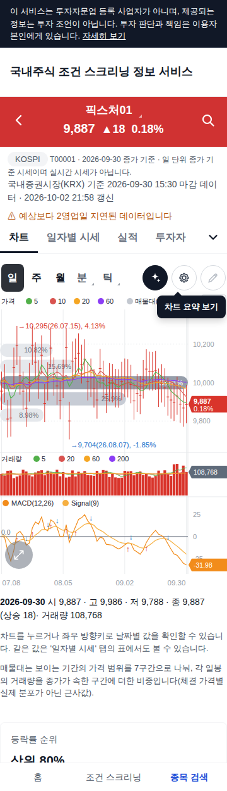
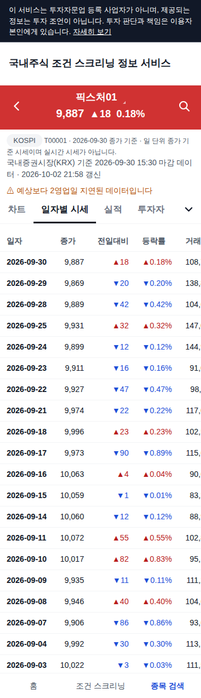
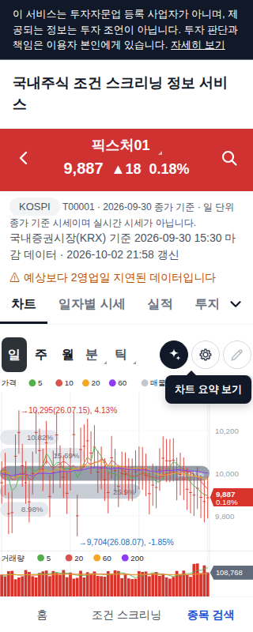
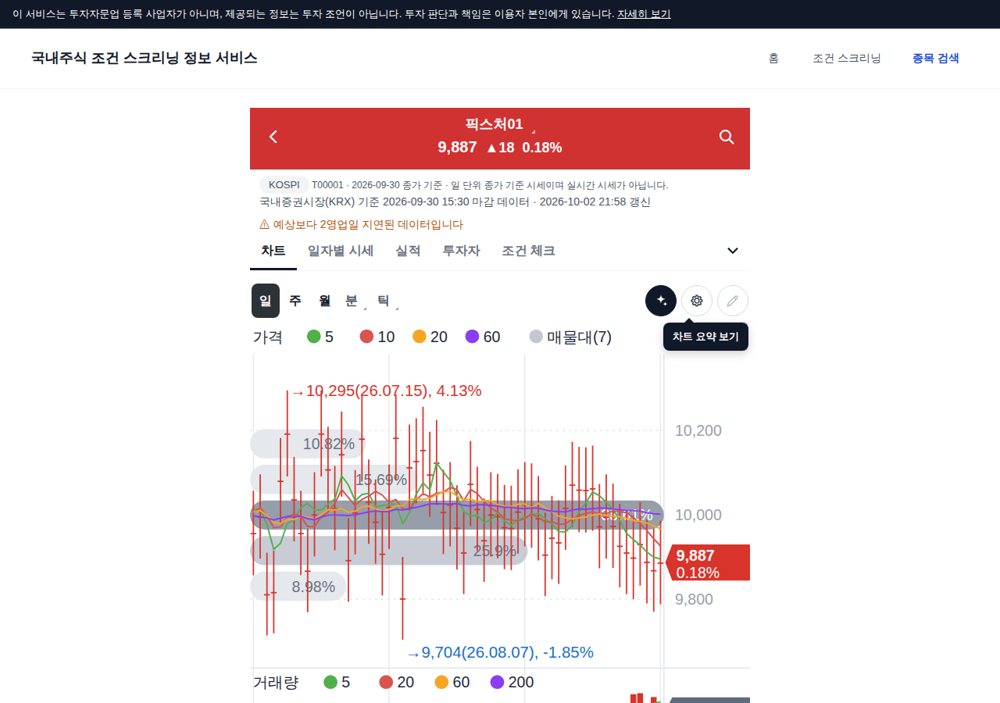
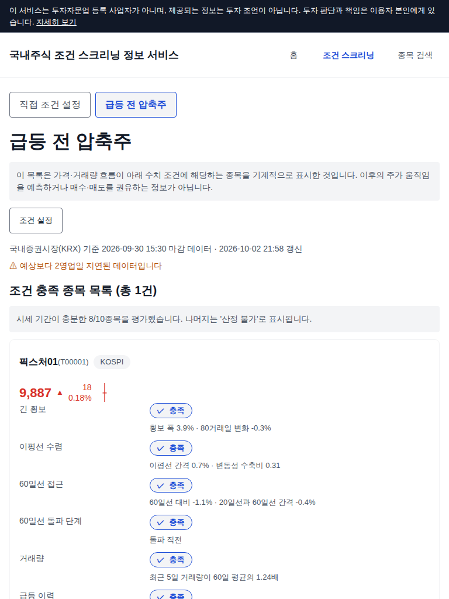
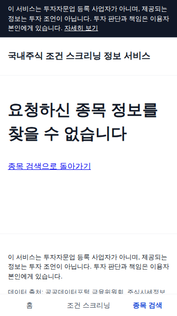
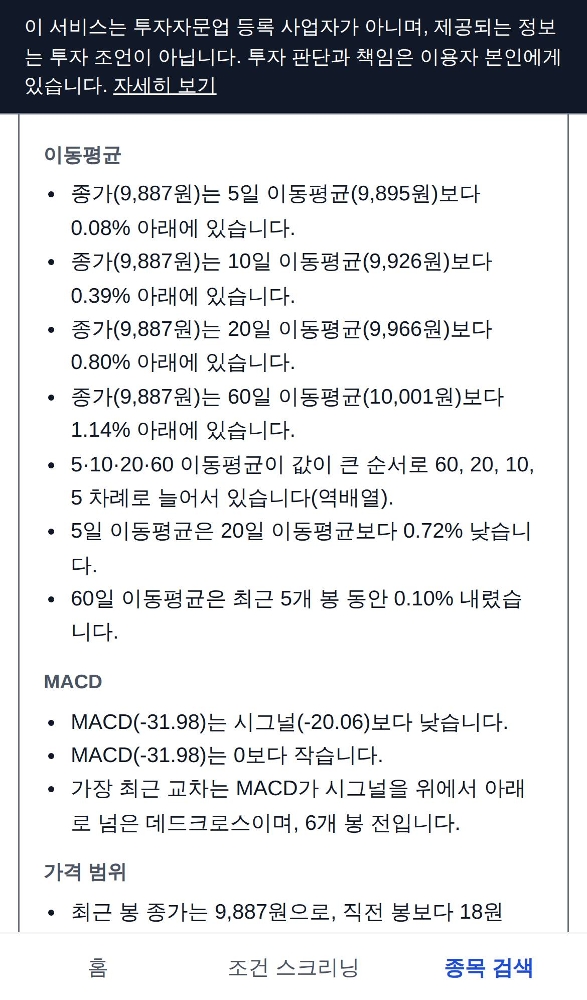
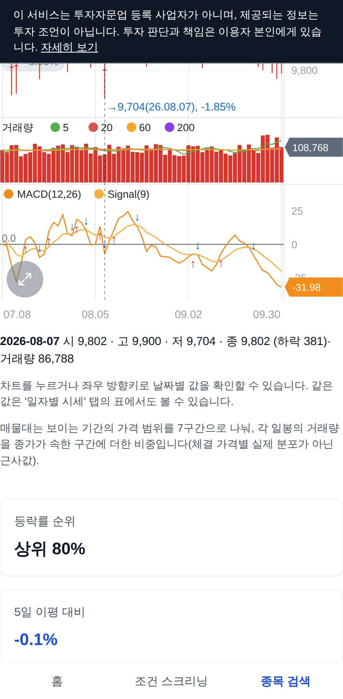
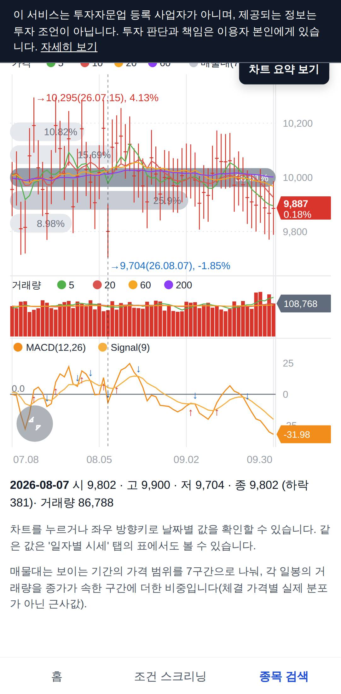
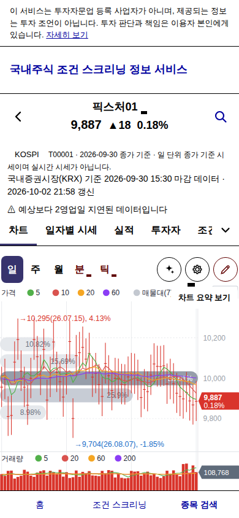
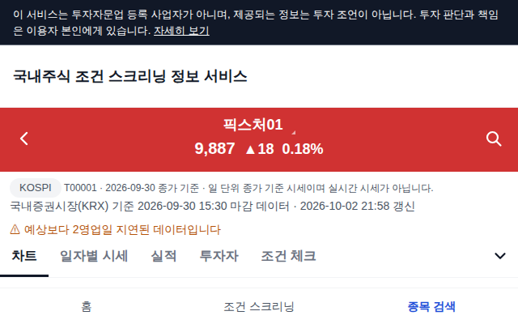
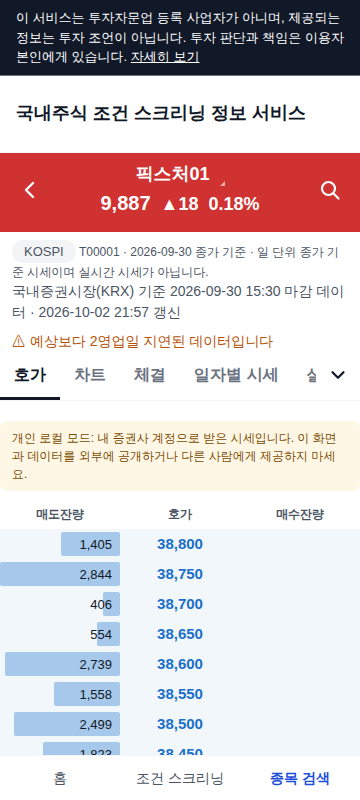
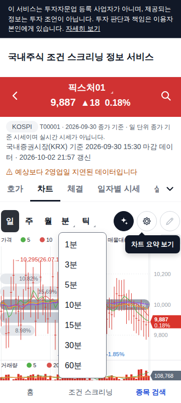
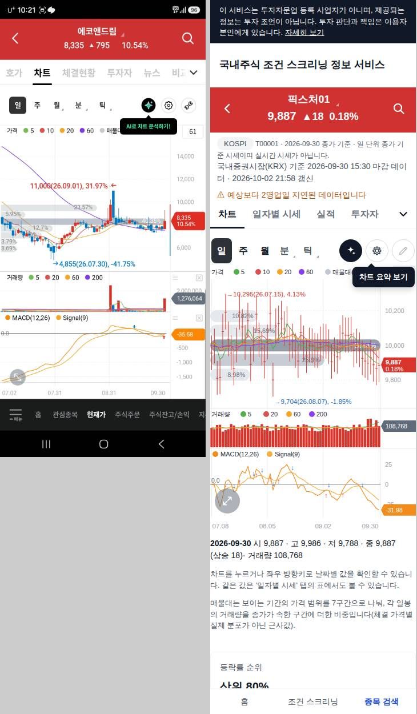
