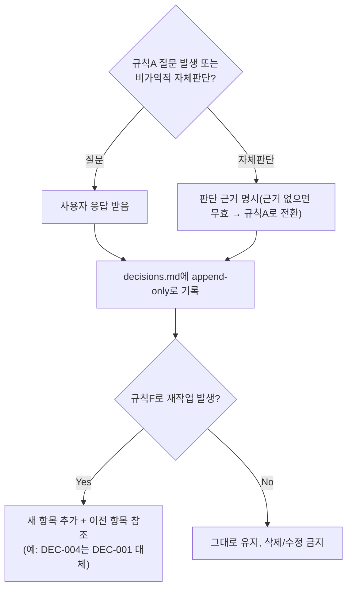

# 의사결정 로그 (Decision Log)

> 규칙 A(모르면 질문)에 따라 사용자에게 질문하고 답을 받았거나, 규칙 A-3(비가역적 결정)에 따라 에이전트가 근거를 갖고 스스로 결정을 내린 경우 반드시 여기에 append한다. 절대 삭제/수정하지 않고 append-only로 유지한다 (과거 결정의 맥락을 잃지 않기 위함).

| ID | 일시 | 단계 | 질문/이슈 | 결정 내용 | 결정자 (사용자 응답 / 에이전트 자체판단) | 비가역성 | 영향받는 산출물 |
|----|------|------|-----------|-----------|------------------------------------------|----------|------------------|
| DEC-001 |  |  |  |  |  |  |  |

## 작성 규칙
- **비가역성** 컬럼: High(되돌리기 매우 어려움: DB 스키마 확정, 프레임워크 선택, 인증 방식 등) / Medium / Low로 표기한다.
- "에이전트 자체판단"으로 기록하는 경우, 반드시 판단 근거를 결정 내용에 함께 서술한다. 근거 없는 자체판단 기록은 무효로 간주하고 규칙 A에 따라 사용자에게 확인받아야 한다.
- 규칙 F(피드백 루프)에 의해 재작업이 발생한 경우, 원래 결정을 수정하는 새 항목을 추가하고 이전 항목을 참조한다 (예: "DEC-004는 DEC-001을 대체함, 사유: 9단계 보안검증에서 인증모델 결함 발견").

## 절차 흐름 (참고용 다이어그램)
> 아래 다이어그램은 위 절차를 시각적으로 요약한 참고 자료다. 규칙/조건의 최종 근거는 항상 위 텍스트다.

