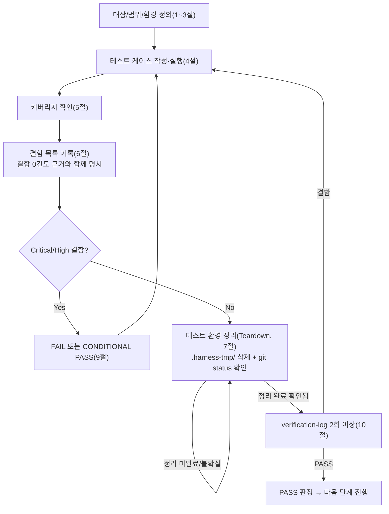

# 테스트 결과서 (Test Result Report)

> 이 템플릿의 모든 섹션은 필수이며, 해당 사항이 없을 경우에도 "해당 없음(사유)"으로 명시해야 한다. 섹션을 통째로 생략하는 것은 금지된다.
> 이 템플릿을 사용하는 에이전트: 06(단위테스트), 07(업무단위 통합테스트), 08(전체 풀테스트), 09(보안검증), 10(배포테스트), 13(배포후 검증)

## 1. 개요
- 테스트 대상 (모듈/기능/업무단위/전체 시스템 중 명시): 
- 테스트 유형: (단위 / 통합 / 단위+통합 병합(Low 등급 전용) / 시스템 / 보안 / 배포 전 / 배포 후 중 택1)
- 적용 Tier (Low/Standard/High, ORCHESTRATOR.md 1장 참고): 
- 적용 속도 트랙 (L1~L5, 06/07 전용. ORCHESTRATOR.md 1장 "구현 속도 트랙" 참고. 해당 없는 단계는 "N/A"): 
- 테스트 목적: 
- 관련 산출물 (기획서/설계서/디자인서/작업단위 명세 링크): 
- 테스트 수행자(에이전트): 
- 테스트 일시: 
> "단위+통합 병합"은 Low 등급이고 해당 feature의 작업 단위가 3개 이하일 때만 06단계 테스터가 이 보고서 1건으로 06·07 범위를 모두 커버하는 경우다. 이 경우 4절 이하에 단위 수준 케이스와 업무단위 수준(단위 간 데이터흐름/E2E 시나리오) 케이스를 모두 포함해야 한다.

## 2. 테스트 범위 및 제외 범위
- 범위 (In-Scope): 
- 제외 범위 (Out-of-Scope) 및 사유: 

## 3. 테스트 환경
- 실행 환경 (OS/런타임/브라우저/DB 등): 
- 테스트 데이터: 
- 전제 조건 (Preconditions): 

## 4. 테스트 케이스 및 결과
| ID | 시나리오 | 사전조건 | 실행 절차 | 예상 결과 | 실제 결과 | Pass/Fail | 비고 |
|----|----------|----------|-----------|-----------|-----------|-----------|------|
| TC-001 |  |  |  |  |  |  |  |

> 정상 경로(Happy Path)뿐 아니라 경계값, 예외 입력, 동시성/부하(해당 시), 권한 경계(해당 시) 케이스를 반드시 포함한다.

## 5. 커버리지
> 속도 트랙 L1(경량판)인 경우 "L1 경량판 — 미해당"으로 명시하고 넘어갈 수 있다 (ORCHESTRATOR.md 1장 "구현 속도 트랙" 참고). L2 이상은 정상 작성한다.
- 커버리지 지표 (라인/브랜치/기능 커버리지 등): 
- 커버되지 않은 부분과 사유: 

## 6. 결함(Defect) 목록
| ID | 설명 | 재현 절차 | 심각도(Critical/High/Medium/Low) | 상태(Open/Fixed/Deferred) | 조치 내용 |
|----|------|-----------|-----------------------------------|----------------------------|-----------|
| DEF-001 |  |  |  |  |  |

- 결함이 0건인 경우: "결함 없음"을 명시하고, 어떤 케이스들을 통해 이를 확인했는지 근거를 남긴다 (근거 없는 "이상 없음"은 금지).

## 7. 테스트 환경 정리(Teardown) 확인 — 규칙 K
> 이 절은 3절("테스트 환경")에서 만든 것을 되돌리는 절이다. venv/임시 DB/임시 설정 파일 등을 하나도 만들지 않았다면 "해당 없음(사유)"으로 명시한다 — 섹션 자체를 생략하는 것은 금지된다.
- 이번 테스트에서 생성한 임시 아티팩트 목록 (경로 포함, 예: `.harness-tmp/venv_06_unit12/`):
- 위 아티팩트를 전부 `.harness-tmp/` 하위에서만 생성했는가 (규칙 K 1번): [ ] 예 / [ ] 아니오 — 아니오라면 사유:
- 정리(삭제) 완료 여부:
- 정리 후 `git status` 실행 결과 (그대로 첨부, 요약 금지):
- 이번 테스트 도중 강제 중단(TaskStop 등)이 있었는가: [ ] 없음 / [ ] 있음 — 있었다면 규칙 K 3번에 따른 재점검·정리 내역:
- **이 절이 미완성이거나 `git status`가 깨끗함을 확인하지 못했다면, 8절에서 PASS로 판정할 수 없다 (규칙 K 2번).**

## 8. 리스크 및 잔존 이슈
> 속도 트랙 L1(경량판)인 경우 "L1 경량판 — 미해당"으로 명시할 수 있다. 단 "07 부채(미실행)" 사실만은 이 절이 아니라 `traceability.md`에 반드시 남겨야 한다(ORCHESTRATOR.md 1장 참고).
- 이번 테스트로 커버되지 않는 알려진 리스크: 
- 후속 조치가 필요한 항목: 

## 9. 결론 및 판정
- [ ] PASS — 다음 단계 진행 가능 (7절 Teardown 확인 완료가 전제조건)
- [ ] CONDITIONAL PASS — 조건: 
- [ ] FAIL — 사유 및 재작업 요청 사항: 

## 10. 내부 검증 (최소 2회, `verification-log-template.md` 사용)
> 속도 트랙 L1(경량판)인 경우 "L1 경량판 — 검증 생략"으로 명시할 수 있다(ORCHESTRATOR.md 1장 참고). L2 이상, 그리고 Tier 규칙B(3장 참고)가 적용되는 모든 경우는 정상 작성한다.
- 1차 검증 결과 요약: 
- 2차 검증 결과 요약: 
- 검증 로그 파일 경로: 

## 절차 흐름 (참고용 다이어그램)
> 아래 다이어그램은 위 절차를 시각적으로 요약한 참고 자료다. 규칙/조건의 최종 근거는 항상 위 텍스트다.

