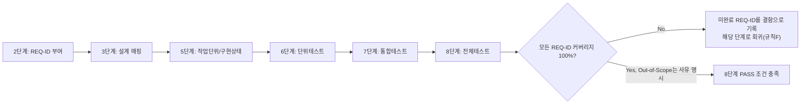

# 요구사항 추적 매트릭스 (Requirements Traceability Matrix)

> 2단계(기획서 작성)에서 생성하고, 이후 모든 단계가 갱신한다. 8단계(전체 풀테스트) 완료 조건은 이 매트릭스의 모든 행이 "구현"과 "테스트" 컬럼까지 채워져 있는 것이다 (제외 항목은 사유 명시).

| REQ-ID | 요구사항/기능 (기획서 §) | 설계 매핑 (설계서 §) | 작업 단위 (unit-n) | 구현 상태 | 단위테스트 (unit-n-test) | 통합테스트 (feature-x) | 전체테스트(08) | 비고 |
|--------|--------------------------|------------------------|----------------------|------------|----------------------------|---------------------------|------------------|------|
| REQ-001 |  |  |  | Not Started / In Progress / Done |  |  |  |  |

## 작성 규칙
- REQ-ID는 2단계에서 기획서의 기능 범위(In-Scope) 항목마다 하나씩 부여한다. 이후 단계에서 새 ID를 임의로 추가하지 않고, 새 요구사항이 필요하면 규칙 A에 따라 질문하거나 규칙 F(피드백 루프)로 상위 단계를 수정한다.
- Out-of-Scope로 명시된 항목은 매트릭스에 포함하되 상태를 "Out-of-Scope(사유)"로 표기해, 나중에 "빠뜨린 것"과 "의도적으로 뺀 것"을 구분할 수 있게 한다.
- 8단계에서 이 매트릭스를 검토해 커버리지 100%를 확인하지 못하면 PASS 판정할 수 없다.

## REQ-ID 생애주기 (참고용 다이어그램)
> 아래 다이어그램은 하나의 REQ-ID가 단계를 거치며 채워지는 흐름을 시각적으로 요약한 참고 자료다. 최종 근거는 항상 위 표와 작성 규칙이다.

