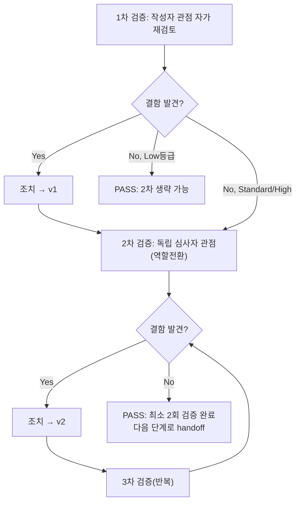

# 내부 검증 로그 (Internal Verification Log)

> 이 파일은 문서/코드 산출물 1건당 1개씩 작성한다. 파일명 규칙: `verify-log_<산출물파일명>.md`
> **원칙(Standard/High 등급): 최소 2회 검증 필수. 1차에서 결함이 0건이어도 2차 검증은 생략할 수 없다.**
> **Tier 예외(Low 등급만, ORCHESTRATOR.md 1장 "프로젝트 위험도 등급" 참고): 1차에서 결함이 0건이면 2차를 생략하고 PASS 확정할 수 있다. 1차에서 결함이 하나라도 나오면 이 예외는 소멸하고 원칙(2회 이상)이 그대로 적용된다.**
> 2차 이상에서 결함이 나오면 수정 후 3차, 4차... 결함 0건이 나올 때까지 반복한다. 2회는 하한선이지 상한선이 아니다.

## 대상 산출물
- 파일: 
- 작성 에이전트: 
- 적용 Tier (Low/Standard/High): 
- 버전: v0 (초안)

## 1차 검증 (작성자 관점 자가 재검토)
- 검증자(역할): 
- 일시: 
- 체크리스트
  - [ ] 입력 계약(Input Contract)에 명시된 모든 입력을 실제로 반영했는가
  - [ ] 출력 계약(Output Contract)에 명시된 모든 필수 항목이 빠짐없이 존재하는가
  - [ ] 상위 단계 산출물과 용어/수치/범위가 모순되지 않는가
  - [ ] 추측으로 채운 항목이 있는가 (있다면 "가정" 섹션에 명시했는가, 혹은 질문으로 전환했는가)
  - [ ] 20년차 실무자 기준으로 봤을 때 구조적/논리적 결함이 없는가
  - [ ] 오탈자, 형식 오류, 누락된 표/그림 참조가 없는가
- 발견된 결함 목록:
  1. 
- 조치 내용: (수정 후 → v1)

## 2차 검증 (독립 심사자 관점 — 역할 전환 재검토)
> "내가 이 문서를 오늘 처음 받아본 심사자라면?"이라는 관점에서, 1차 검증자가 놓쳤을 법한 리스크·엣지케이스·암묵적 가정을 의심하며 재검토한다.
> **Low 등급이고 1차 검증 결함이 0건이면 이 섹션 전체를 생략하고 바로 "최종 판정"으로 넘어갈 수 있다.** (Standard/High 등급, 또는 1차에서 결함이 하나라도 나온 경우는 생략 불가.)
- 검증자(역할): 
- 일시: 
- 체크리스트
  - [ ] 1차 검증에서 지적된 항목이 실제로 반영되었는가 (재확인)
  - [ ] 엣지 케이스/예외 상황이 누락되지 않았는가
  - [ ] 문서만 보고 다음 단계 에이전트가 추가 질문 없이 작업을 시작할 수 있는가
  - [ ] 되돌리기 어려운 결정(비가역적 결정)에 대한 근거가 명시되어 있는가
  - [ ] 보안/성능/운영 관점에서 명백히 위험한 내용이 없는가
- 발견된 결함 목록:
  1. 
- 조치 내용: (수정 후 → v2, 최종)

## (필요 시) 3차 이상 검증
- 2차에서 결함이 발견된 경우에만 반복. 형식은 2차와 동일.

## 최종 판정
- [ ] PASS (결함 0건, 최소 2회 검증 완료) — 다음 단계로 handoff 가능
- [ ] PASS (Low 등급, 1차 검증 결함 0건으로 2차 생략) — 다음 단계로 handoff 가능
- [ ] FAIL — 재작업 필요, 사유: 

## 절차 흐름 (참고용 다이어그램)
> 아래 다이어그램은 위 절차를 시각적으로 요약한 참고 자료다. 규칙/조건의 최종 근거는 항상 위 텍스트다.

